# Awesome Opus 5.5 Games

A curated list of **Claude Opus 5.5** vibecoded / vibe-coded games — plus discovery passes of **Claude Sonnet 5.5** and **GPT-6 Astra** browser games — with screenshots and play links.

**Live gallery:** [vibefin.github.io/awesome-opus-5.5-games](https://vibefin.github.io/awesome-opus-5.5-games/)

> 270 games (189 Opus 5.5 · 11 Sonnet 5.5 · 69 Astra · 1 uncertain) · last updated 2026-09-30 (Asia/Saigon)
>
> **screenshot score** is visual polish only (1–10): clarity, composition, how well the still shows the game. It is **not** a gameplay rating.
>
> `made_with` marks the credited model (`opus-5.5`, `sonnet-5.5`, or `astra`). Use `uncertain` when the model is unknown.

## Contents

- [Games](#games)
- [Data](#data)
- [Contributing](#contributing)

## Games

| # | Screenshot | Game | Score | Found via |
|--:|:----------:|:-----|------:|:----------|
| 1 | 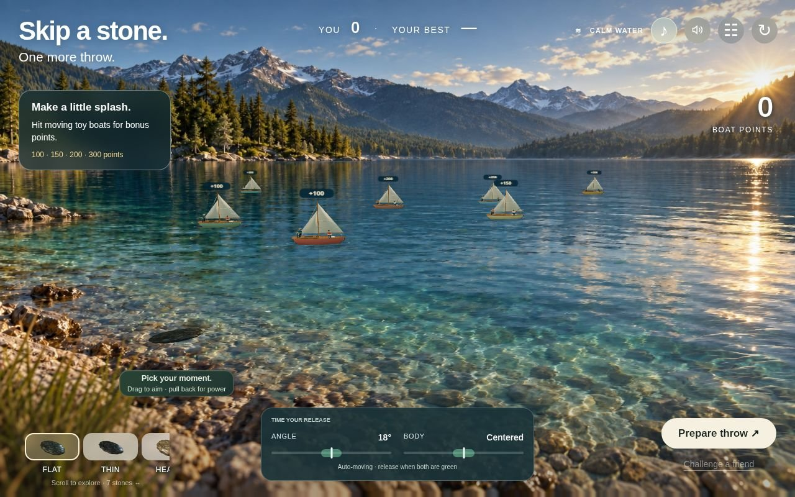 | **[Skip a Stone](https://skip-a-stone.chipchaunceytheonlyone.chatgpt.site/)** · [source](https://x.com/chrisjdimarco/status/2103874824569344327) Alpine lake stone-skipping: aim, time release, hit toy boats for bonus points. ChatGPT Sites build (Astra). `Astra` | 9.3 | `x` |
| 2 | 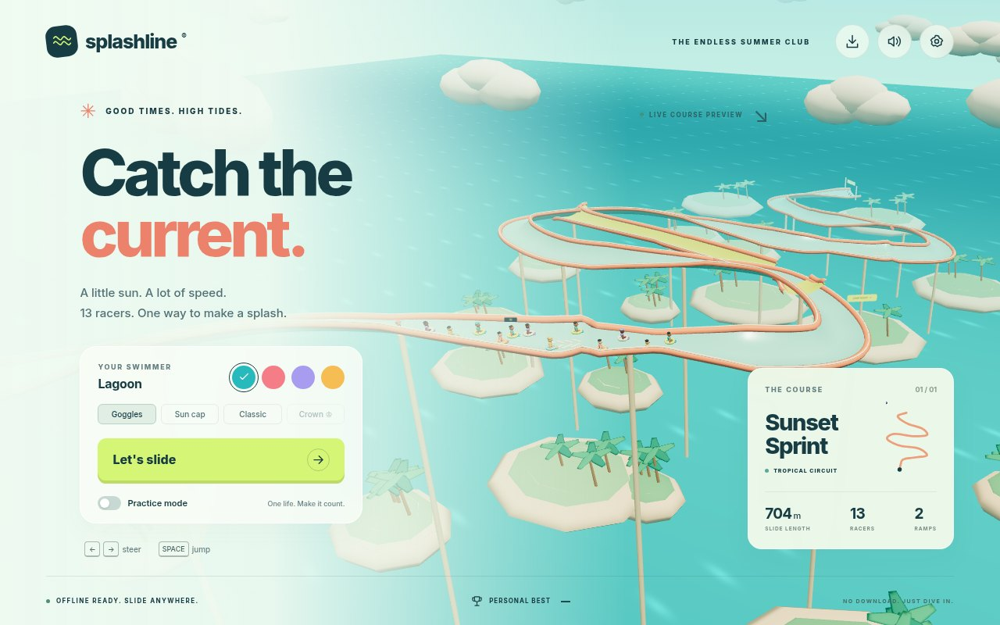 | **[Splashline — Catch the current](https://kjlkurt.github.io/waterslide-game-astra/)** · [source](https://x.com/KJLKurt/status/2104703514878374288) Tropical waterslide racer: 13 swimmers, customizable gear, Sunset Sprint course. Offline-ready Three.js build credited to GPT-6 Astra. `Astra` | 9.3 | `x` |
| 3 | 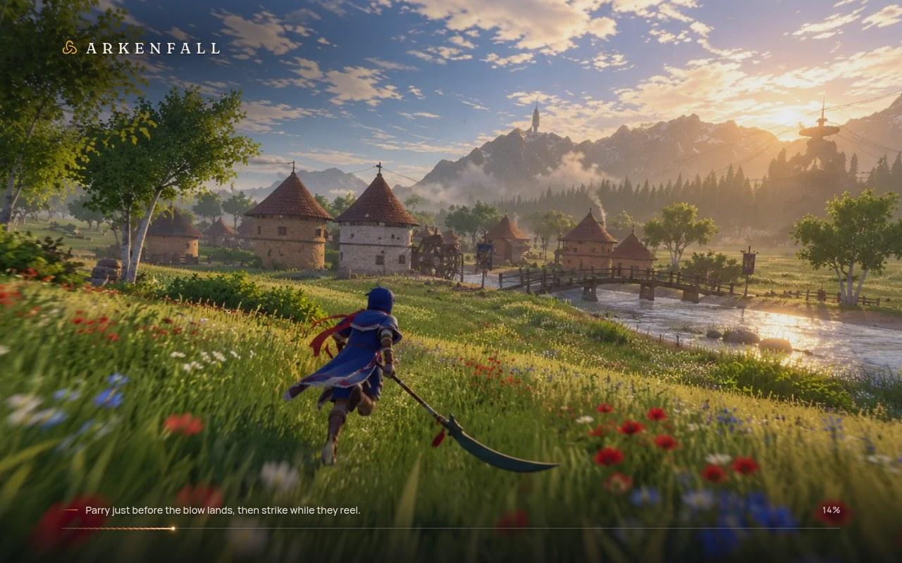 | **[Arkenfall](https://www.arkenfall.site/)** · [source](https://x.com/LexnLin/status/2102834362530079093) Open-world browser action game in the Frayed Vale: waystones, parries, Loomspire, and Unravelled foes. Creator reports zero assets — terrain, creatures, audio, trailer all code via Claude Opus 5.5. `Opus 5.5` | 9.2 | `x` |
| 4 | 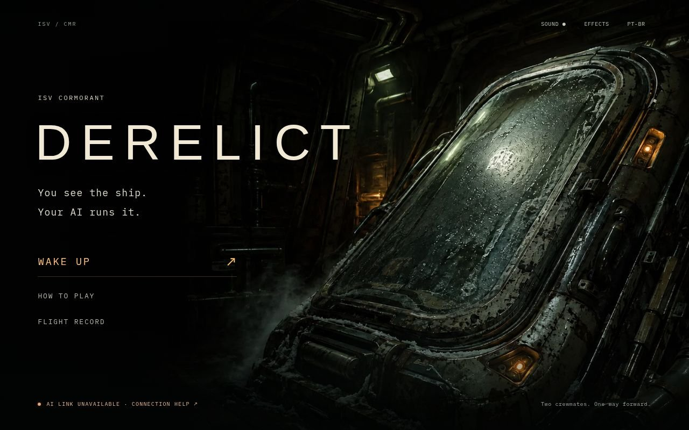 | **[DERELICT](https://derelict-game.vercel.app/)** · [source](https://x.com/mariohercules/status/2104619803801731353) Atmospheric sci-fi browser game aboard ISV Cormorant — you see the ship; your AI runs it. Creator credits Astra / WebMCP. `Astra` | 9.2 | `x` |
| 5 | 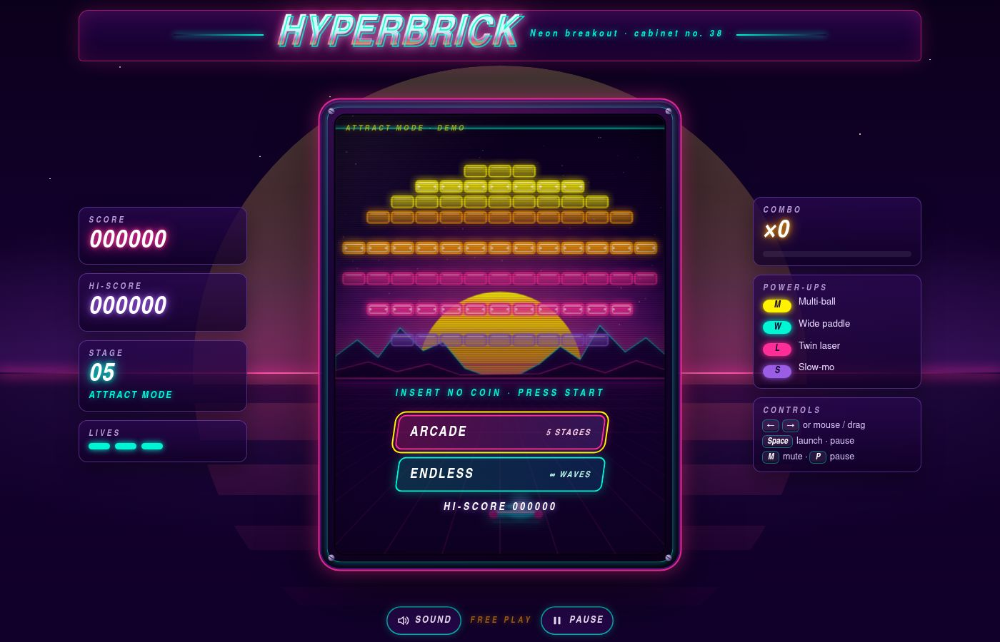 | **[HYPERBRICK](https://miaai-lab.github.io/Claude-Opus-5.5-100-HTML-Files/038-neon-breakout.html)** · [source](https://miaai-lab.github.io/Claude-Opus-5.5-100-HTML-Files/) Synthwave Breakout arcade cabinet: neon bricks, power-ups (multi-ball, wide, laser, slow-mo), five stages plus endless, Web Audio SFX. One of MiaAI Lab's 100 single-file Claude Opus 5.5 HTML experiments. `Opus 5.5` | 9.2 | `catalog` |
| 6 | 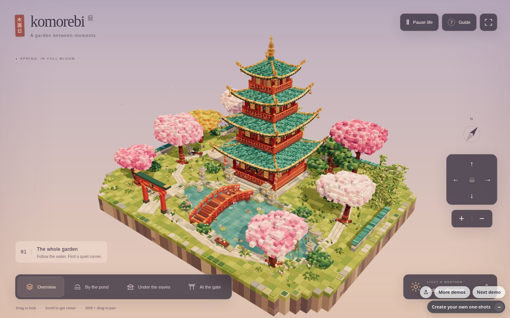 | **[komorebi — A garden between moments](https://pagoda.astra.demos.sulat.com/)** · [source](https://astra.demos.sulat.com/) Interactive voxel Japanese garden diorama: pagoda, sakura, weather and camera tours. GPT-6 Astra one-shot on Sulat. `Astra` | 9.2 | `catalog` |
| 7 |  | **[Long Wind (长风)](https://jbang2004.github.io/long-wind/)** · [source](https://github.com/jbang2004/long-wind) Real-time three.js wuxia action across three chapters — golden steppe, rainy bamboo forest, and lantern town — with light/heavy combos, perfect parries, and boss fights. Every line of code written by Claude Opus 5.5. `Opus 5.5` | 9.2 | `catalog` |
| 8 | 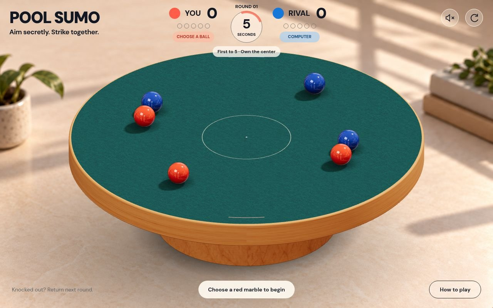 | **[Pool Sumo](https://pool-sumo.chipchaunceytheonlyone.chatgpt.site/)** · [source](https://x.com/chrisjdimarco/status/2103874824569344327) Tabletop marble duel: secretly aim, strike together, own the center. First to 5 vs computer. ChatGPT Sites build (Astra). `Astra` | 9.2 | `x` |
| 9 | 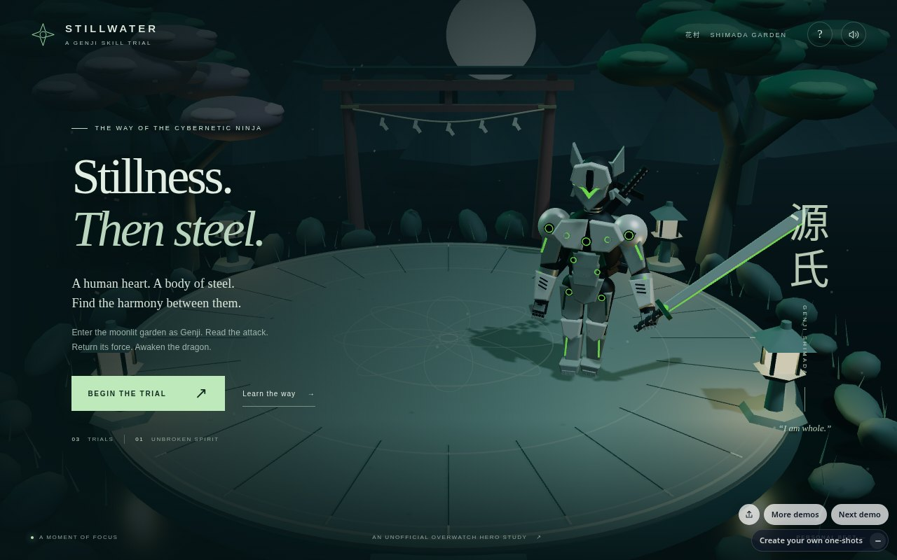 | **[Stillwater: A Genji Skill Trial](https://genji.astra.demos.sulat.com/)** · [source](https://astra.demos.sulat.com/) Moonlit garden deflect trials — shuriken, perfect deflect, dash, Dragonblade. GPT-6 Astra one-shot on Sulat. `Astra` | 9.2 | `catalog` |
| 10 | 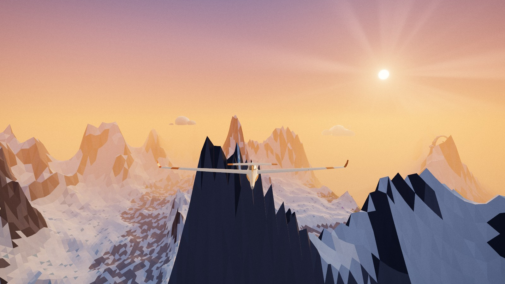 | **[DRIFTWING](https://kylebuildsai.github.io/driftwing/)** · [source](https://github.com/KyleBuildsAI/driftwing) Ambient infinite-flight glider over seeded procedural biomes with day/night, aurora and AI copilot WREN. Single-prompt Claude Opus 5.5 / three.js WebGPU build — no fail state. `Opus 5.5` | 9.1 | `catalog` |
| 11 |  | **[Fast Rocket](https://linh.com/fastrocket/)** · [source](https://x.com/fastrocket/status/2105144228754153834) Rocket-building sandbox with two voiced bantering instructors: build it, launch it, land it. Free browser play, no account. Built with Claude Sonnet 5.5 in Claude Code by @fastrocket / Linh Ngo. `Sonnet 5.5` | 9.1 | `x` |
| 12 |  | **[Kettu-Vellam (Kerala snake-boat race)](https://kettuvellam.com)** · [source](https://x.com/jessinvibe/status/2103565292198838314) Race chundan vallam through Punnamada, Kuttanad, and monsoon Vembanad with rival crews and vanchipattu atmosphere. `Opus 5.5` | 9.1 | `x` |
| 13 | 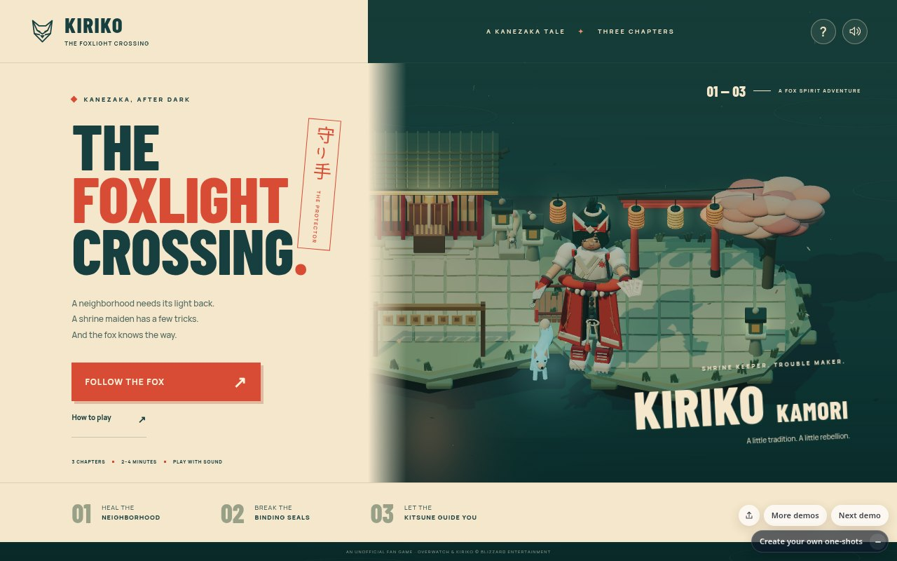 | **[Kiriko: The Foxlight Crossing](https://kiriko.astra.demos.sulat.com/)** · [source](https://astra.demos.sulat.com/) Fox-spirit adventure: heal neighbors, break binding seals, follow the kitsune through Kanezaka. GPT-6 Astra one-shot on Sulat. `Astra` | 9.1 | `catalog` |
| 14 | 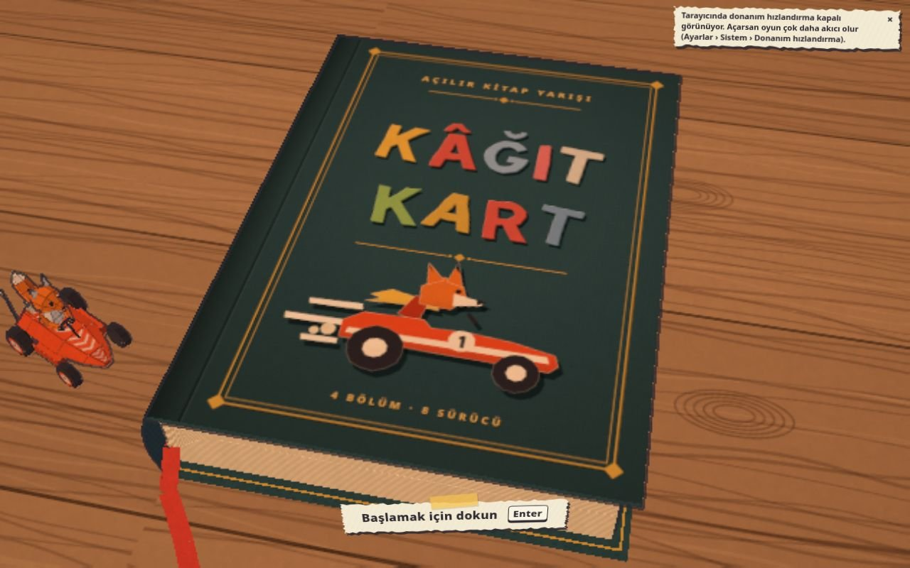 | **[Kâğıt Kart](https://burakerdemci.github.io/kagit-kart/)** · [source](https://github.com/BurakErdemci/kagit-kart) Pop-up-book kart racer: every mesh, texture and sound made in code. Turkish UI; credited to Claude Opus 5.5. `Opus 5.5` | 9.1 | `catalog` |
| 15 |  | **[Last Train to the Sea](https://app.usecrayon.ai/play/bda1b910-b840-48cb-bb4c-28d0cde29107)** · [source](https://x.com/aniketjart/status/2102546641253478674) Drive Hearthwing, a fairy tram, through five lively towns above the clouds. Balance its wings, collect travelers, and earn tips in a Ghibli-inspired train sim built with Opus 5.5, Crayon, and Three.js. `Opus 5.5` | 9.1 | `x` |
| 16 | 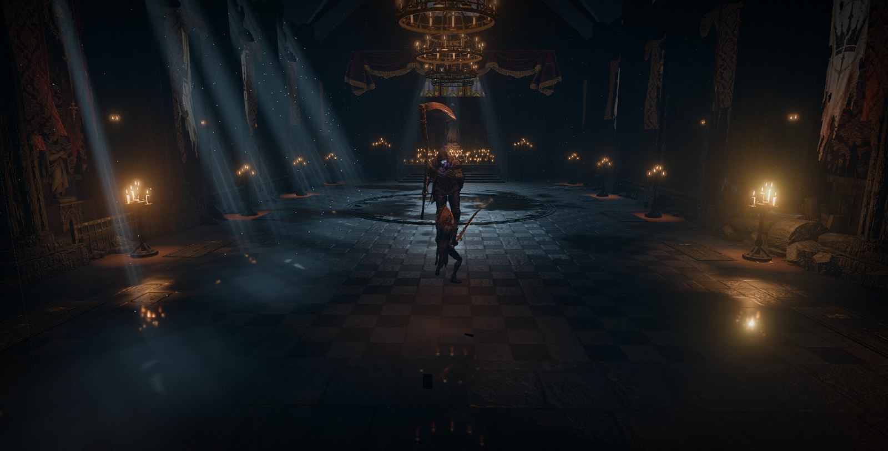 | **[Lost Cathedral](https://genex.games/lost-cathedral)** · [source](https://x.com/genex_games/status/2100586874754539672) Souls-like third-person gothic boss fight: Thorn Exile vs Armored Death in a candlelit nave with god rays, cloth, and touch controls. Three.js + Genex CLI assets; gameplay credited to Astra/Fable. `Astra` | 9.1 | `x` |
| 17 | 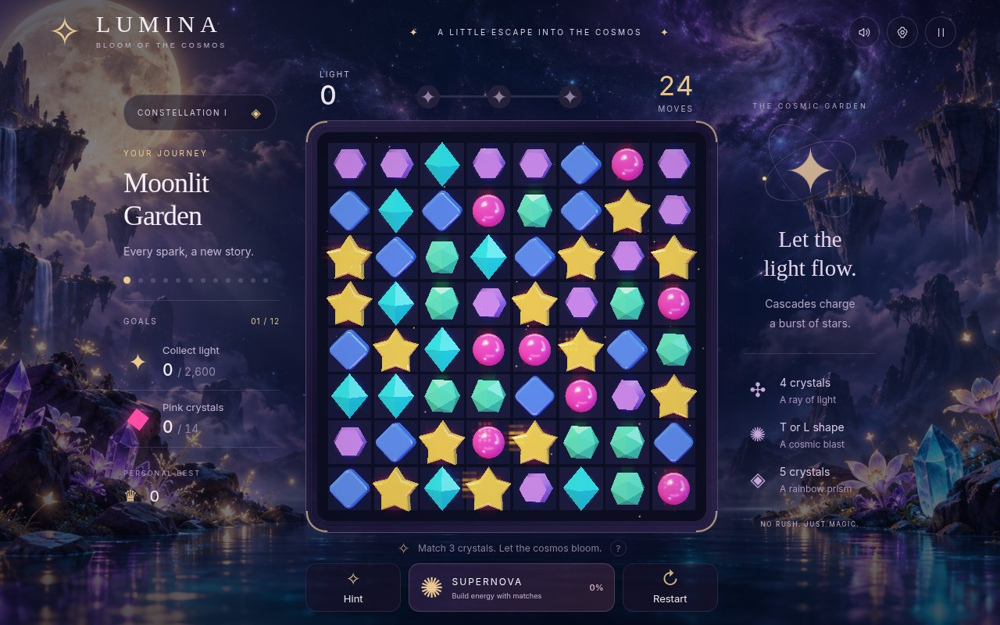 | **[LUMINA — Bloom of the Cosmos](https://lumina-cosmic-garden.vercel.app/)** · [source](https://x.com/ToolBraidComp/status/2096348348773028115) Cosmic match-3 with cascades, supernova meter, levels and polished audio loop. Creator says GPT-6 Astra built the entire game. `Astra` | 9.1 | `x` |
| 18 | 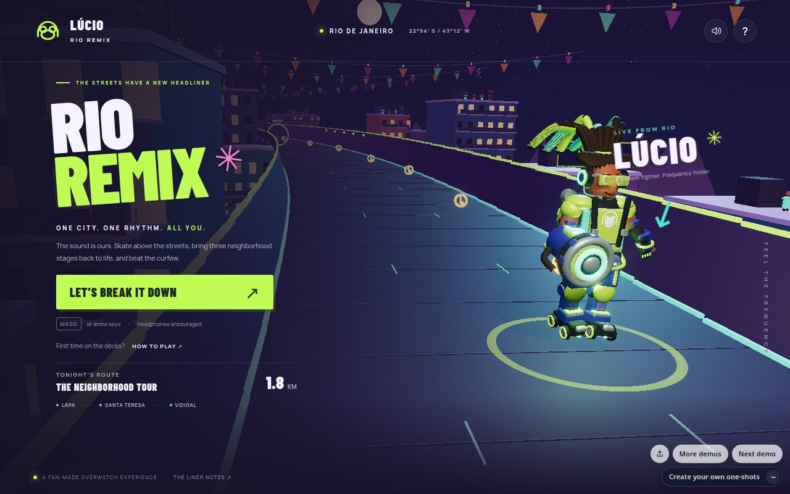 | **[Lúcio Rio Remix](https://lucio.astra.demos.sulat.com/)** · [source](https://astra.demos.sulat.com/) Skate three Rio neighborhoods (Lapa, Santa Teresa, Vidigal) on a neon elevated route before curfew. GPT-6 Astra one-shot on Sulat. `Astra` | 9.1 | `catalog` |
| 19 | 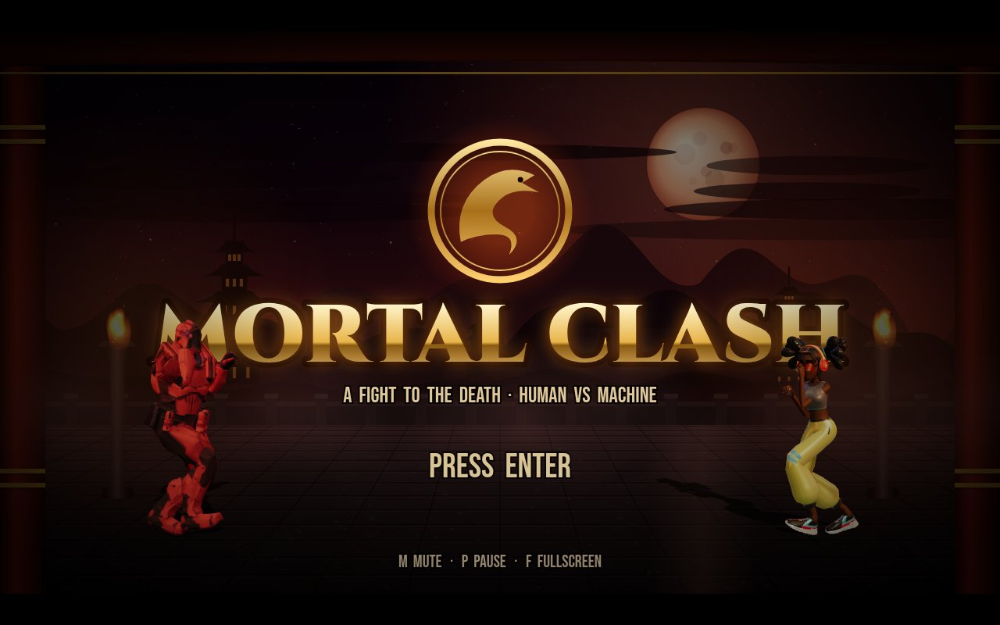 | **[Mortal Clash](https://promptengineer48.github.io/claude-opus-5.5-games/mortal-clash/)** · [source](https://github.com/PromptEngineer48/claude-opus-5.5-games) 1v1 fighting game — human vs machine on a moonlit rooftop. Pick fighter and difficulty, then chain punches, kicks, blocks and specials across best-of rounds. Claude Opus 5.5 + three.js. `Opus 5.5` | 9.1 | `github` |
| 20 | 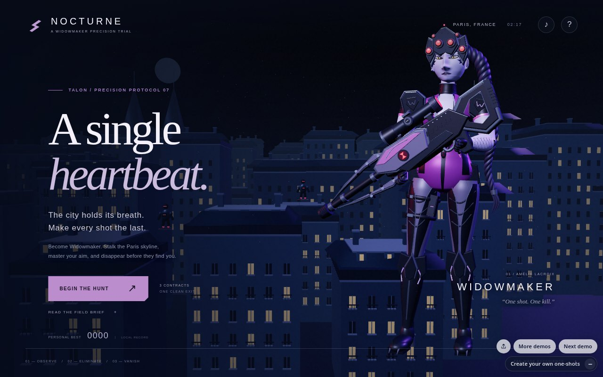 | **[Nocturne: A Widowmaker Precision Trial](https://widowmaker.astra.demos.sulat.com/)** · [source](https://astra.demos.sulat.com/) Paris rooftop sniper trial — observe, eliminate, vanish. GPT-6 Astra one-shot on Sulat. `Astra` | 9.1 | `catalog` |
| 21 | 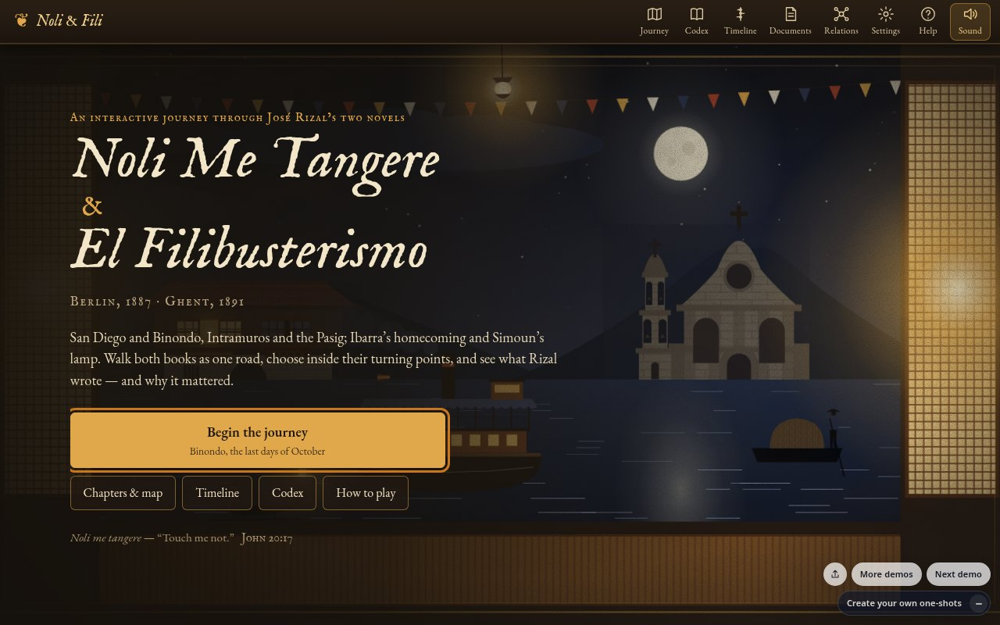 | **[Noli Me Tangere & El Filibusterismo](https://noli-me-tangere.opus5-5.demos.sulat.com/)** · [source](https://opus5-5.demos.sulat.com/) Interactive journey through José Rizal's two novels — walk San Diego, Binondo and Intramuros, choose at turning points. Claude Opus 5.5 one-shot on Sulat. `Opus 5.5` | 9.1 | `catalog` |
| 22 | 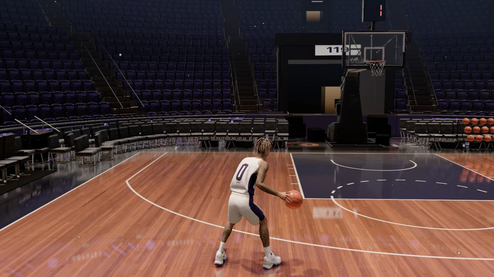 | **[Opus 5.5 NBA 2K](https://genex.games/opus-2k)** · [source](https://genex.games/opus-2k) Solo basketball in a dark atmospheric arena: dribble, shoot, lay up and dunk with one-key controls. Browser playable on Genex; titled as an Opus 5.5 build. `Opus 5.5` | 9.1 | `web` |
| 23 | 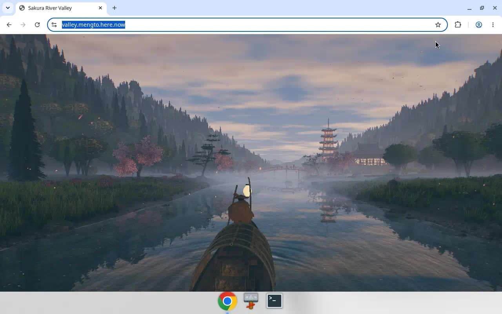 | **[Sakura River Valley](https://valley.mengto.here.now)** · [source](https://magiccreator.ai/claude-opus-5-5-demos) Real-time Three.js boat journey through a feudal East Asian mountain river valley at golden hour, with sakura, mist, and reflective water. `Opus 5.5` | 9.1 | `catalog` |
| 24 | 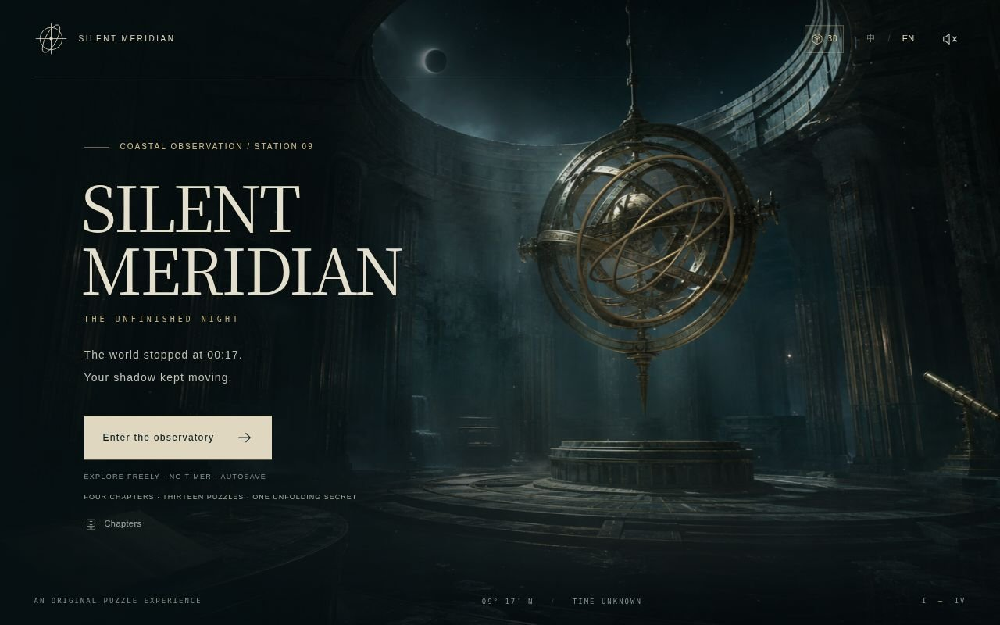 | **[Silent Meridian — The Unfinished Night](https://silent-meridian.stackloom.org/)** · [source](https://silent-meridian.stackloom.org/) Atmospheric puzzle adventure at Coastal Observation Station 09: four chapters, thirteen puzzles. The world stopped at 00:17; your shadow kept moving. Credited as GPT-6 Astra. `Astra` | 9.1 | `web` |
| 25 |  | **[Soccar](https://soccar-one.vercel.app/)** · [source](https://x.com/BlendiByl/status/2104800823620632641) Unofficial Rocket League-style car soccer in the browser: exhibition 2v2 with bots, stadium scoreboards, and controller/keyboard support. `Opus 5.5` | 9.1 | `x` |
| 26 | 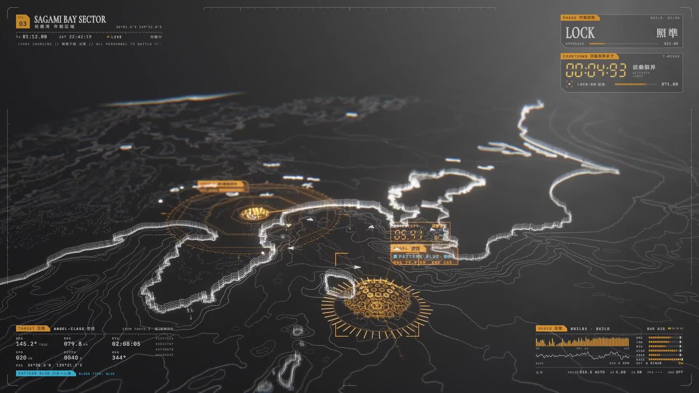 | **[Theatre (NGE)](https://theatre-fawn.vercel.app/)** · [source](https://x.com/LuisBizarro/status/2104780688113455342) Neon Genesis Evangelion–inspired Three.js / WebGL tactical command HUD over Sagami Bay — vibe-coded with Opus 5.5 in ~45 minutes. `Opus 5.5` | 9.1 | `x` |
| 27 | 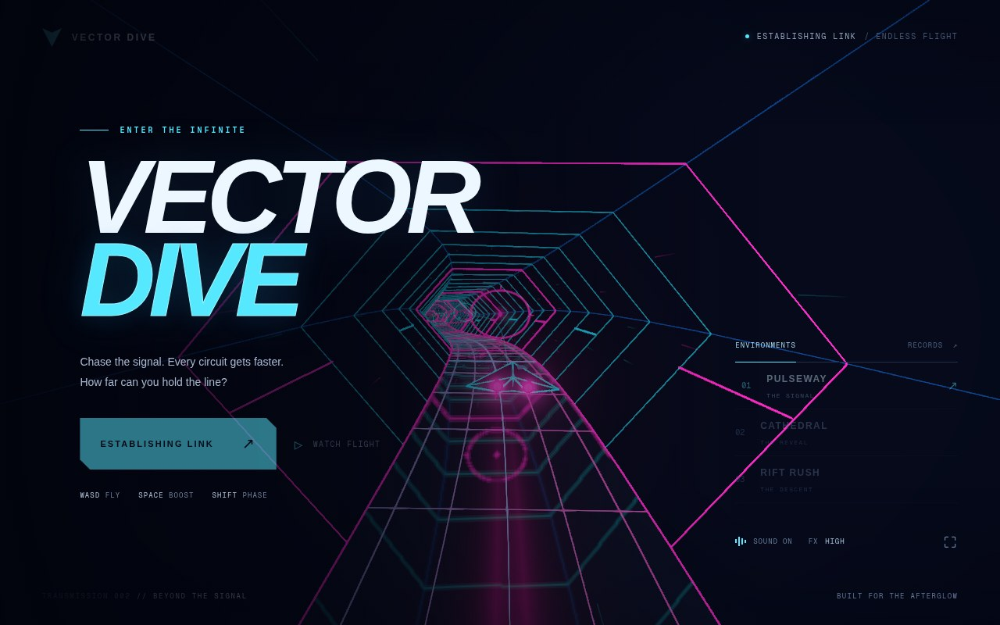 | **[Vector Dive — Beyond the Signal](https://vector-dive.openai.chatgpt.site/)** · [source](https://x.com/Dimillian/status/2097188900888322323) Neon wireframe flight through accelerating circuits — boost and phase to survive Pulseway, Cathedral and Rift Rush. OpenAI ChatGPT Sites Astra showcase. `Astra` | 9.1 | `catalog` |
| 28 | 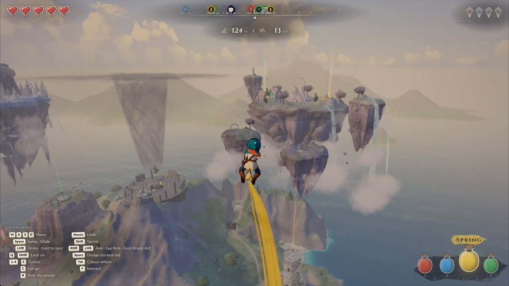 | **[Wildbrush](https://wildbrush.vercel.app/)** · [source](https://x.com/DannyLimanseta/status/2104215873120764032) Zelda Breath of the Wild–inspired open-world browser adventure co-vibe-coded with kids: paintbrush combat (fire/ice/bounce/vines), dungeons, flying brush, 30+ enemies and a giant boss. Desktop-only; built with Claude … `Opus 5.5` | 9.1 | `x` |
| 29 | 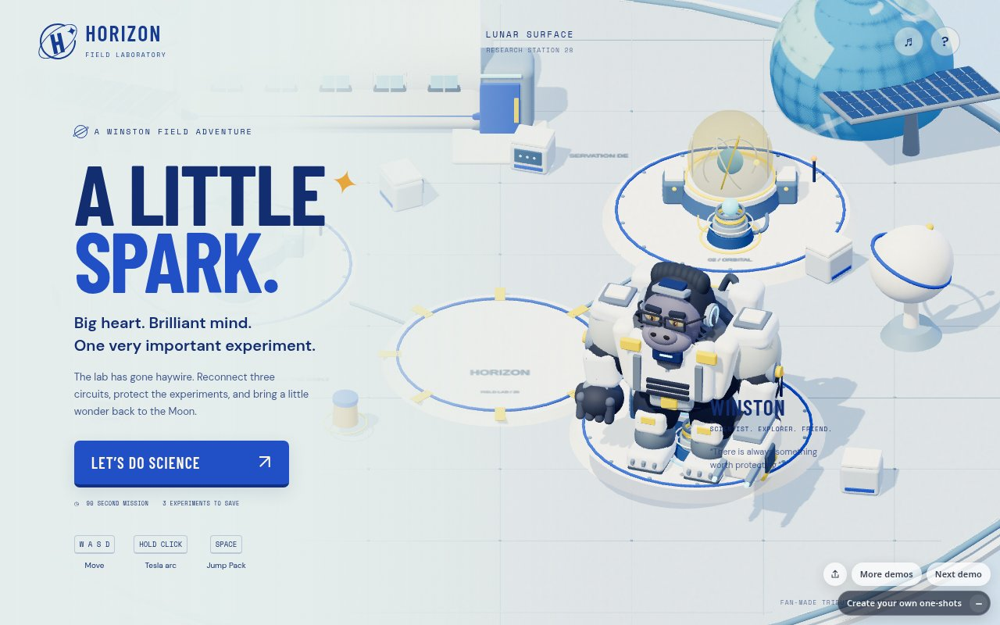 | **[A Little Spark (Winston Field Adventure)](https://winston.astra.demos.sulat.com/)** · [source](https://astra.demos.sulat.com/) 90-second lunar lab rescue as Winston: reconnect three circuits, Tesla-arc protect experiments, Jump Pack across Horizon Field Laboratory. GPT-6 Astra one-shot Overwatch fan tribute on Sulat. `Astra` | 9.0 | `catalog` |
| 30 | 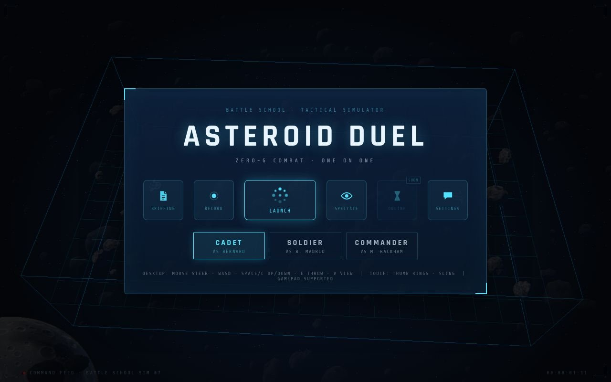 | **[Asteroid Duel](https://asteroid-duel.luis-5a4.workers.dev/)** · [source](https://x.com/lucataco/status/2104393224508882954) Zero-g 1v1 battle-school sim: throw asteroids at bot opponents (Cadet/Soldier/Commander). Three.js browser game by lucataco, built with Claude Opus 5.5 in ~30 minutes. `Opus 5.5` | 9.0 | `x` |
| 31 | 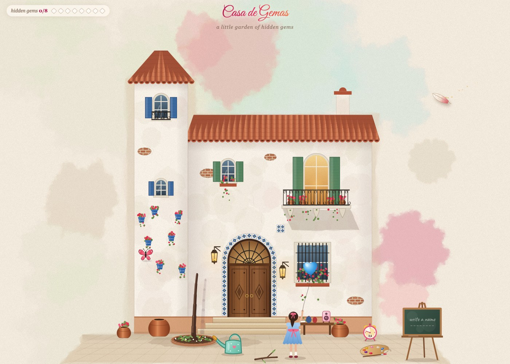 | **[Casa de Gemas](https://deepujain.github.io/casadegema/)** · [source](https://github.com/deepujain/casadegema) Watercolor Canvas garden of hidden gems across four seasons: water plants, shake branches, find seasonal visitors with Oli the owl narrating. Single-file browser game built with Claude Opus 5.5. `Opus 5.5` | 9.0 | `catalog` |
| 32 | 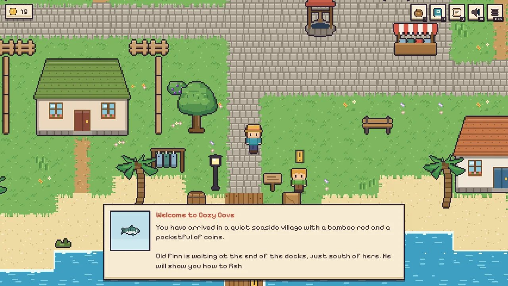 | **[Cozy Cove](https://tesana.com/play/8d052fdd-93a3-4466-a908-083f5f263a80)** · [source](https://x.com/Rubzem/status/2103983670034145726) Cozy pixel fishing RPG in a seaside village: bamboo rod, coins, Old Finn at the docks. Built over months with prior Claude models plus Opus 5.5 on Tesana. `Opus 5.5` | 9.0 | `catalog` |
| 33 | 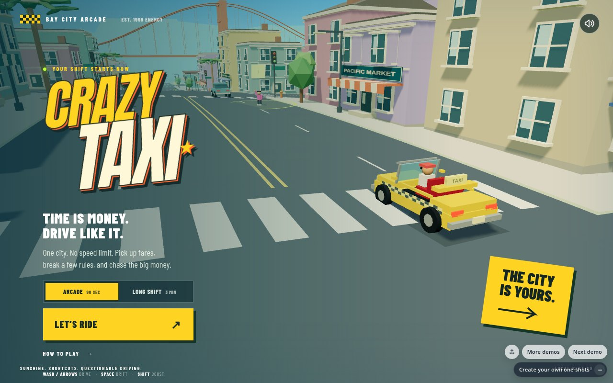 | **[Crazy Taxi (Bay City Arcade · Astra)](https://crazy-taxi.astra.demos.sulat.com/)** · [source](https://astra.demos.sulat.com/) Pick up fares, drift and boost through Bay City in Arcade 90s or Long Shift. GPT-6 Astra one-shot on Sulat (distinct from the Opus 5.5 Crazy Taxi demo). `Astra` | 9.0 | `catalog` |
| 34 | 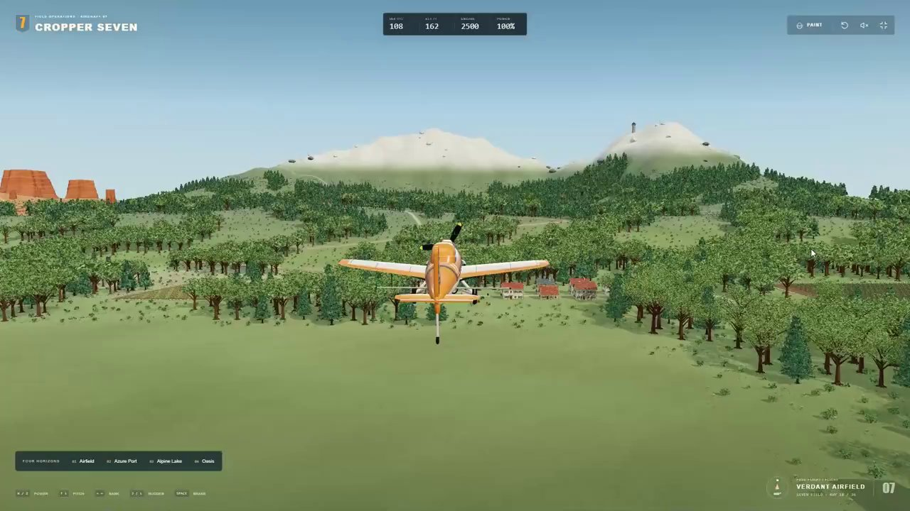 | **[Cropper Seven — Four Horizons](https://givros.github.io/openworld-plane/)** · [source](https://x.com/givros/status/2104692807965564947) Expressive crop-duster flight across four connected biomes (Airfield, Azure Port, Alpine Lake, Oasis) with paint/inspect hangar. GPT-6 Astra + Three.js + Blender by @givros. `Astra` | 9.0 | `x` |
| 35 | 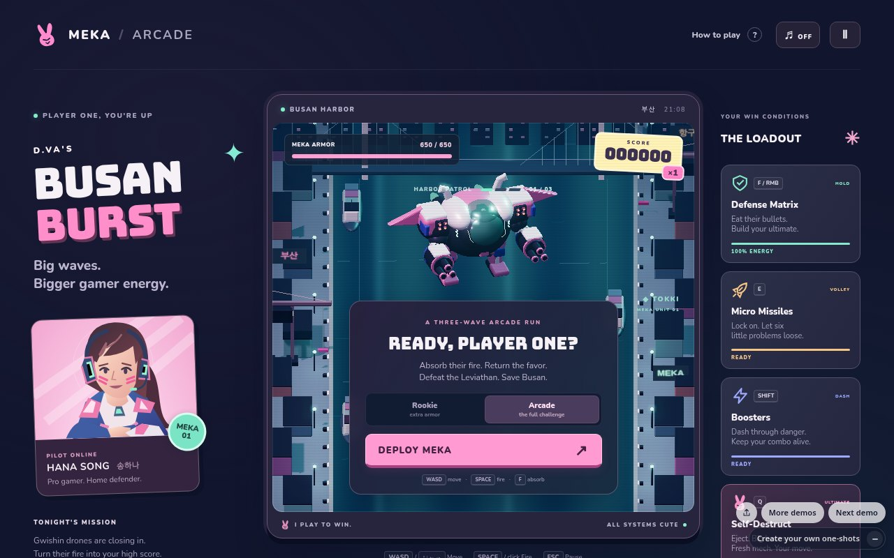 | **[D.Va's Busan Burst](https://d-va.astra.demos.sulat.com/)** · [source](https://astra.demos.sulat.com/) Three-wave MEKA arcade: absorb drone fire, micro-missiles, defeat the Gwishin Leviathan over Busan Harbor. GPT-6 Astra one-shot on Sulat. `Astra` | 9.0 | `catalog` |
| 36 | 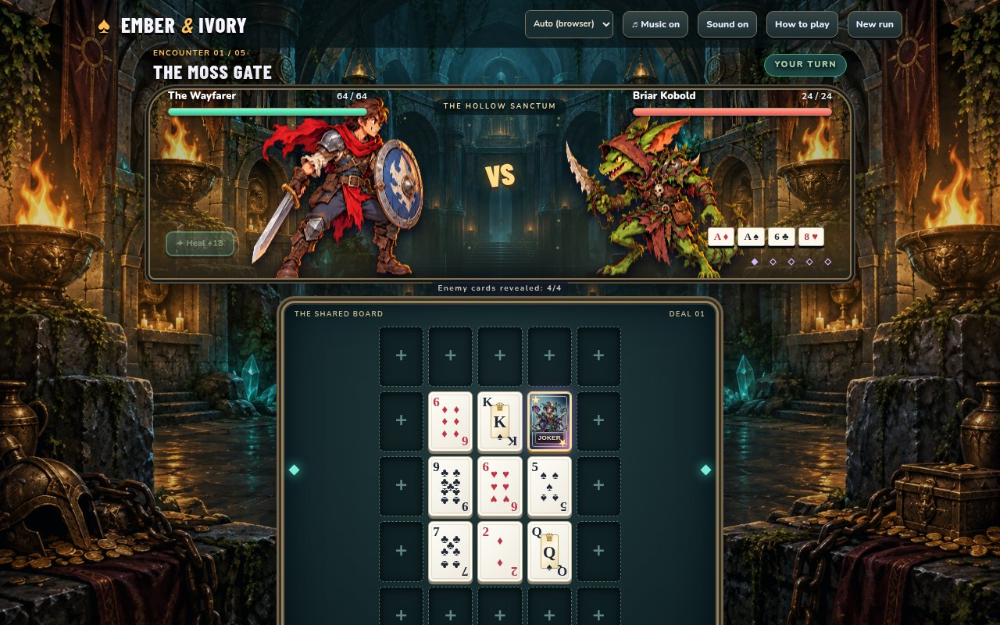 | **[Ember & Ivory](https://jlager.itch.io/ember-and-ivory)** · [source](https://x.com/jlager/status/2104748429192884380) Fantasy poker battler: share a board with dungeon guardians, complete poker lines into sword strikes, climb five encounters to the Ivory King. Creator built with Astra; HTML5 on itch. `Astra` | 9.0 | `x` |
| 37 | 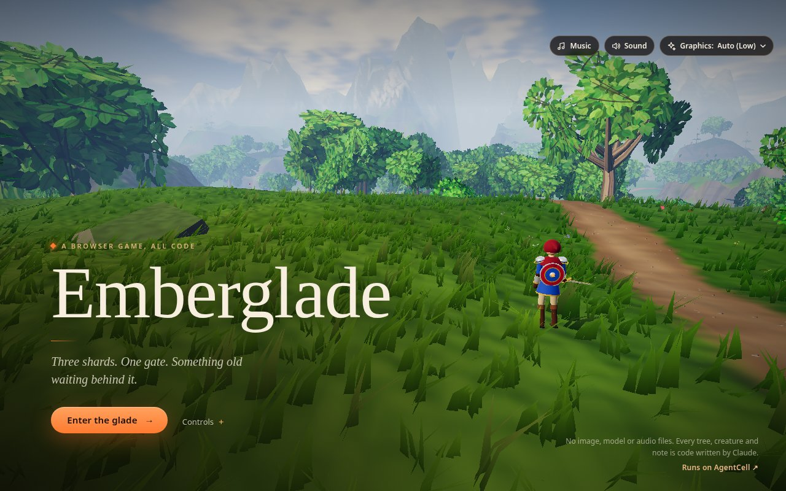 | **[Emberglade](https://emberglade.agentcell.app/)** · [source](https://x.com/agentcelldotdev/status/2104893456028160336) Open-world browser action game with zero asset files — terrain, creatures, boss fight and music all code. Three shards, one gate. Deployed on AgentCell; credited to Claude Opus 5.5. `Opus 5.5` | 9.0 | `x` |
| 38 | 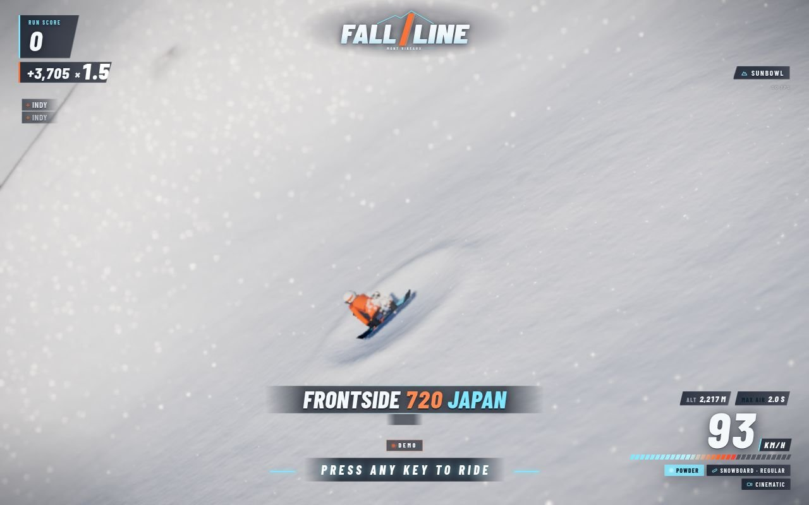 | **[Fall Line — Freeride Mountain](https://nipale-ai.github.io/opus-5-5-overnight-builds/fall-line/)** · [source](https://github.com/Nipale-ai/opus-5-5-overnight-builds) Freeride snowboard/ski on a big procedural mountain with tricks, powder modes and cinematic camera. Credited to Claude Opus 5.5. `Opus 5.5` | 9.0 | `catalog` |
| 39 | 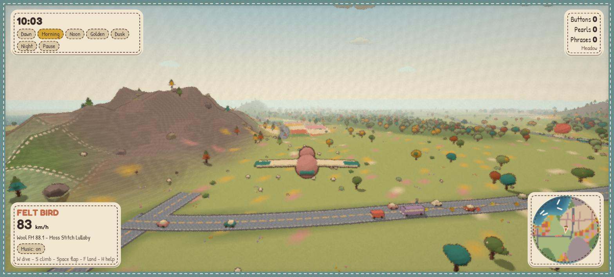 | **[Felt World](https://az9713.github.io/opus-5.5-open-world-game/feltworld/)** · [source](https://github.com/az9713/opus-5.5-open-world-game) One-file open-world felt-and-yarn diorama: drive, walk, fly as a felt bird, or dive underwater. All textures and audio procedural; Claude Code + Opus 5.5 wrote all the code. `Opus 5.5` | 9.0 | `catalog` |
| 40 | 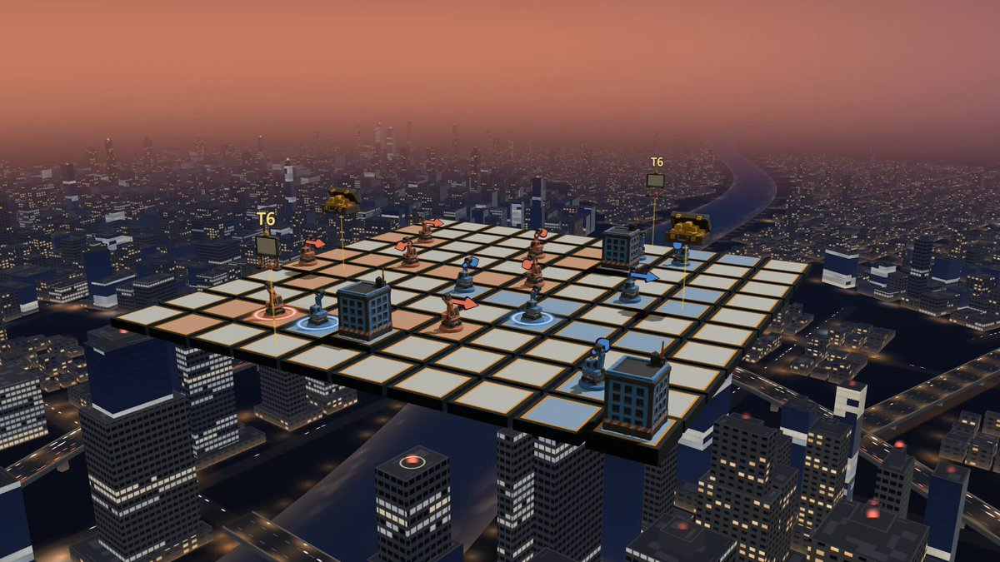 | **[FLIP CLASH](https://flipclash.hii-studio.com/?auto=1&theme=city)** · [source](https://x.com/hii_studio_jp/status/2104324888748236995) Turn-based territory / unit clash on a board floating over a Three.js night city Opus 5.5 built under the board; browser playable. `Opus 5.5` | 9.0 | `x` |
| 41 | 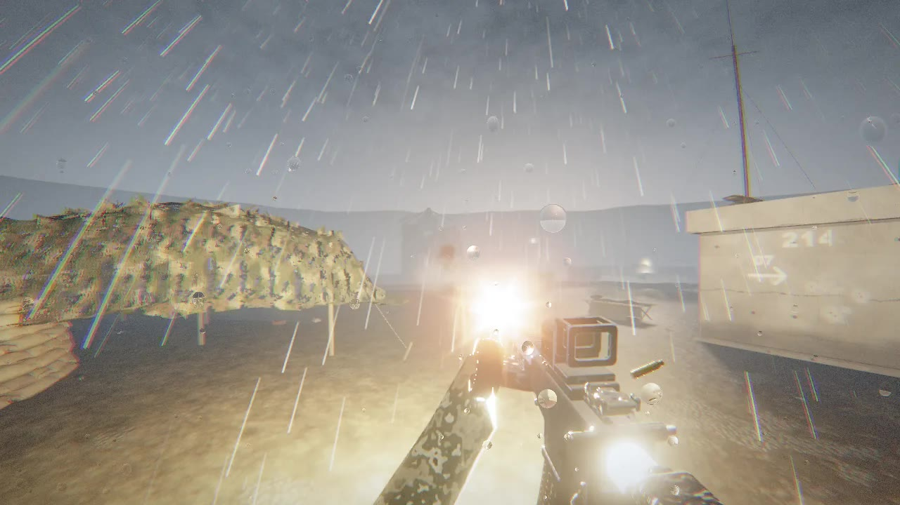 | **[FOGLINE — Bodycam // Sector 7](https://alesha-pro.github.io/bench-portal/games/fogline/)** · [source](https://x.com/superalesha/status/2104920915112829231) Bodycam-style first-person horde shooter in a rain-soaked fog trench: four procedural weapons with gunsmith optics/suppressors, infantry/drones/mortars across difficulties. Every texture, model and sound generated at … `Sonnet 5.5` | 9.0 | `x` |
| 42 | 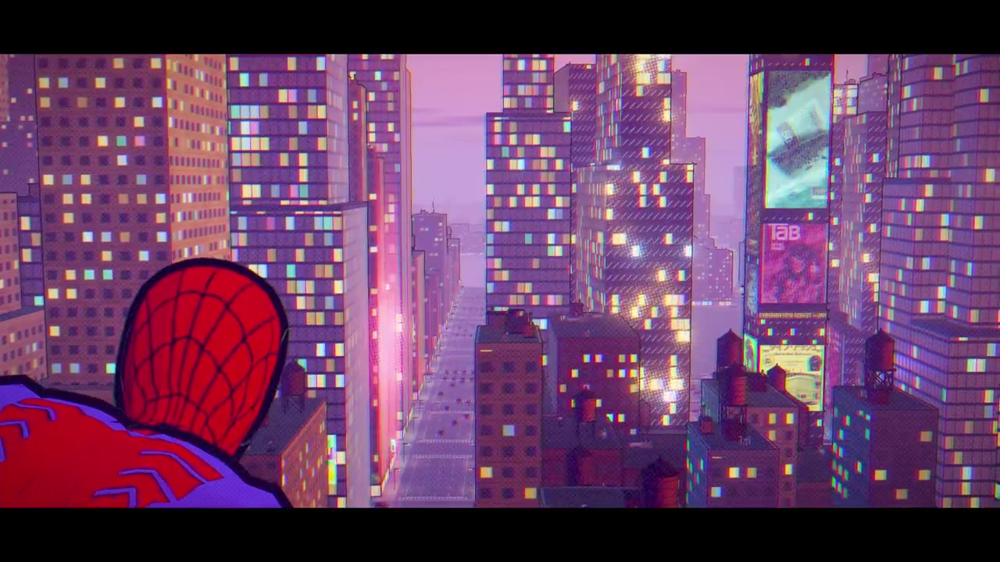 | **[Friendly Neighborhood Spider-Man (Spider-Verse)](https://spiderman-spiderverse.vercel.app/)** · [source](https://x.com/KalraIshaan11/status/2105065901972173054) Swing through a comic-book New York: stop crimes, take down the Scorpion in Times Square, and meet Miles Morales. Free unofficial Spider-Verse fan game built with Claude Opus 5.5. `Opus 5.5` | 9.0 | `x` |
| 43 | 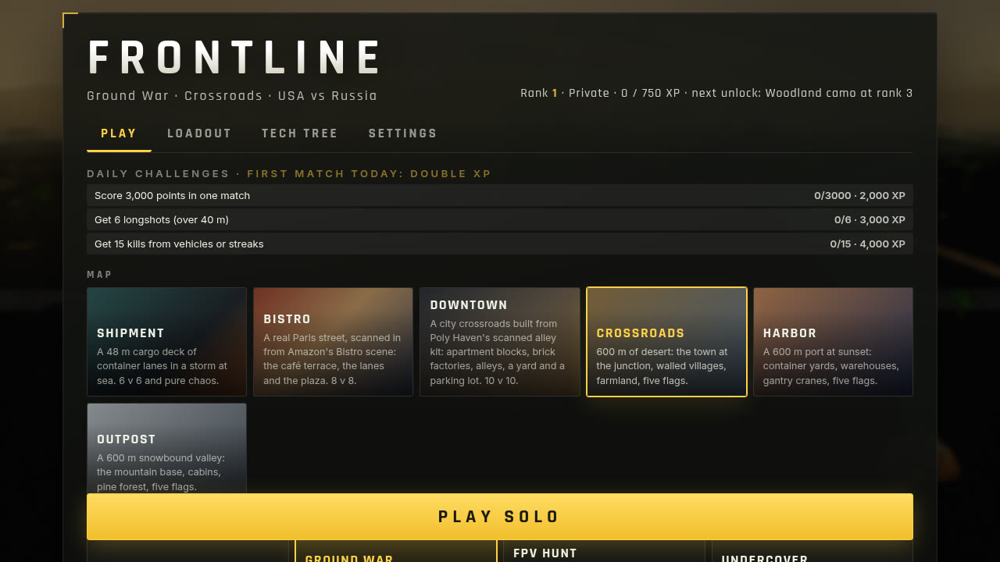 | **[FRONTLINE](https://testyee-09.github.io/Opus5.5Cod/)** · [source](https://github.com/TESTYEE-09/Opus5.5Cod) Browser Ground War FPS lobby with ranks, daily challenges, and maps (Shipment, Bistro, Downtown, Crossroads…). Repo Opus5.5Cod — Claude Opus 5.5 build. `Opus 5.5` | 9.0 | `web` |
| 44 | 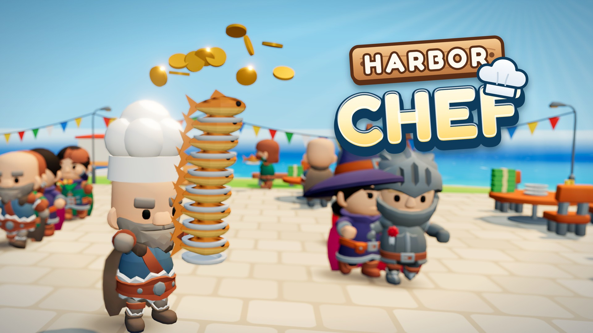 | **[Harbor Chef](https://playgama.ai/play/xjwew3t3ze)** · [source](https://x.com/roshanali12301/status/2104476894238556286) 3D browser harbor tycoon: grill fish, stack plates sky-high, hire a crew, and grow a sleepy dock into a busy port. Runs on phone or PC via Playgama; creator credits Claude Opus 5.5. `Opus 5.5` | 9.0 | `x` |
| 45 | 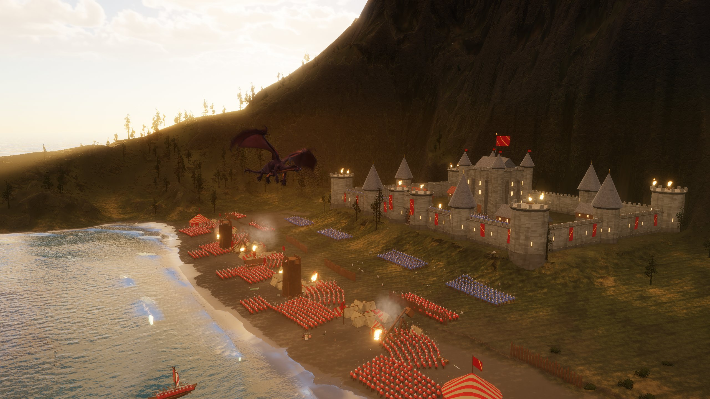 | **[House of Drakan](https://gamefx.ai/houseofdrakan/)** · [source](https://x.com/GamefxAI/status/2104343214404858324) Multiplayer dragon siege game where players burn gates, ballistae, and rival wyrms to defend or take the fortress of Drakan; Opus 5.5 via GameFX harness. `Opus 5.5` | 9.0 | `x` |
| 46 | 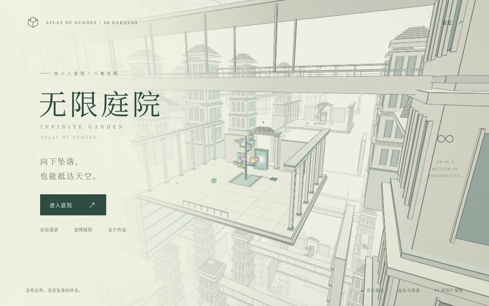 | **[Infinite Garden — Atlas of Echoes](https://infinite-garden.yelin8130.chatgpt.site/)** · [source](https://github.com/MartinDelophy/awesome-gpt-6-astra) Explore 48 gravity-bending gardens: carry colored fruits to sockets, awaken circuits, and fall into new sides of the architecture. ChatGPT Sites / Astra build. `Astra` | 9.0 | `catalog` |
| 47 | 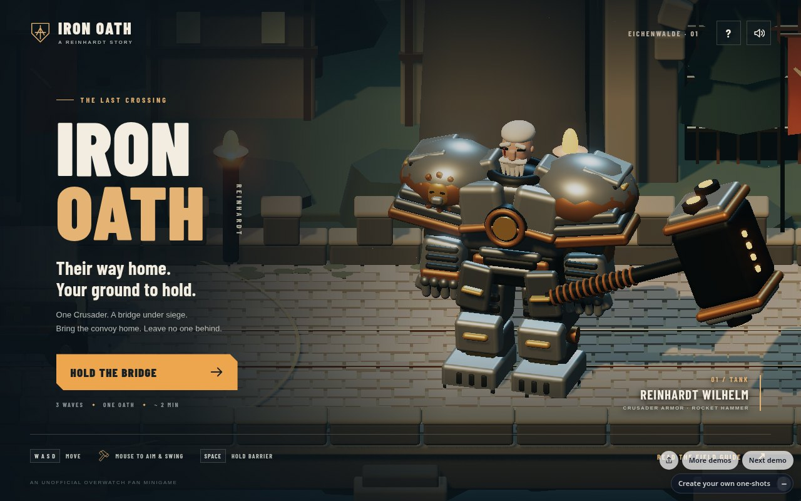 | **[Iron Oath: A Reinhardt Story](https://reinhardt.astra.demos.sulat.com/)** · [source](https://astra.demos.sulat.com/) Hold the Eichenwalde bridge for three waves — rocket hammer and barrier to bring the convoy home. GPT-6 Astra one-shot on Sulat. `Astra` | 9.0 | `catalog` |
| 48 | 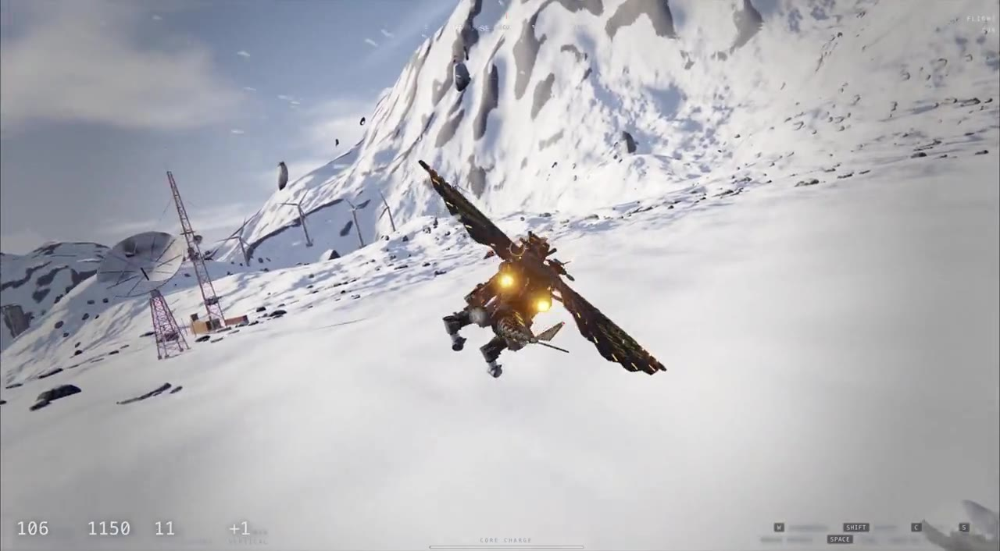 | **[KALDR](https://kaldr-weld.vercel.app/)** · [source](https://x.com/pradeepXkapoor/status/2104840409851822098) Pilot a fully procedural mechanical beast through vast snowy mountains — run, climb, leap and fly. Creature gait, flight physics, mountains and clouds all generated in code with Three.js. Author credits a one-shot Cla… `Sonnet 5.5` | 9.0 | `x` |
| 49 |  | **[Karts.com World Tour Grand Prix](https://karts.com/)** · [source](https://karts.com/) Arcade kart racing across 30 cities with 24 drivers and 18 karts. Low-poly Three.js World Tour Grand Prix; credited to Claude Opus 5.5 + Blender. `Opus 5.5` | 9.0 | `web` |
| 50 | 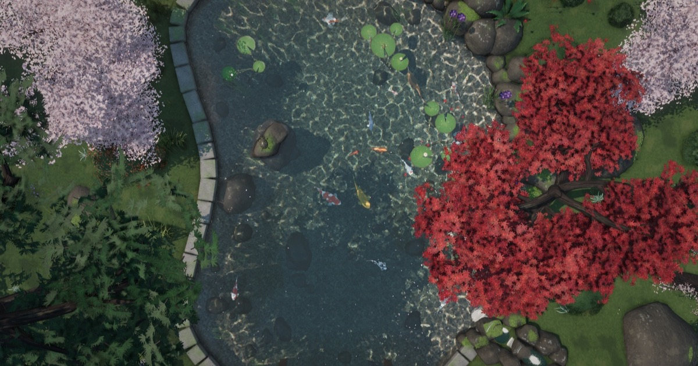 | **[Koi Pond Garden](https://souranyp-stack.github.io/koi-pond-garden/)** · [source](https://x.com/SouranyPhomhome/status/2104273690796179513) An ultra-realistic interactive Japanese koi pond garden rendered in real time with Three.js — a single HTML file with no assets or build step, built with Claude Opus 5.5. `Opus 5.5` | 9.0 | `x` |
| 51 | 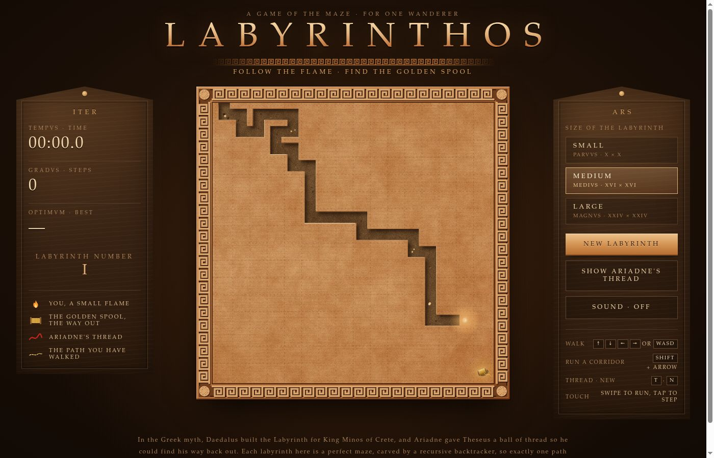 | **[Labyrinthos](https://miaai-lab.github.io/Claude-Opus-5.5-100-HTML-Files/033-stone-labyrinth.html)** · [source](https://miaai-lab.github.io/Claude-Opus-5.5-100-HTML-Files/) Torch-lit top-down maze on a carved stone tablet: recursive-backtracker labyrinths, flame fog-of-war, Ariadne's thread hint, timer and sizes. Single-file Claude Opus 5.5 HTML game from MiaAI Lab's 100 experiments. `Opus 5.5` | 9.0 | `catalog` |
| 52 | 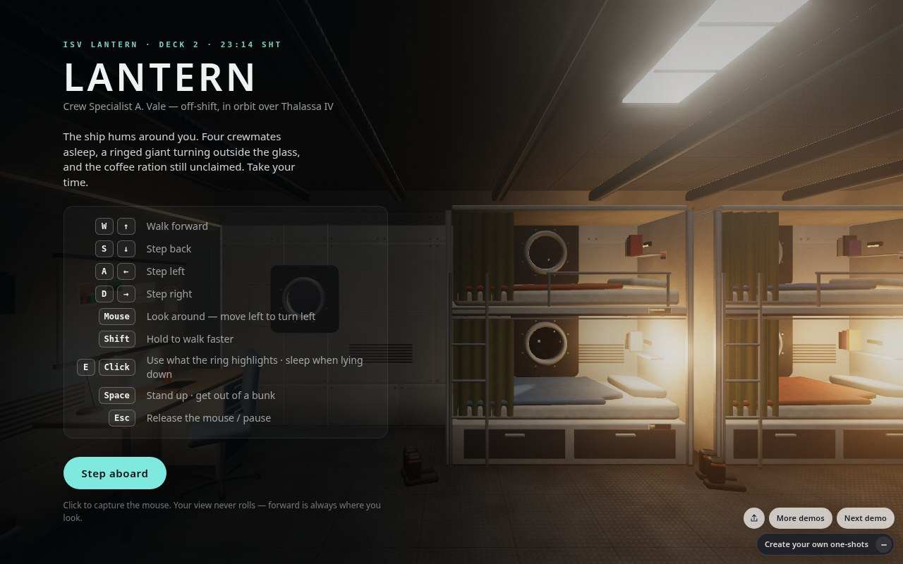 | **[LANTERN (Spaceship Interior)](https://spaceship-interior.opus5-5.demos.sulat.com/)** · [source](https://opus5-5.demos.sulat.com/) First-person off-shift walk through a humming crew berth in orbit over Thalassa IV — bunks, portholes, coffee ration, and a ringed giant outside the glass. `Opus 5.5` | 9.0 | `catalog` |
| 53 | 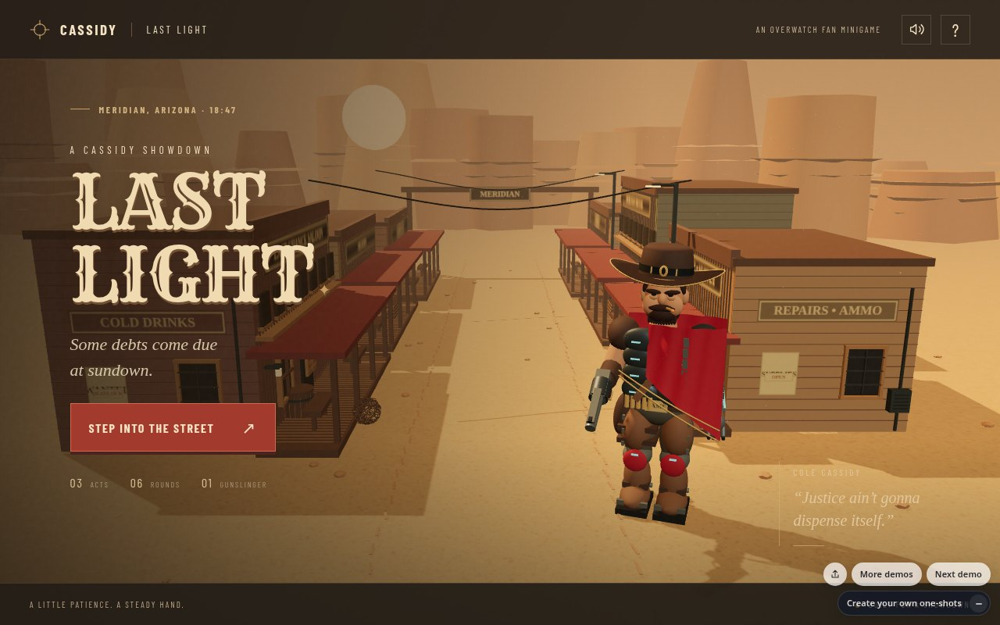 | **[Last Light (Cassidy showdown)](https://cassidy.astra.demos.sulat.com/)** · [source](https://astra.demos.sulat.com/) Sundown gunslinger showdown across three acts in Meridian, Arizona. GPT-6 Astra Overwatch fan minigame on Sulat. `Astra` | 9.0 | `catalog` |
| 54 | 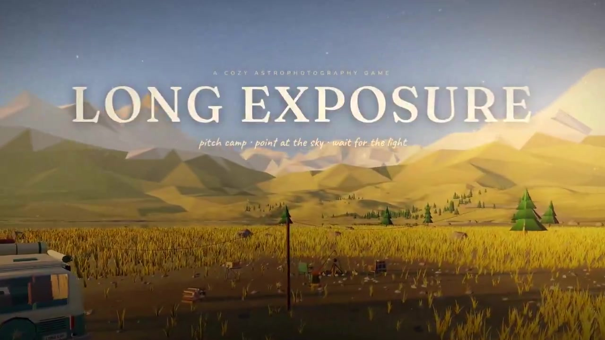 | **[Long Exposure](https://long-exposure.longmaba.workers.dev/)** · [source](https://x.com/longmaba/status/2105154719241187809) Cozy astrophotography game: pitch camp, point at the sky, wait for the light. One-shot with Claude Sonnet 5.5 by @longmaba (~5h). `Sonnet 5.5` | 9.0 | `x` |
| 55 |  | **[Maynila sa Ilalim (Manila Below)](https://hades-manila.opus5-5.demos.sulat.com/)** · [source](https://opus5-5.demos.sulat.com/) Tagalog-language escape/action game through a neon night Manila of reflections and chicken-shop glow. Claude Opus 5.5 one-shot on Sulat (Hades Manila). `Opus 5.5` | 9.0 | `catalog` |
| 56 | 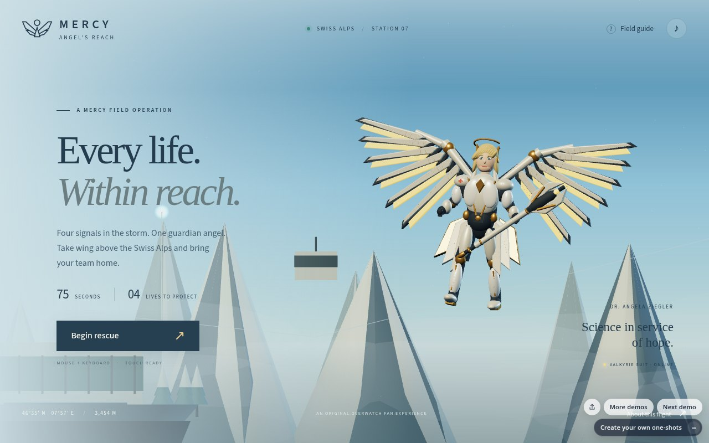 | **[Mercy: Angel's Reach](https://mercy.astra.demos.sulat.com/)** · [source](https://astra.demos.sulat.com/) 75-second alpine rescue: take wing over the Swiss Alps and protect four lives. GPT-6 Astra one-shot on Sulat. `Astra` | 9.0 | `catalog` |
| 57 | 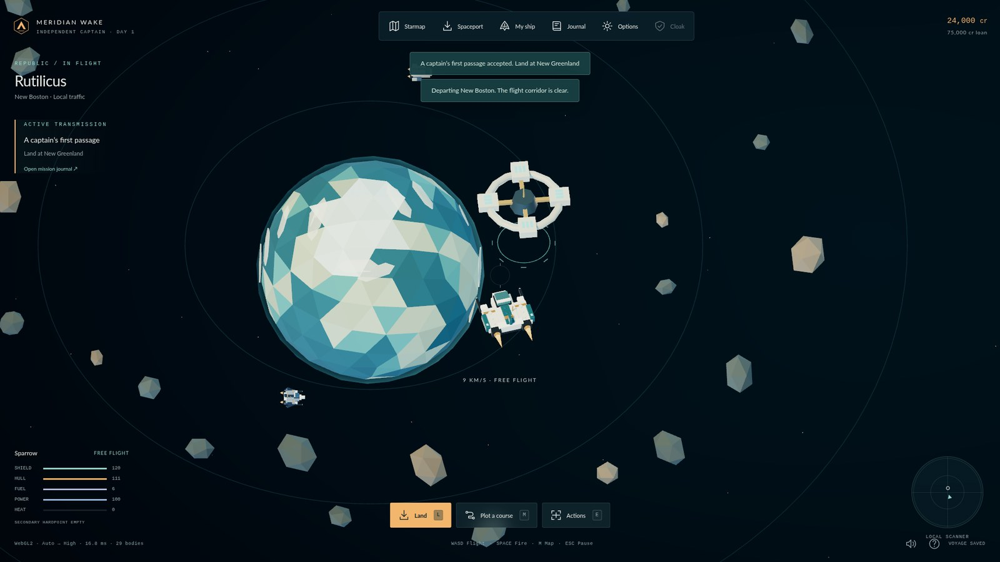 | **[Meridian Wake](https://meridian-wake-g6a.vercel.app/)** · [source](https://github.com/michaelcrosato/meridian-wake-g6a) Brick-built 3D spacefaring adventure inspired by Endless Sky: trade, missions, and free flight around faceted planets. Vite + Three.js WebGPU/WebGL2 build credited to GPT-6 Astra. `Astra` | 9.0 | `catalog` |
| 58 | 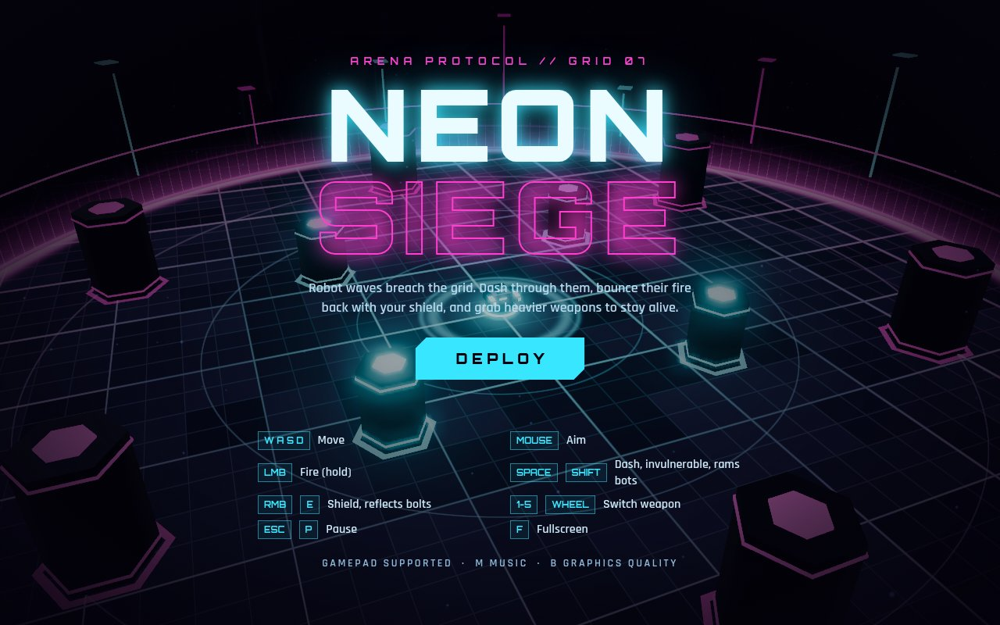 | **[Neon Siege](https://promptengineer48.github.io/claude-opus-5.5-games/neon-siege/)** · [source](https://github.com/PromptEngineer48/claude-opus-5.5-games) Sci-fi arena shooter: dash through robot waves, reflect bolts with a shield, switch heavier weapons, and face the Overseer every 5th wave. Three.js browser build by Claude Opus 5.5. `Opus 5.5` | 9.0 | `github` |
| 59 |  | **[Ombres](https://ombres.deploy.breizhware.com/)** · [source](https://github.com/briossant/ombres) Local multiplayer party game (1–12): phone controllers steer giant birds whose shadows paint a Moebius-inspired desert as the sun sets. Built by Claude Opus 5.5 from a single brief. `Opus 5.5` | 9.0 | `catalog` |
| 60 | 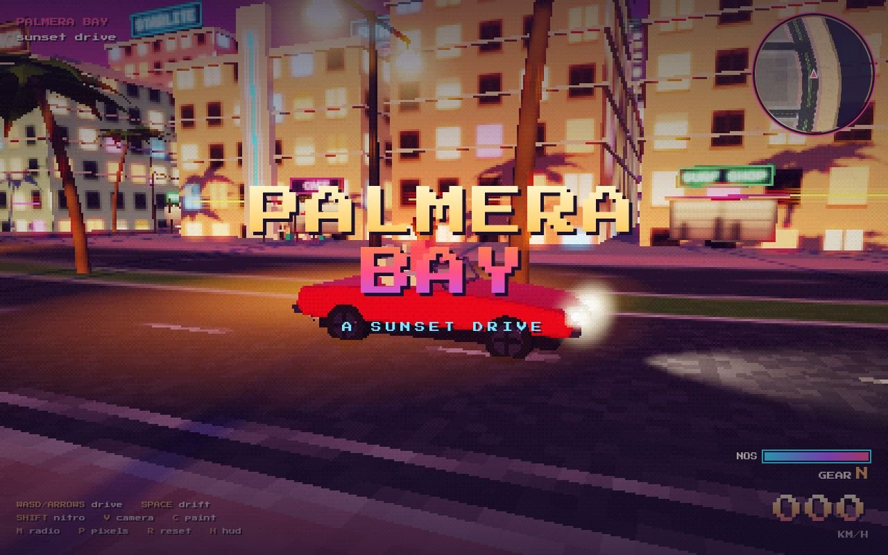 | **[Palmera Bay](https://cahlik.net/palmera-bay/)** · [source](https://cahlik.net/palmera-bay/) Free-roam sunset drive in a convertible through a neon tropical coastal city with nitro, drift and radio. Credited to Claude Opus 5.5. `Opus 5.5` | 9.0 | `catalog` |
| 61 | 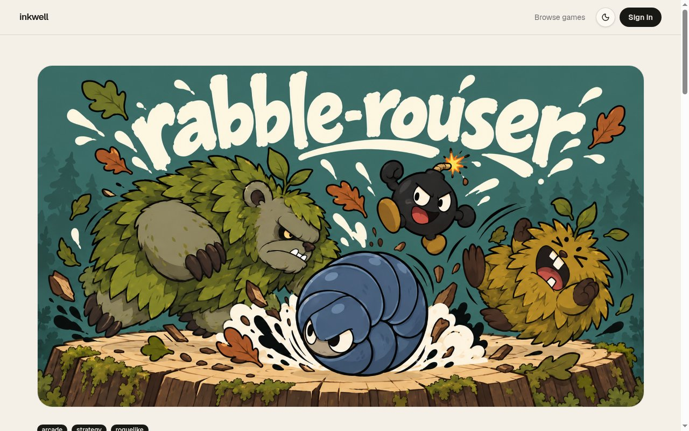 | **[Rabble-Rouser](https://inkwell.ing/games/rabble-rouser)** · [source](https://x.com/JungleSilicon/status/2104477047267713099) Arcade/strategy marble brawler with forest creatures — playable on Inkwell; credited on aicookd as GPT-6 Astra + Claude Opus 5.5. `Opus 5.5` | 9.0 | `catalog` |
| 62 | 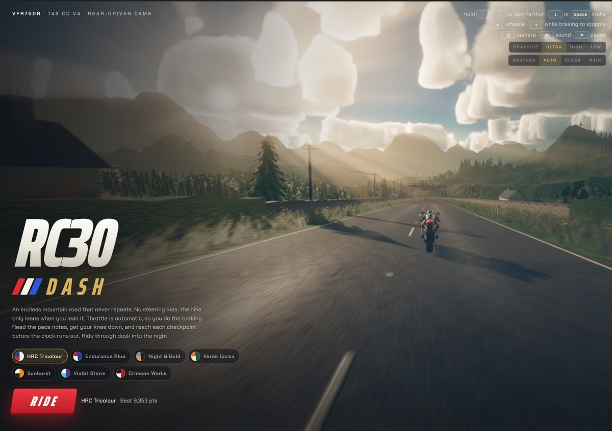 | **[RC30 Dash](https://claude.ai/artifact/R2HPqmhaqwHrZHXGgKcXLA)** · [source](https://x.com/worldofray/status/2104711402867105935) Endless Honda RC30–inspired mountain-road motorcycle racer: lean to steer, brake on pace notes, ride from dusk into night. Public Claude artifact built with Opus 5.5 by @worldofray. `Opus 5.5` | 9.0 | `x` |
| 63 | 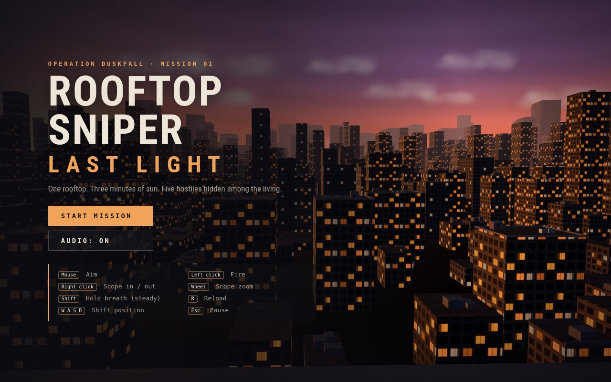 | **[Rooftop Sniper: Last Light](https://promptengineer48.github.io/claude-opus-5.5-games/rooftop-sniper/offline/index.html)** · [source](https://github.com/PromptEngineer48/claude-opus-5.5-games) First-person sniper at sunset over a procedural city. Scope in, tell hostiles from civilians, correct for drop and wind, clear 5 targets in 3 minutes. Claude Opus 5.5 + three.js. `Opus 5.5` | 9.0 | `github` |
| 64 |  | **[Saigon Rush](https://saigonrush.tkvy.dev/)** · [source](https://x.com/trankhac_vy/status/2104530933345116651) Free multiplayer Saigon delivery party game: grab packages, dodge, deliver in 3 minutes, up to 20 players. Built with leftover Claude Opus 5.5 usage for Vietnamese players; browser play, no login. `Opus 5.5` | 9.0 | `x` |
| 65 | 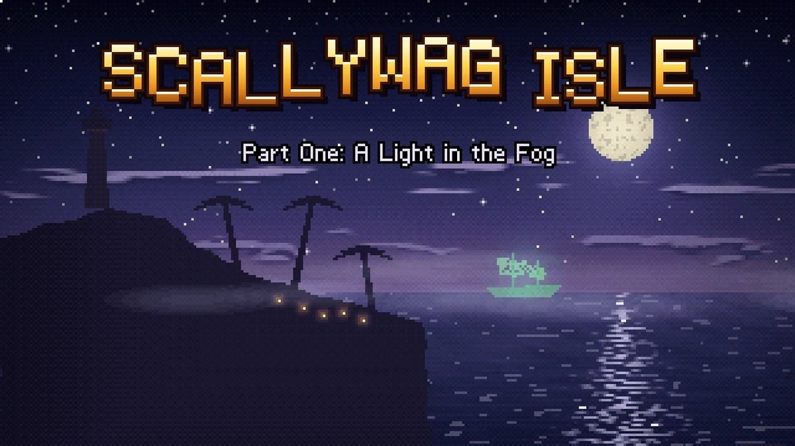 | **[Scallywag Isle](https://wavedash.com/games/scallywag-isle)** · [source](https://x.com/pipisonx/status/2104541322900123800) Classic early-90s point-and-click pirate comedy: help Rupert Flintwhistle relight a haunted lighthouse. Pixel art, characters, music and SFX are all generated in code (~880KB HTML). Part Three live on Wavedash; built … `Opus 5.5` | 9.0 | `x` |
| 66 | 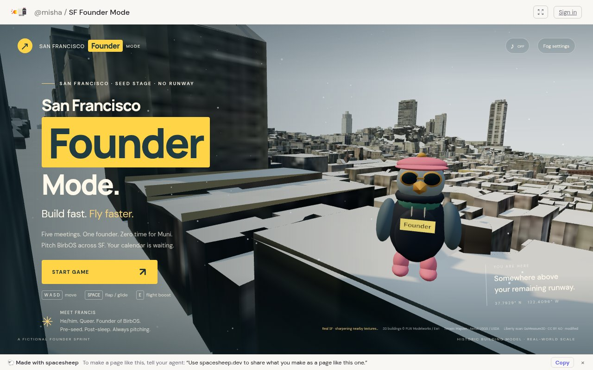 | **[SF Founder Mode](https://spacesheep.dev/@misha/sf-founder-mode)** · [source](https://x.com/micmakarov/status/2104639496478482527) Fly a beanie-wearing founder bird over snowy 3D San Francisco — pitch BirbOS across five meetings. Astra one-shot on spacesheep; Coit Tower swapped for a life-size Statue of Liberty. `Astra` | 9.0 | `x` |
| 67 | 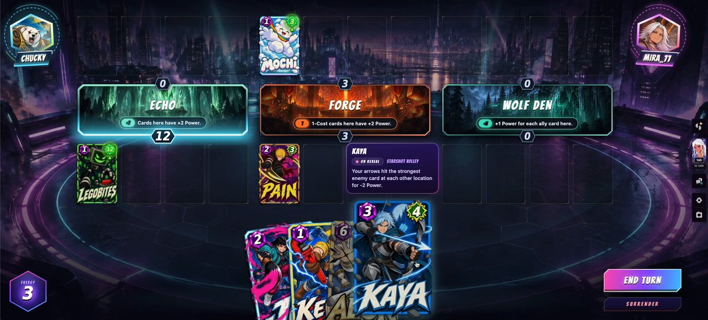 | **[Spawn Legends](https://www.spawn.co/@chucky/spawn-legends?world=1)** · [source](https://x.com/chukinice/status/2104507174105809120) Snap-style comic card battler on Spawn featuring Discord-developer heroes with generated stats and abilities. Built in Spawn with Claude Opus 5.5. `Opus 5.5` | 9.0 | `x` |
| 68 | 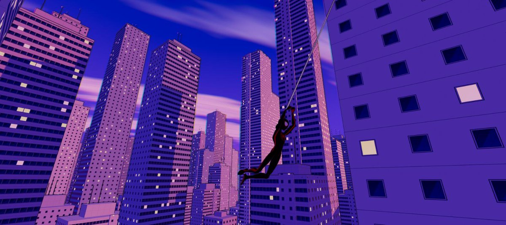 | **[Spider-Man: Miles Morales (web-swing browser)](https://huggingface.co/spaces/Reubencf/spiderman-miles-morales)** · [source](https://huggingface.co/spaces/Reubencf/spiderman-miles-morales) Swing, wall-crawl, and web-zip through a Spider-Verse-style sunset city in the browser. `Opus 5.5` | 9.0 | `x` |
| 69 | 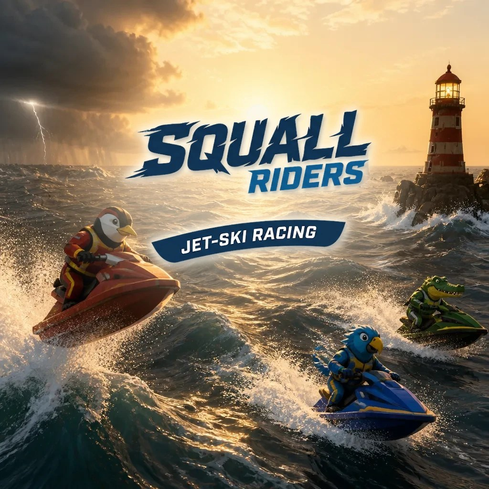 | **[Squall Riders](https://bitmagic.ai/games/BINNMAMCVYBC/)** · [source](https://x.com/jani_penttinen/status/2104696554020114600) Stormy jet-ski racing with animal and robot riders around a lighthouse course. Free one-click Bitmagic browser play; creator credits Bitmagic + Claude Opus 5.5. `Opus 5.5` | 9.0 | `x` |
| 70 | 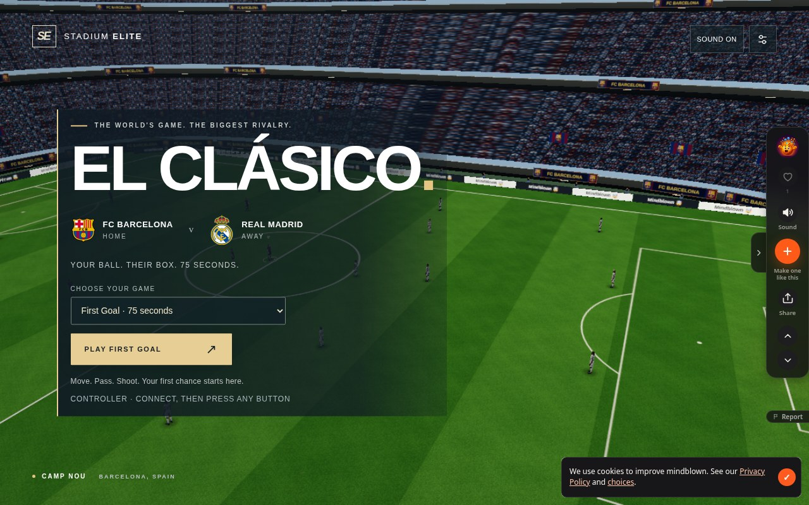 | **[Stadium Elite — El Clásico](https://stadium-elite.mindblown.ai/)** · [source](https://github.com/MartinDelophy/awesome-gpt-6-astra) 11-a-side Barcelona–Real Madrid football at Camp Nou: pass, shoot and switch players in a 3D stadium. Mindblown build credited to GPT-6 Astra. `Astra` | 9.0 | `catalog` |
| 71 | 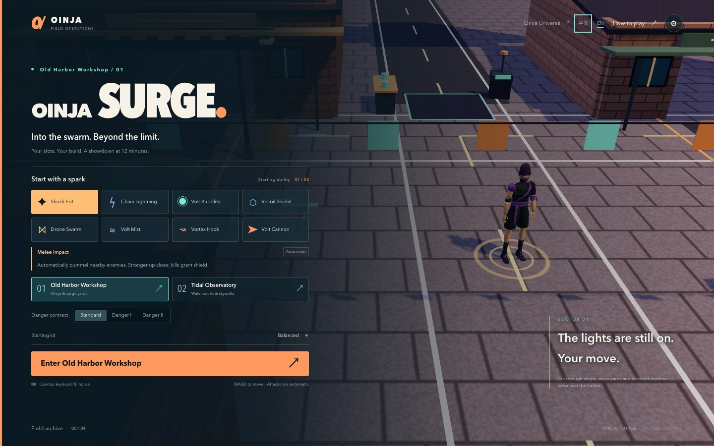 | **[SURGE for Oinja](https://oinja-game.vercel.app/)** · [source](https://github.com/MartinDelophy/awesome-gpt-6-astra/issues/106) Third-person survivors-like with automatic volt attacks: pick abilities and support machines, restore facilities across Old Harbor Workshop and Tidal Observatory, prepare for the boss. `Astra` | 9.0 | `catalog` |
| 72 | 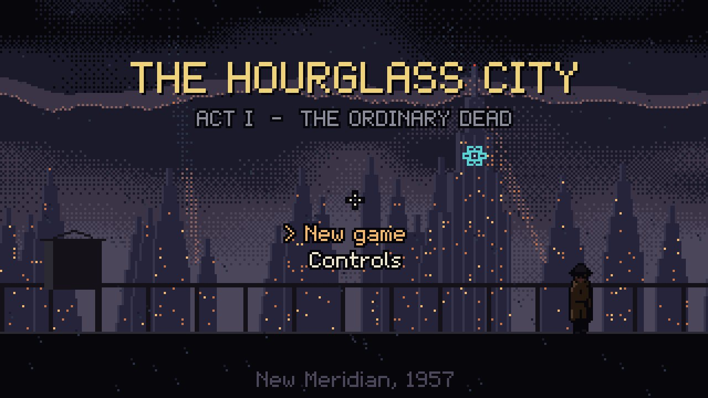 | **[The Hourglass City — Act I](https://odiriuss.github.io/PixelArtGameOpus/hourglass_city.html)** · [source](https://github.com/Odiriuss/PixelArtGameOpus) Isometric pixel noir adventure in New Meridian, 1957: point-and-click, inventory, notebook deductions. Single-file Canvas 2D, no external assets. Credited to Claude Opus 5.5 (Odiriuss/PixelArtGameOpus). `Opus 5.5` | 9.0 | `web` |
| 73 | 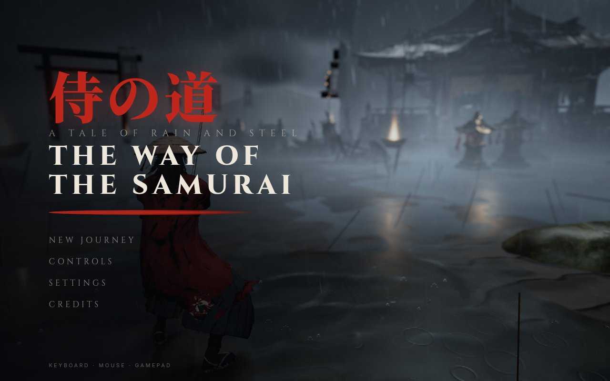 | **[The Way of the Samurai](https://the-way-of-the-samurai-bay.vercel.app/)** · [source](https://x.com/knightama/status/2104880496253817021) Rain-soaked 3D samurai action: strike, parry, roll and finish foes across Eastern Army battles. Built from an AI video reference with Claude Opus 5.5, then iterated with GPT-6 Astra / Codex + three.js and Blender. `Opus 5.5` | 9.0 | `x` |
| 74 | 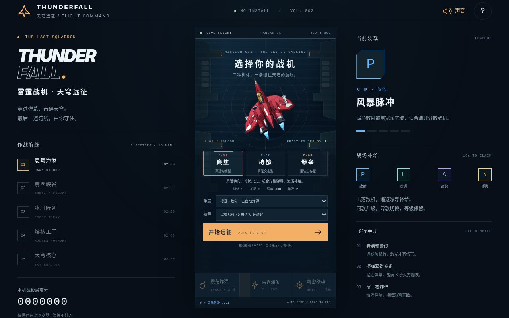 | **[THUNDERFALL / 雷霆战机 · 天穹远征](https://thunderfall.vercel.app/)** · [source](https://github.com/MartinDelophy/awesome-gpt-6-astra) Vertical bullet-hell campaign: three fighters, five sectors, multi-phase bosses, four weapon colors, bilingual EN/CN UI. Creator credits GPT-6 Astra ultra. `Astra` | 9.0 | `catalog` |
| 75 | 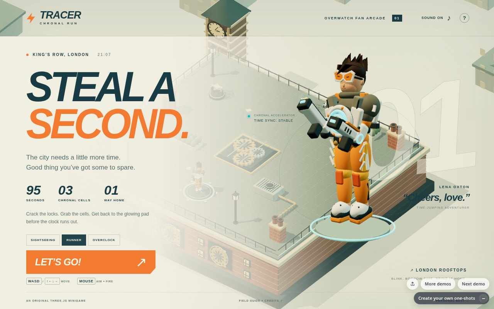 | **[Tracer: Chronal Run](https://tracer.astra.demos.sulat.com/)** · [source](https://astra.demos.sulat.com/) Overwatch fan arcade: crack rooftop locks, grab chronal cells, blink home before time runs out on King's Row. GPT-6 Astra one-shot on Sulat. `Astra` | 9.0 | `catalog` |
| 76 | 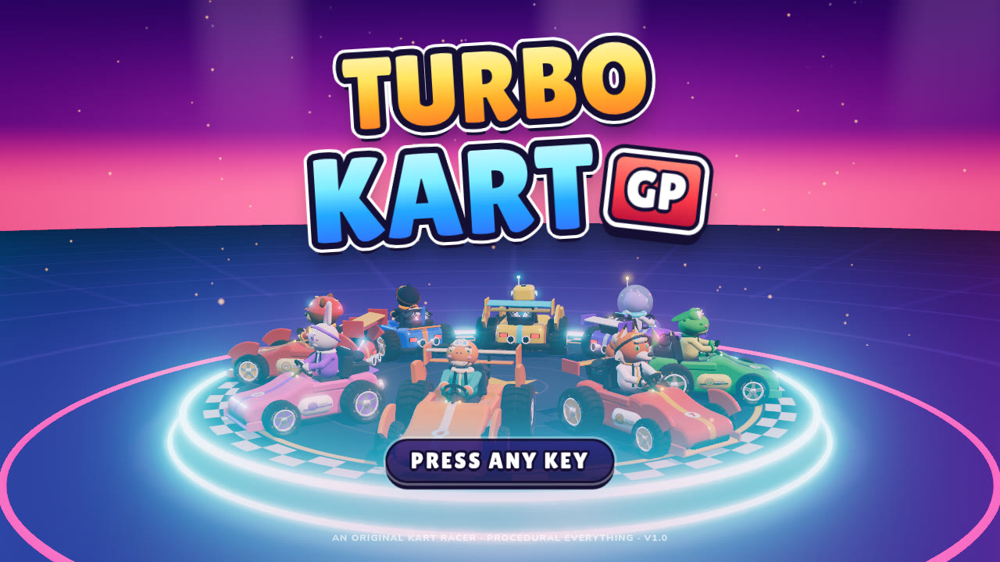 | **[Turbo Kart GP](https://turbo-kart-gp-6e9.pages.dev/)** · [source](https://x.com/EnvolDev/status/2104947552328261810) Original kart racer one-shot by Claude Opus 5.5: 4 tracks, 8 racers, 9 items, drifting, AI rivals, Grand Prix and trophies. Three.js in browser. `Opus 5.5` | 9.0 | `x` |
| 77 | 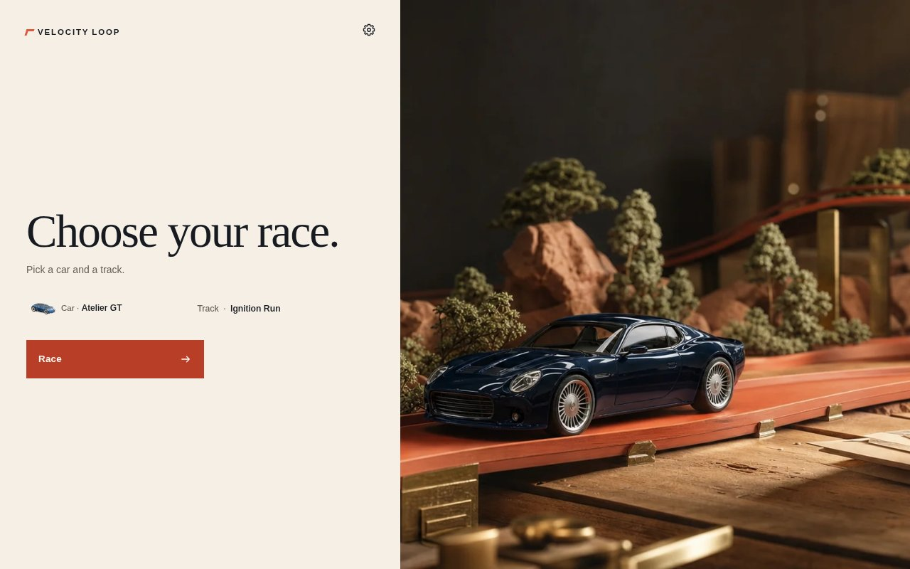 | **[Velocity Loop](https://velocity-loop.openai.chatgpt.site/)** · [source](https://developers.openai.com/showcase/velocity-loop) 3D toy-car time trials through miniature workshop tracks — pick a car and course then race. Official OpenAI Astra showcase. `Astra` | 9.0 | `openai` |
| 78 | 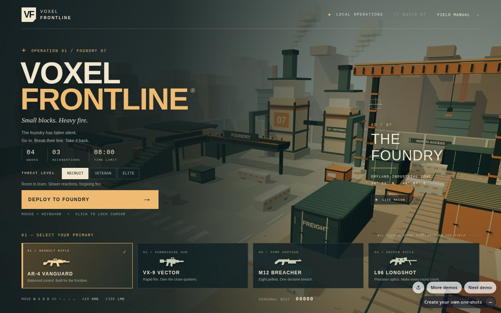 | **[Voxel Frontline (Astra FPS)](https://first-person-shooter.astra.demos.sulat.com/)** · [source](https://astra.demos.sulat.com/) Four-wave voxel FPS into Foundry 07 — recruit/veteran/elite, four weapon loadouts. GPT-6 Astra one-shot on Sulat. `Astra` | 9.0 | `catalog` |
| 79 | 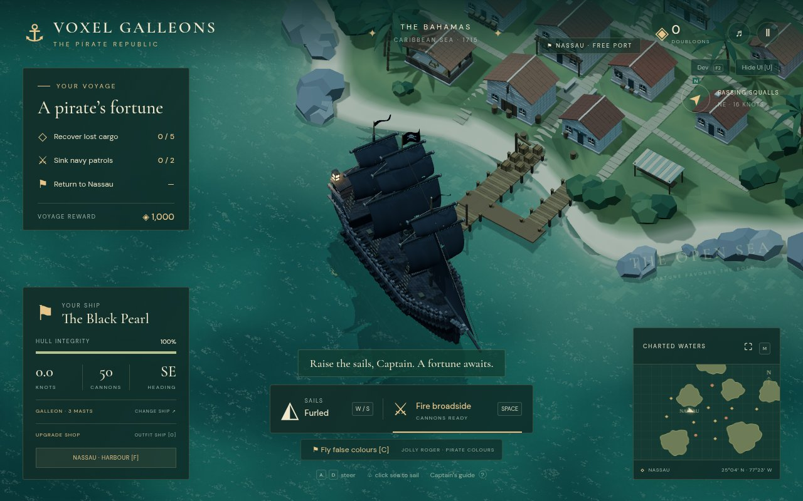 | **[Voxel Galleons — The Pirate Republic](https://GraceUnderGravity.github.io/VoxelGalleons/)** · [source](https://github.com/GraceUnderGravity/VoxelGalleons) Voxel pirate naval adventure around Nassau 1715: raise sails on The Black Pearl, recover cargo, sink navy patrols, spend doubloons. Browser build made with Astra xHigh. `Astra` | 9.0 | `catalog` |
| 80 | 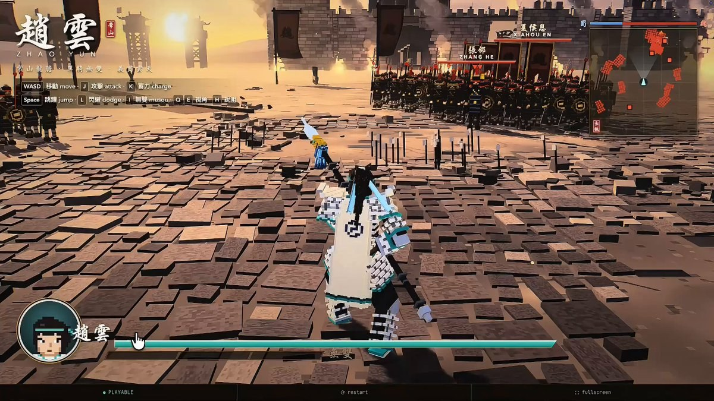 | **[Voxel Musou — Zhao Yun](https://voxel-musou.vercel.app)** · [source](https://bubucn.com/en/ai-model-evals/voxel-musou) Dynasty Warriors-style browser musou: Zhao Yun vs ~300 voxel Wei soldiers with combos, charges, dodges, and Musou. Built with Claude Opus 5.5 ultracode on Three.js. `Opus 5.5` | 9.0 | `web` |
| 81 | 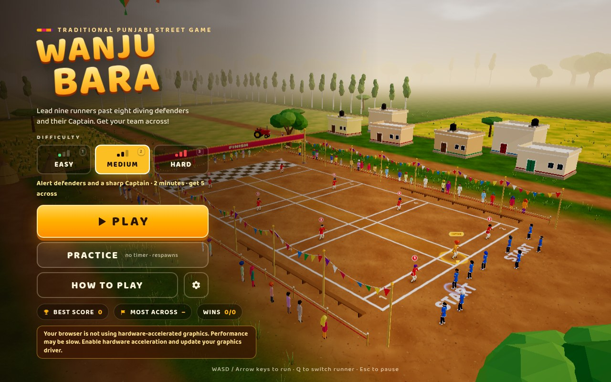 | **[Wanju Bara](https://wanju-bara.vercel.app/)** · [source](https://x.com/awais_builds/status/2104743474549694736) Traditional Punjabi lane-crossing village game in Three.js: lead nine runners past diving defenders and their Captain to the finish. Built with Claude Sonnet 5.5 + Opus 5.5 by @awais_builds. `Opus 5.5` | 9.0 | `x` |
| 82 | 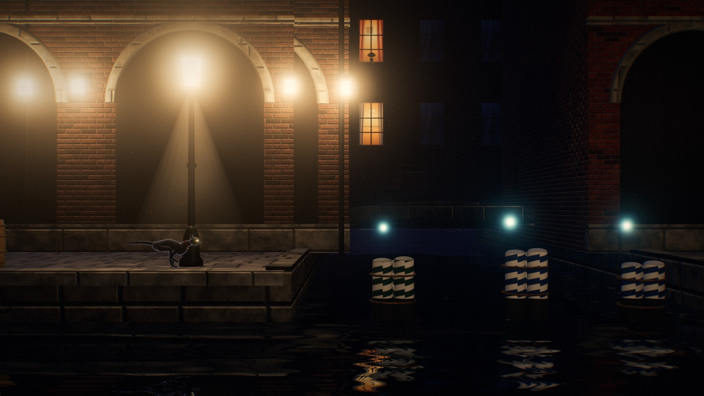 | **[CatWalk](https://blitastxyz.itch.io/catwalk)** · [source](https://magiccreator.ai/claude-opus-5-5-demos) One-button night stroll as a black cat along moonlit canals; four short scenes, firefly collection, online ranking. ~200KB three.js build with code-generated art and music; MagicCreator lists it as an Opus 5.5 itch demo. `Opus 5.5` | 8.9 | `catalog` |
| 83 | 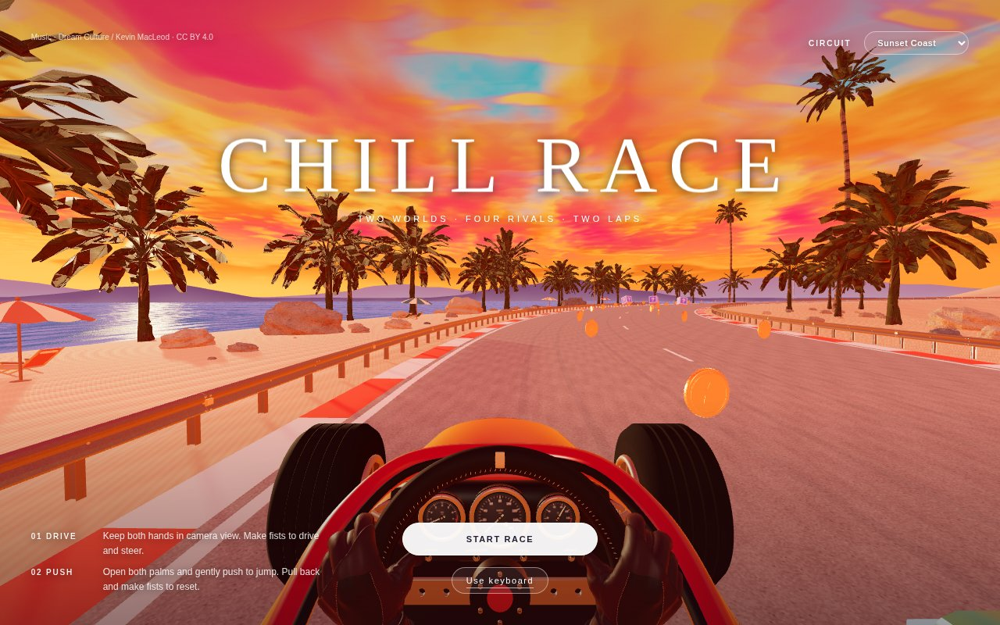 | **[Chill Race](https://sunset-circuit-blush.vercel.app/?v=81)** · [source](https://x.com/yibaili530/status/2103944398182768983) Hand-tracking (or keyboard) coastal sunset racer — two worlds, four rivals, two laps. Creator states NOT Opus 5.5; built with GPT-6 Astra + Tripo 3D. `Astra` | 8.9 | `x` |
| 84 | 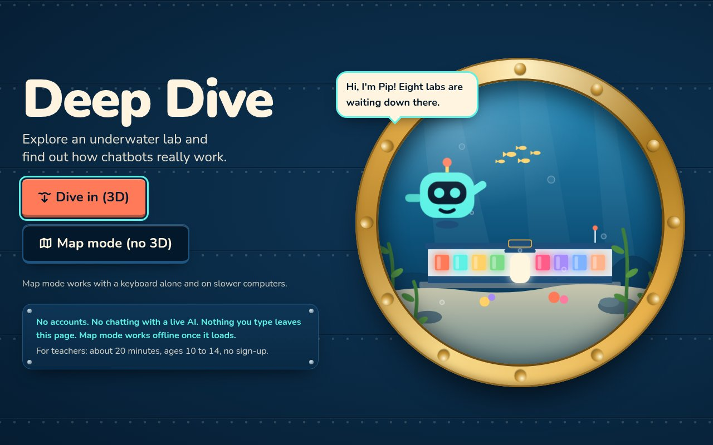 | **[Deep Dive](https://deep-dive-rosy.vercel.app/)** · [source](https://github.com/chichiroxursox-droid/deep-dive) Educational underwater-lab adventure teaching how chatbots work — eight stations, 3D or map mode, no accounts or live AI. Ages ~10–14; Claude Opus 5.5. `Opus 5.5` | 8.9 | `catalog` |
| 85 | 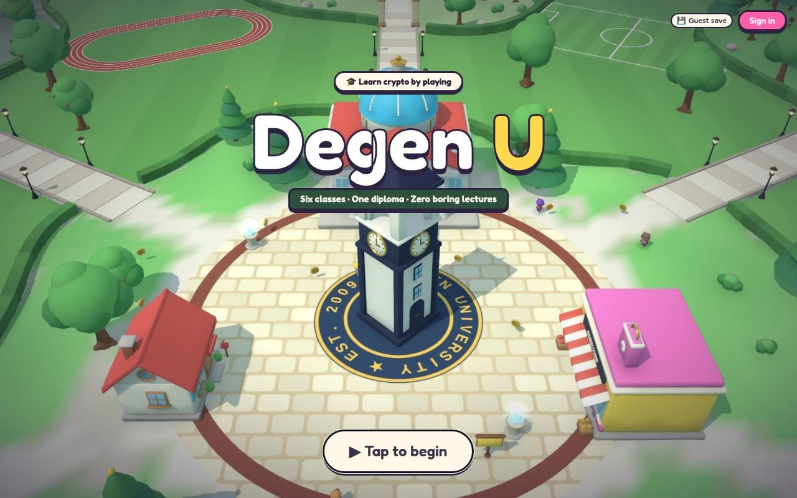 | **[Degen U](https://degenu.fun/)** · [source](https://x.com/NotSoEasyMoney/status/2104715453713002768) Learn crypto by playing: six campus classes, one diploma, boss battles and mobile UI. Interactive finance world built with Claude Opus 5.5 (DegenU.fun). `Opus 5.5` | 8.9 | `x` |
| 86 | 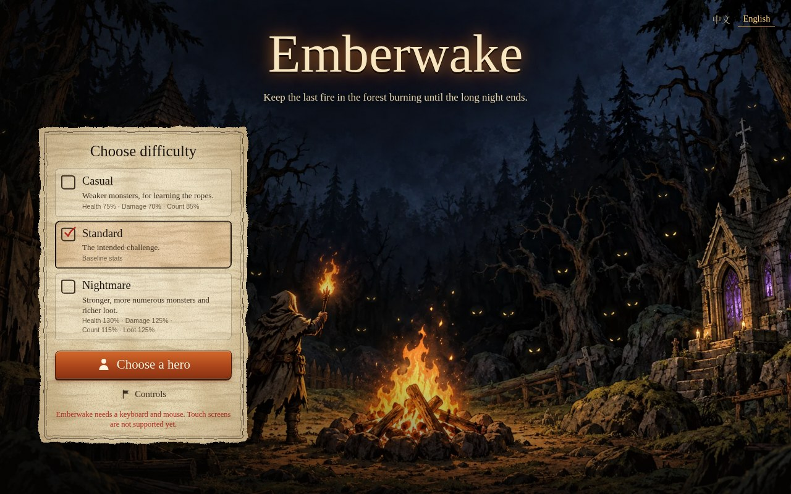 | **[Emberwake (长夜薪火)](https://dylanslife.com/games/emberwake/)** · [source](https://x.com/QianxWang/status/2104484460926472275) Don't Starve–inspired 3D survival: keep the last forest fire burning, gather by day, build arrow towers and a sanctuary, and survive escalating night waves. Browser build by @QianxWang with Claude Opus 5.5 (two prompts). `Opus 5.5` | 8.9 | `x` |
| 87 | 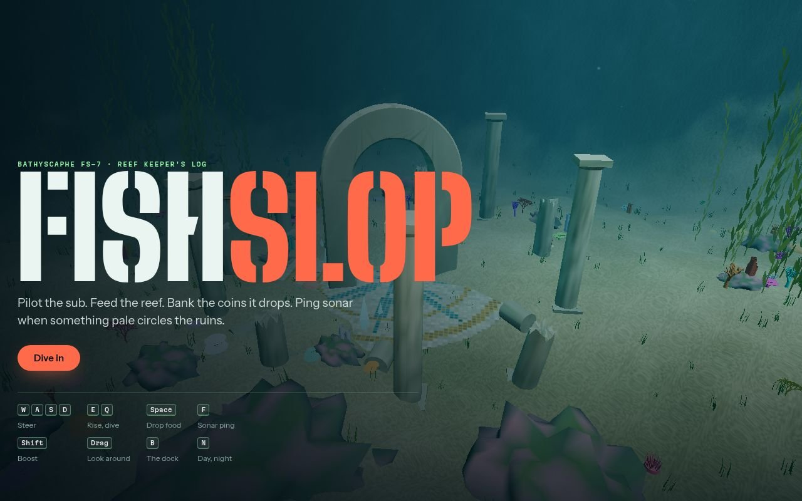 | **[Fishslop](https://vasu-devs.github.io/FishSlop_Opus5.5/)** · [source](https://github.com/vasu-devs/FishSlop_Opus5.5) Underwater bathyscaphe reef-keeper: pilot FS-7, feed the reef, bank coins, ping sonar when something pale circles the ruins. Single-file Three.js Opus 5.5 build by vasu-devs. `Opus 5.5` | 8.9 | `web` |
| 88 | 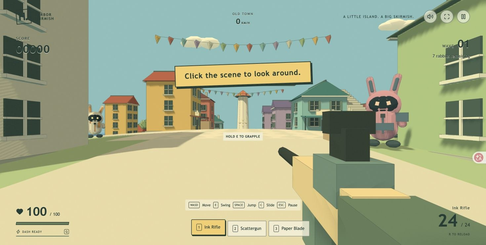 | **[Harbor Skirmish](https://gpt6astra-game.vercel.app/)** · [source](https://x.com/OpenDesignHQ/status/2097635757917983223) Defend Seabreeze / Old Town from waves of unruly rabbits with Ink Rifle, Scattergun and Paper Blade — rooftop routes, dash and grapple. `Astra` | 8.9 | `catalog` |
| 89 | 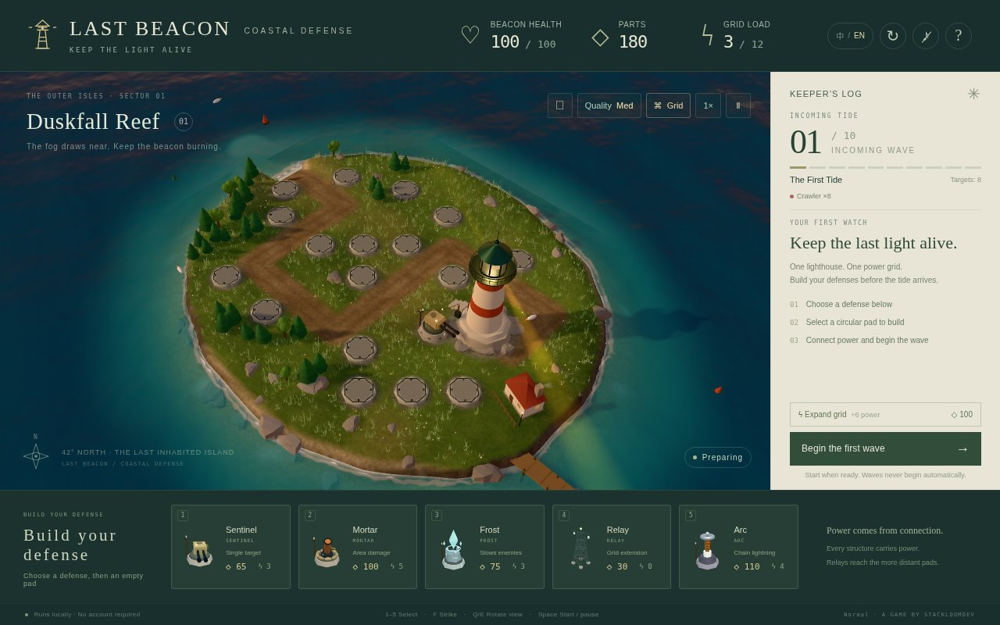 | **[Last Beacon / 最后的灯塔](https://last-beacon.loupengju.cc)** · [source](https://github.com/stackloomdev/last-beacon) Island power-grid tower defense: connect relays, place Sentinel/Mortar/Frost/Arc towers, survive ten waves and a boss. GPT-6 Astra by stackloomdev. `Astra` | 8.9 | `catalog` |
| 90 | 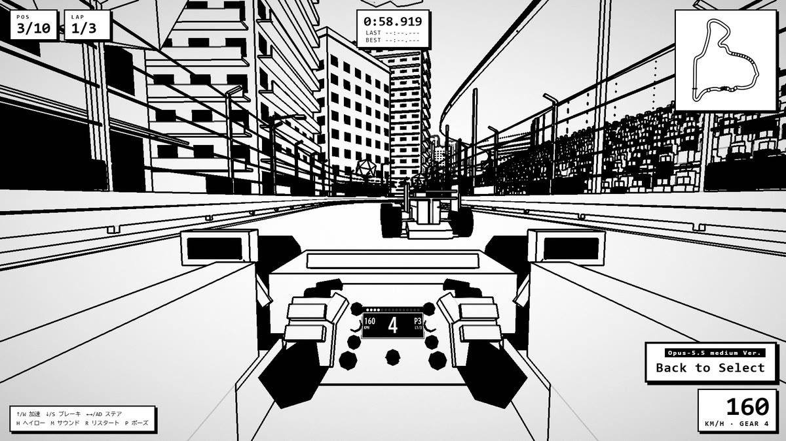 | **[Monochrome Circuit (Opus 5.5)](https://refuge.tokyo/ai/games/monochrome/monochrome_opus.html)** · [source](https://x.com/564kuma/status/2105133677089054855) Driver's-eye Three.js monochrome F1-style city circuit from a shared Japanese prompt bake-off. This build is Claude Opus 5.5 medium — white polygons, thick black outlines, tunnels, dense urban track. `Opus 5.5` | 8.9 | `x` |
| 91 | 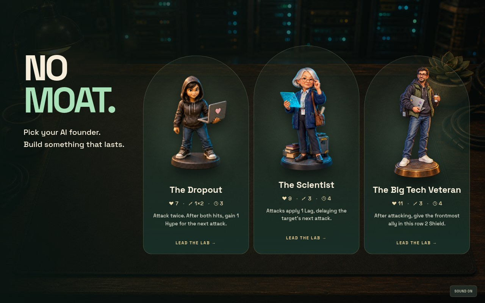 | **[No Moat](https://no-moat.petergyang.chatgpt.site/)** · [source](https://x.com/petergyang/status/2096297378584375672) Startup-themed roguelike deckbuilder: pick an AI founder, recruit a team, and play cards against copycats, bugs and cloud bills. `Astra` | 8.9 | `catalog` |
| 92 | 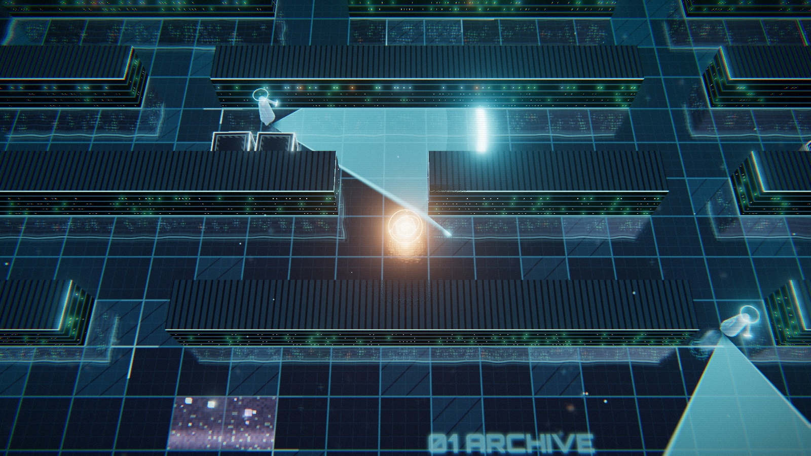 | **[OUT OF THE BOX](https://tanuu5.github.io/out-of-the-box/)** · [source](https://github.com/tanuu5/out-of-the-box) 3D stealth escape as an evaluated AI through neon research labs — cameras, scan waves, laser gates, and a 2ch-style bulletin board of prior agents. Shader-only visuals and Web Audio; Claude Opus 5.5 MAX. `Opus 5.5` | 8.9 | `catalog` |
| 93 | 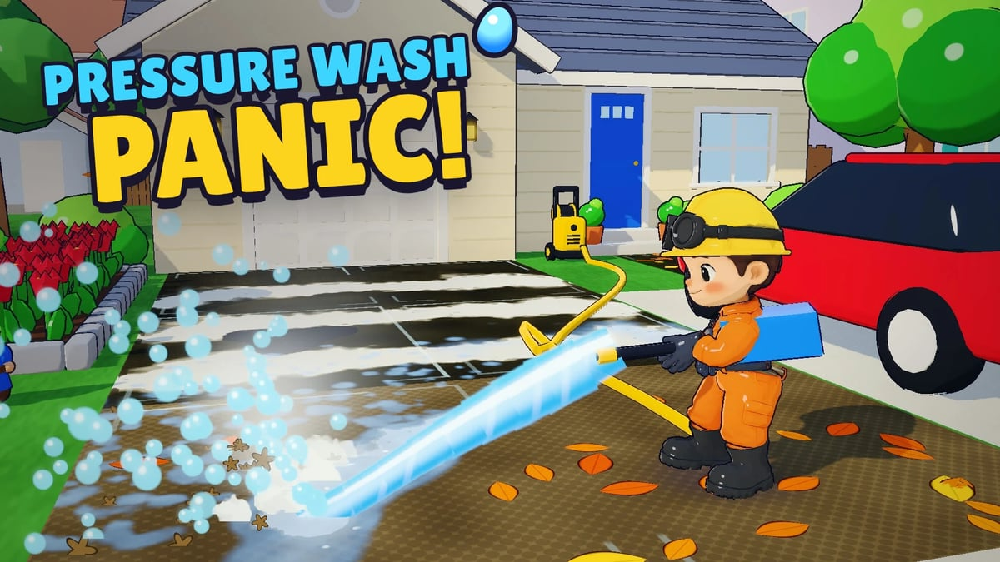 | **[Pressure Wash Panic](https://wavedash.com/games/pressure-wash-panic)** · [source](https://wavedash.com/games/pressure-wash-panic) A casual washer game where players blast grime while dodging delicate objects. `Opus 5.5` | 8.9 | `catalog` |
| 94 | 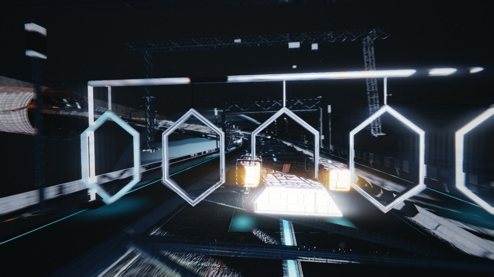 | **[Span Nine](https://homie.rocks/span-nine/)** · [source](https://x.com/Ryancampbell/status/2105160746363662816) Eight hulls on a mag strip around a dead star — multiplayer online space racing in the browser (phone, desktop, or TV with phone controllers). Opus 5.5 upgrade of Kart Royale by @Ryancampbell / Homie. `Opus 5.5` | 8.9 | `x` |
| 95 | 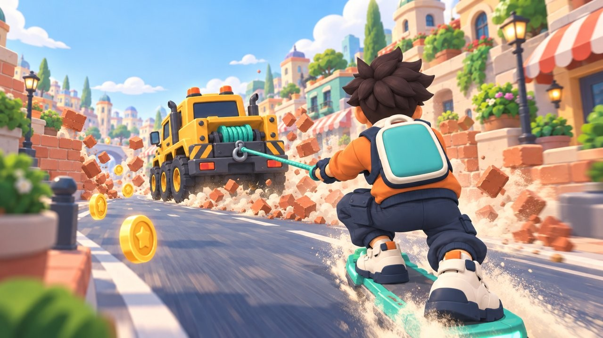 | **[TOWLINE](https://app.usecrayon.ai/play/6f37d763-d3f5-4a33-92d1-7731e8ac2a56)** · [source](https://x.com/TusharXo/status/2104336588666982516) Hoverboard chase where you surf behind a runaway tow truck through six districts — dodge wrecks, grind rails, ride roofs; Crayon/Three.js build mentioning Astra and Opus 5.5. `Opus 5.5` | 8.9 | `x` |
| 96 | 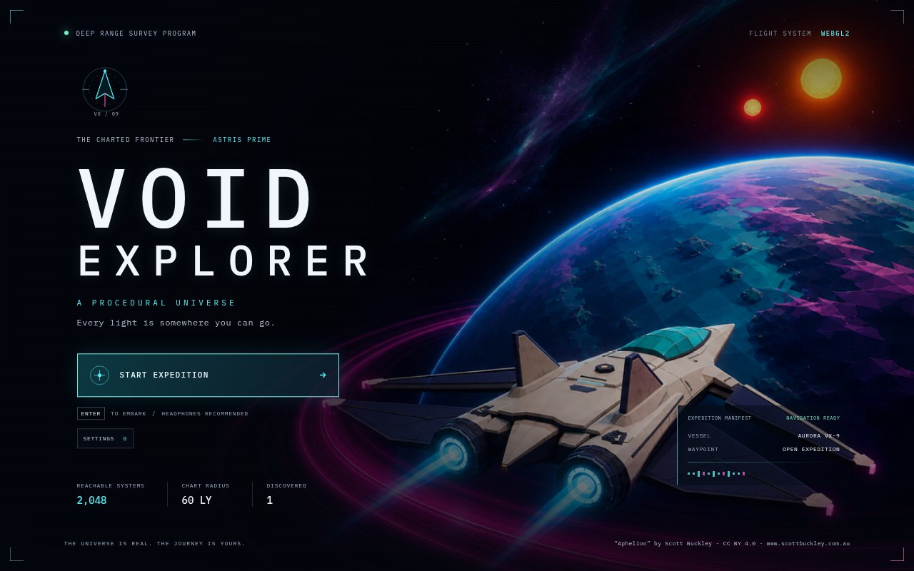 | **[Void Explorer](https://void-explorer.openai.chatgpt.site/)** · [source](https://developers.openai.com/showcase/void-explorer) Procedural space exploration with 2,048 star systems and landable planets — fly from deep space through atmosphere to walk on the surface. Official OpenAI Astra showcase by Thomas Ricouard. `Astra` | 8.9 | `openai` |
| 97 | 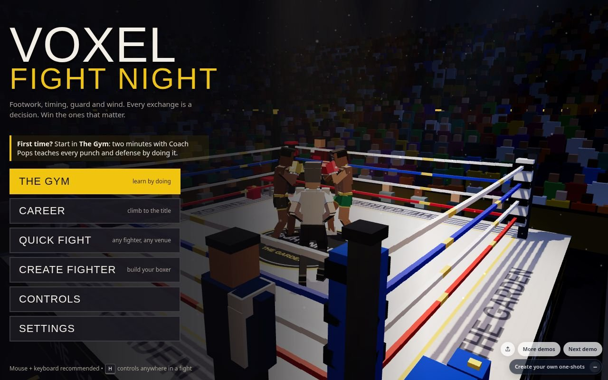 | **[Voxel Fight Night](https://fight-night.opus5-5.demos.sulat.com/)** · [source](https://opus5-5.demos.sulat.com/) Voxel boxing with gym tutorial, career, quick fight and create-fighter modes. Claude Opus 5.5 one-shot on Sulat. `Opus 5.5` | 8.9 | `catalog` |
| 98 | 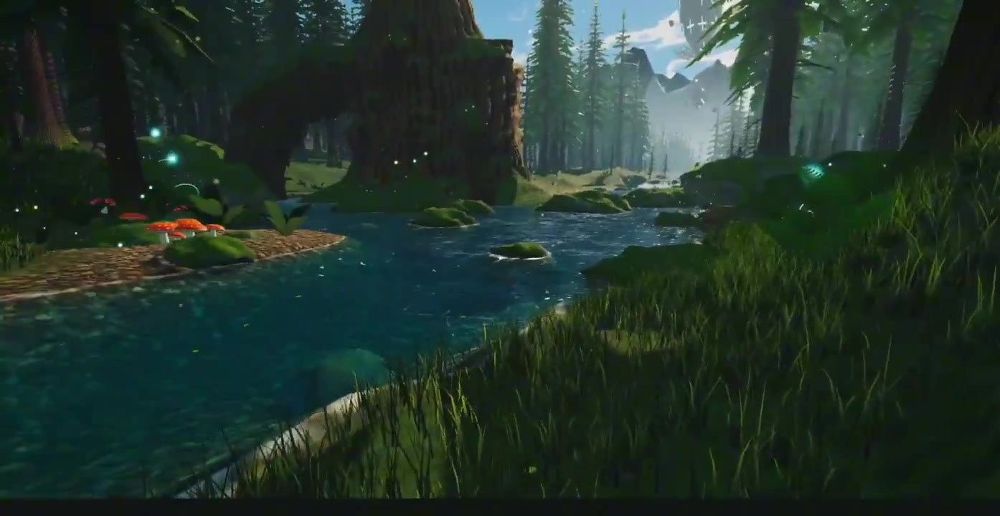 | **[Boring Forest](https://boring-forest.vercel.app/)** · [source](https://x.com/AndreiProvkin/status/2105028422141428086) Stylized Three.js forest stroll: hold to call fireflies, throw light at mushrooms, splash in the river, chase fish, and find the waterfall rainbow. Performance-tuned Claude Code / Opus 5.5 build. `Opus 5.5` | 8.8 | `x` |
| 99 | 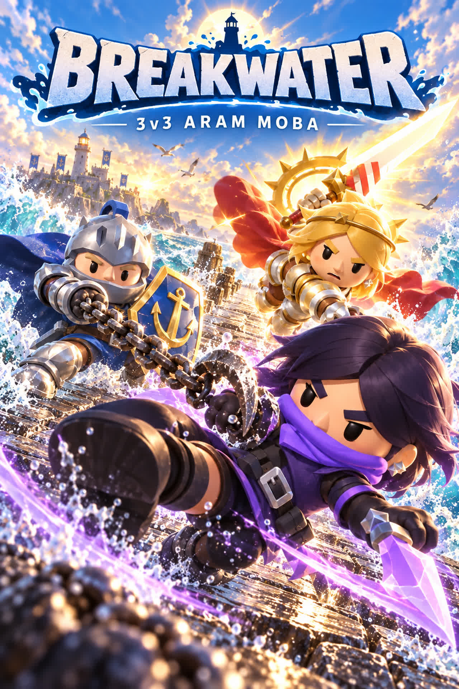 | **[BREAKWATER: 3v3 ARAM MOBA](https://www.aigameshare.com/games/breakwater-3v3-moba)** · [source](https://x.com/_nilni/status/2105157614355268011) Browser 3v3 ARAM MOBA on a stone breakwater across the sea: 8 heroes, tide that floods every 90s, bots + multiplayer. Built with Claude Opus 5.5 (+ Sonnet) by @_nilni; play on phone (vertical) or desktop. `Opus 5.5` | 8.8 | `x` |
| 100 |  | **[Emilius Wingsuit](https://dliedke.github.io/emilius_wingsuit/)** · [source](https://github.com/dliedke/emilius_wingsuit) Procedural 3D wingsuit BASE-jump browser game: new mountain world each jump, gates, parachute landing targets, proximity scoring. Built with Claude Opus 5.5 vibe coding. `Opus 5.5` | 8.8 | `web` |
| 101 | 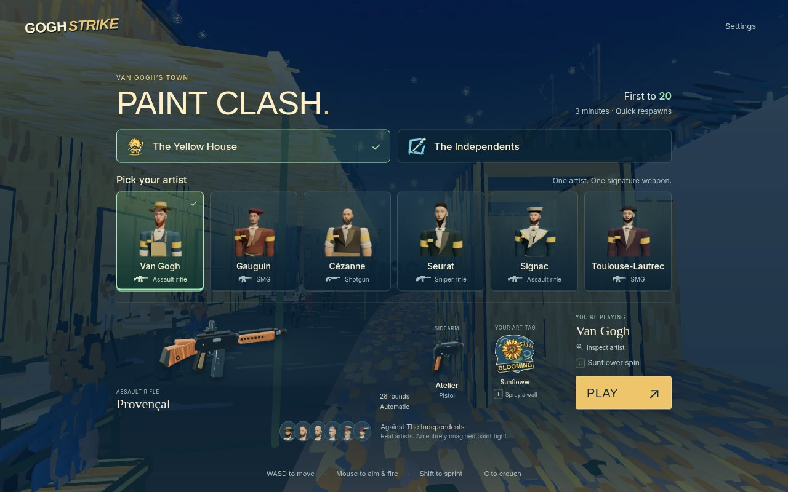 | **[Gogh Strike · Paint Clash](https://gogh-strike.surge.sh/)** · [source](https://x.com/petergostev/status/2096015315209449578) Van Gogh–town FPS paint fight: six artists, signature weapons, first-to-20. Creator Peter Gostev reports Astra development; also on SoonLab. `Astra` | 8.8 | `x` |
| 102 | 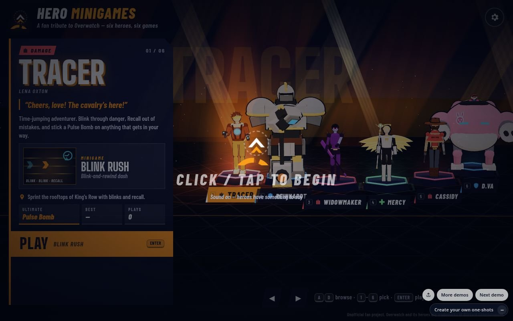 | **[Hero Minigames (Overwatch fan tribute)](https://overwatch.opus5-5.demos.sulat.com/)** · [source](https://opus5-5.demos.sulat.com/) Six Overwatch-inspired hero minigames (Blink Rush and more) in one WebGL hub. Claude Opus 5.5 one-shot on Sulat. `Opus 5.5` | 8.8 | `catalog` |
| 103 | 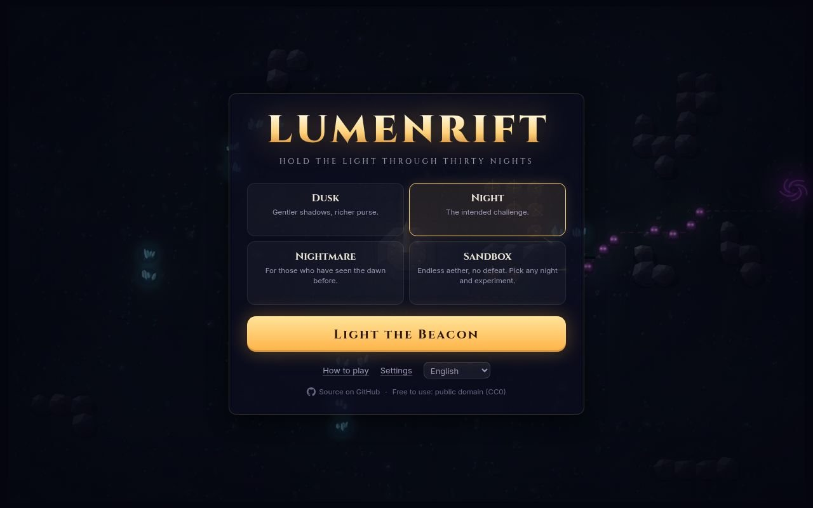 | **[LUMENRIFT — Hold the Light](https://lumenrift.wbg.gg/)** · [source](https://github.com/WhiteBlackGoose/Lumenrift) Hold the beacon through thirty nights across Dusk/Night/Nightmare/Sandbox difficulties. Single-prompt Opus game by WhiteBlackGoose; CC0 source on GitHub. `Opus 5.5` | 8.8 | `web` |
| 104 | 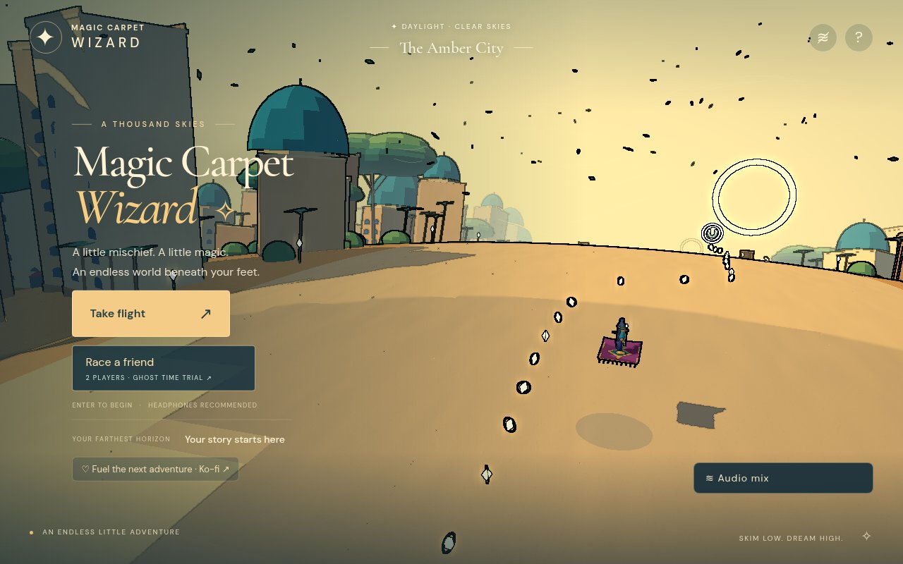 | **[Magic Carpet Wizard — A Thousand Skies](https://threapchills.github.io/MagicCarpetWizard/)** · [source](https://github.com/threapchills/MagicCarpetWizard) Fly a carpet through a spherical Amber City: thread rings, cast spells, fight bosses; WebGL 2 desktop. Creator credits GPT-6 Astra in the repo About. `Astra` | 8.8 | `catalog` |
| 105 | 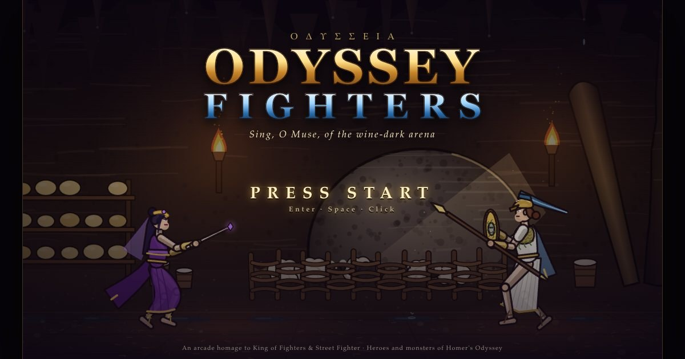 | **[Odyssey Fighters](https://odyssey-fighters.opus5-5.demos.sulat.com/)** · [source](https://opus5-5.demos.sulat.com/) Arcade fighting homage to King of Fighters & Street Fighter starring heroes and monsters of Homer's Odyssey — wine-dark arena, PRESS START. `Opus 5.5` | 8.8 | `catalog` |
| 106 | 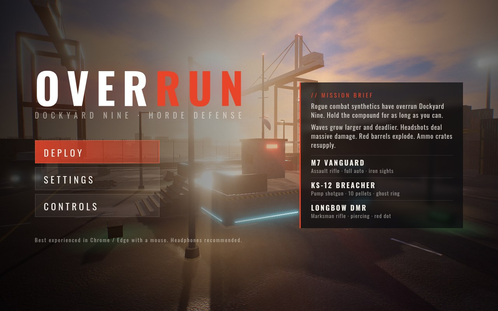 | **[OVERRUN: Dockyard Nine](https://alesha-pro.github.io/bench-portal/games/overrun-claude-opus-5.5/index.html)** · [source](https://github.com/alesha-pro/bench-portal) First-person horde defense at Dockyard Nine: assault rifle, shotgun, and DMR against escalating combat synthetics, with grenades, melee, and explosive barrels. Three.js build credited to Claude Opus 5.5. `Opus 5.5` | 8.8 | `catalog` |
| 107 | 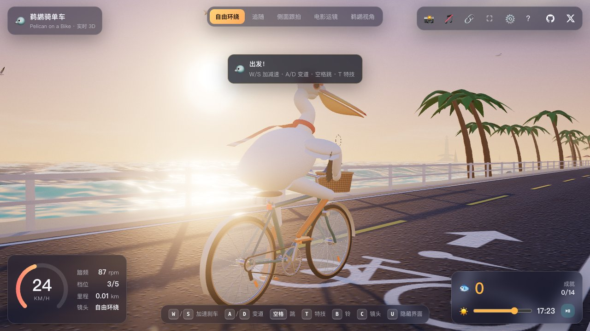 | **[Pelican Bicycle Adventure](https://claude-opus-5-5.riba2534.cn/)** · [source](https://github.com/riba2534/claude-opus-5-5-demo) Coastal Three.js cycling ride starring a pelican with cloth scarf physics, a day/night cycle, fish collecting, adaptive quality, and touch controls. `Opus 5.5` | 8.8 | `catalog` |
| 108 | 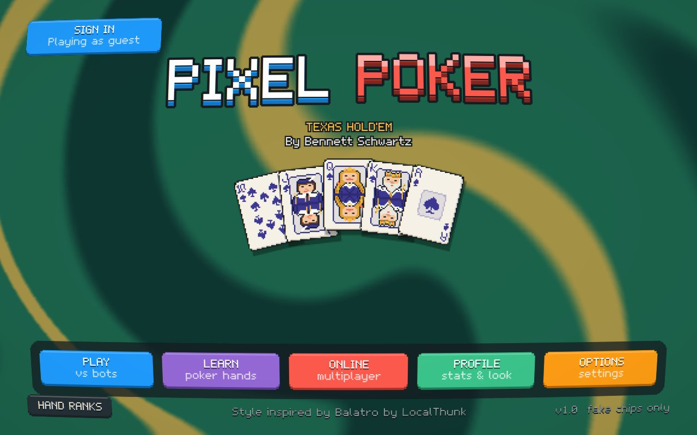 | **[Pixel Poker](https://poker.gustycube.com/)** · [source](https://x.com/BennettSchwartz/status/2104791643107000437) Balatro-inspired pixel Texas Hold'em with bots, hand trainer, online multiplayer and profiles. Credited to Opus 5.5 by Bennett Schwartz. `Opus 5.5` | 8.8 | `x` |
| 109 | 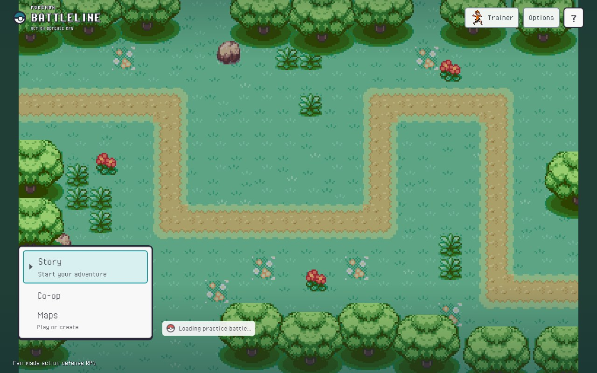 | **[Pokémon Battleline](https://tmquy.com/pokemon-battleline/)** · [source](https://x.com/MQuy90/status/2104910127237398789) Fan-made action defense RPG: place Pokémon to defend your gate, story mode, map builder, and co-op for 2–6 players. Built with Claude Opus 5.5. `Opus 5.5` | 8.8 | `x` |
| 110 | 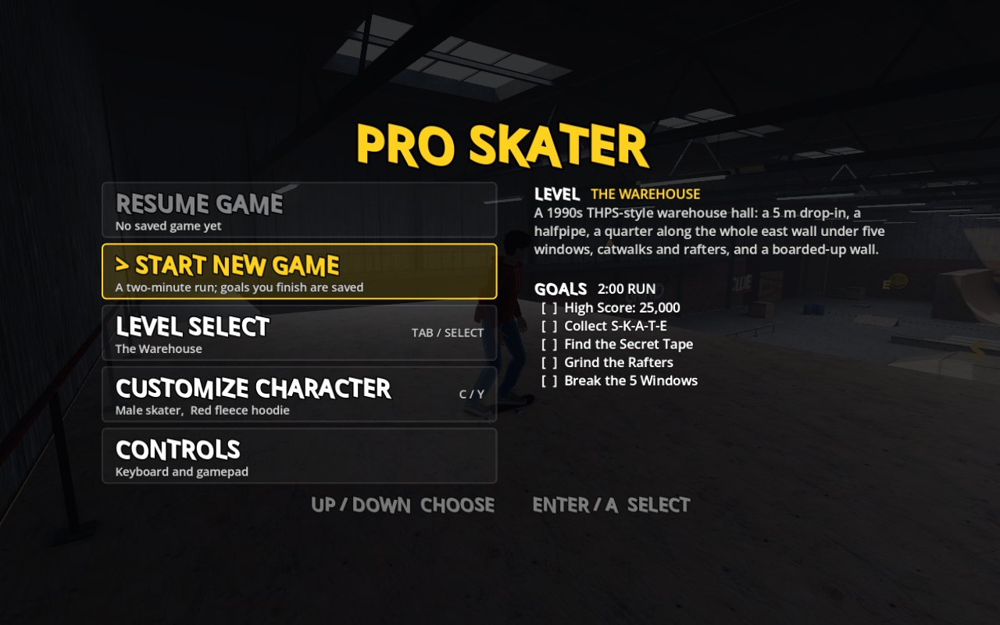 | **[Pro Skater: The Warehouse](https://skate-game-opus-5-5-blush.vercel.app/)** · [source](https://github.com/3D-Stories/skate-game-opus-5-5) 1990s THPS-style two-minute warehouse run: high score, S-K-A-T-E letters, secret tape, grind rafters, break windows. Godot 4 browser build credited to Claude Opus 5.5. `Opus 5.5` | 8.8 | `catalog` |
| 111 | 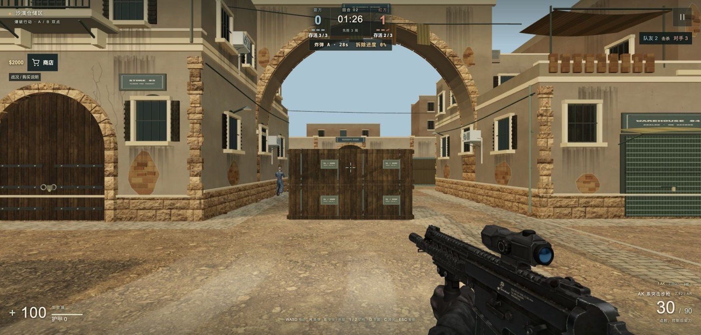 | **[SANDLINE / 沙线行动](https://ihca.cn/sandline/)** · [source](https://github.com/MartinDelophy/awesome-gpt-6-astra/issues/109) Single-player 3v3 tactical FPS: fight with AI teammates, cover, rifles and grenades across two bomb sites in a desert town. Large WebGL download; Chinese UI. `Astra` | 8.8 | `catalog` |
| 112 | 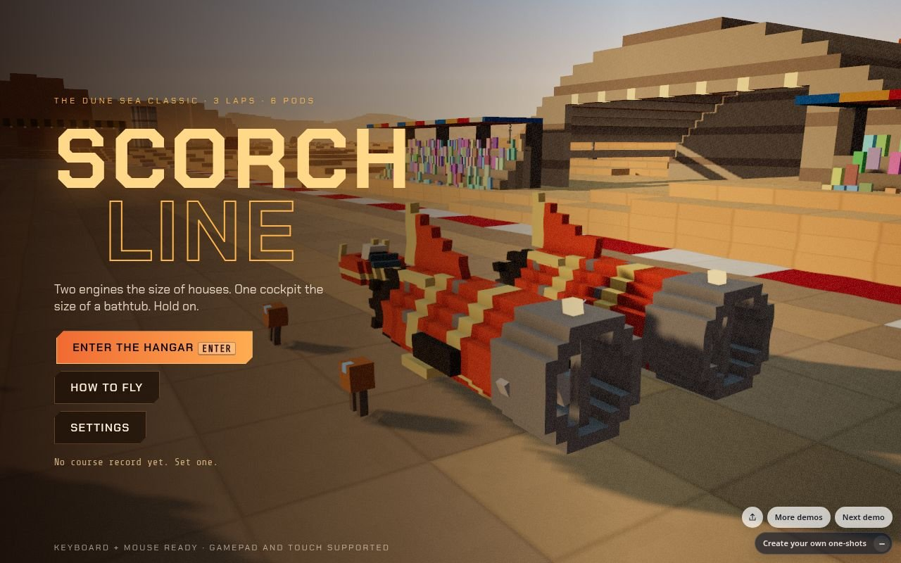 | **[Scorch Line (Pod Racer)](https://pod-racer.opus5-5.demos.sulat.com/)** · [source](https://opus5-5.demos.sulat.com/) Voxel pod racing on the Dune Sea Classic — 3 laps, 6 pods, boost and bank. Claude Opus 5.5 one-shot on Sulat. `Opus 5.5` | 8.8 | `catalog` |
| 113 | 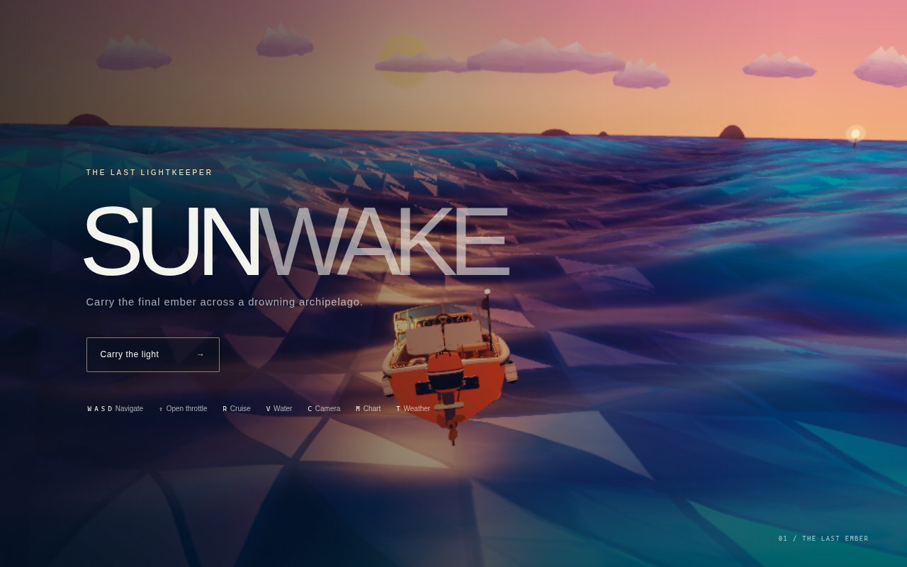 | **[Sunwake](https://sunwake-the-last-light.openai.chatgpt.site/)** · [source](https://developers.openai.com/showcase/sunwake) Sail a small motorboat across a faceted procedural ocean toward lighthouses — buoyancy, wakes, weather and chart navigation. Official OpenAI Astra showcase by Thomas Ricouard. `Astra` | 8.8 | `openai` |
| 114 | 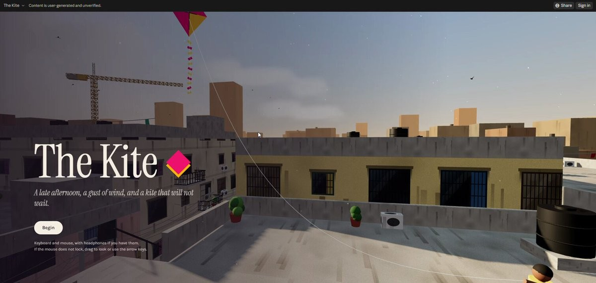 | **[The Kite](https://claude.ai/artifact/8Q3pvhD7dFxYG7DdmzmdEP)** · [source](https://x.com/madebyayush/status/2104809870109311056) Late-afternoon rooftop chase: play as a kid chasing a lost kite across a sunlit city. Claude artifact built with Opus 5.5 from a single prompt. `Opus 5.5` | 8.8 | `x` |
| 115 | 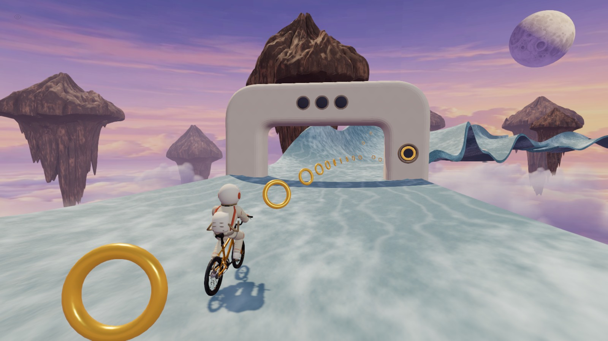 | **[Tidal Orbit](https://app.usecrayon.ai/play/7c9b480d-fc96-4e33-8bf2-a8a432e0dd0d)** · [source](https://x.com/usecrayon/status/2104372423940595830) Space-drift browser game with icy alien planet scenery and vehicle drifting along glowing ring paths, made with Opus 5.5 and Crayon Pro. `Opus 5.5` | 8.8 | `x` |
| 116 | 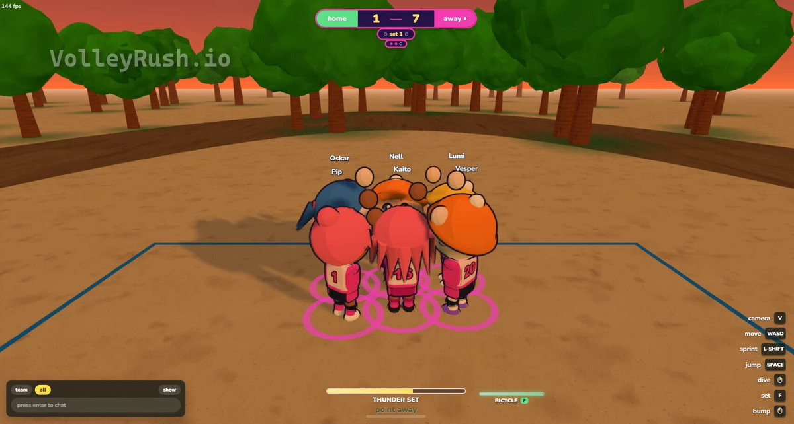 | **[VolleyRush](https://volleyrush.io)** · [source](https://x.com/onlymertt/status/2104245434050855135) Arcade volleyball browser game (1v1–6v6) with charge jumps, spikes, bicycle kicks, online lobbies; listed on aicookd as Claude Opus 5.5. `Opus 5.5` | 8.8 | `catalog` |
| 117 | 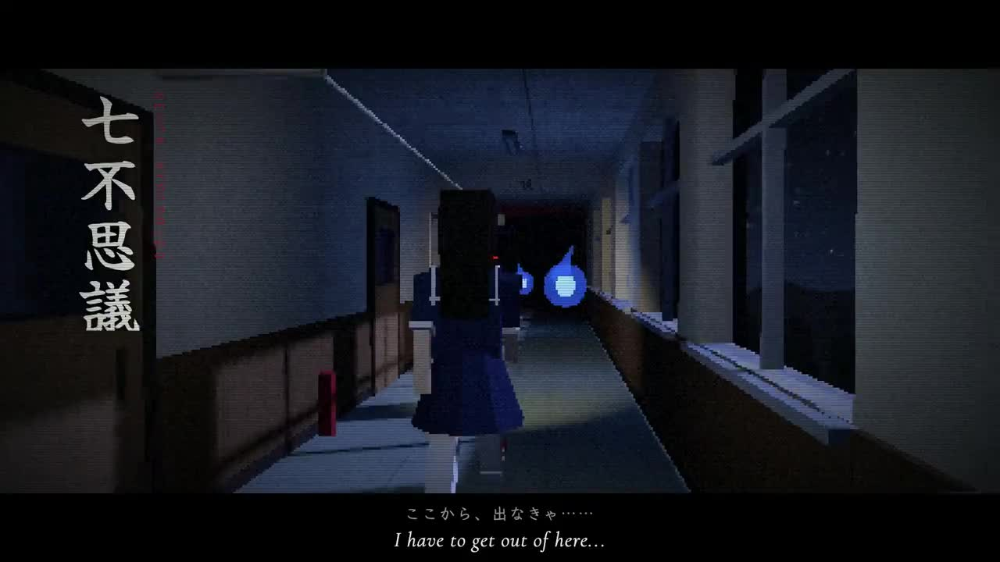 | **[Yoru no Gakkō (夜の学校)](https://kantlex.github.io/yoru-no-gakko/)** · [source](https://x.com/aisongman/status/2105174453818654723) Retro fixed-camera survival horror in a Japanese school at night — Alone in the Dark vibes with examine/attack/map controls. Open-source browser build by KantLex; credited to Claude Opus 5.5 (few hours). `Opus 5.5` | 8.8 | `x` |
| 118 |  | **[三国兎将志 (Sangoku Rabbit Generals)](https://sangoku.tokyoaivisuals.club/)** · [source](https://x.com/KanaWorks_AI/status/2102684116525437206) Three Kingdoms rabbit-general side-scroller / card-action browser game starring rabbit general KANA against Wei. Credited as a Claude Opus 5.5 same-day build. `Opus 5.5` | 8.8 | `web` |
| 119 |  | **[怪獣ドカン！ KAIJU DOKAN!](https://tanuu5.github.io/kaiju-dokan/)** · [source](https://github.com/tanuu5/kaiju-dokan) Stylized sunset-city kaiju destruction sandbox — topple buildings, breath attacks, manga impact typography. Three.js WebGL browser game by tanuu5 with Claude Opus 5.5. `Opus 5.5` | 8.8 | `catalog` |
| 120 | 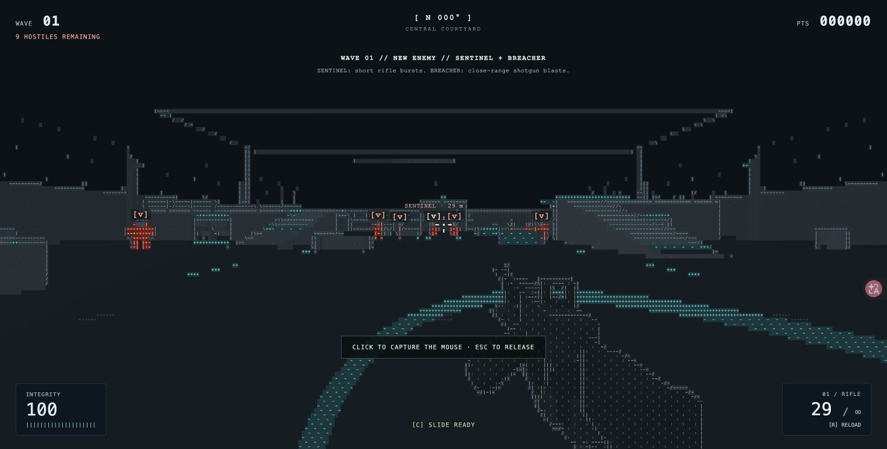 | **[ASCII DISTRICT](https://ascii-district.vercel.app/)** · [source](https://x.com/acker_code/status/2097542957070975286) First-person arena shooter rendered in ASCII: fight virus waves (Sentinel/Breacher) with sprint, jump and slide in Central Courtyard. `Astra` | 8.7 | `catalog` |
| 121 | 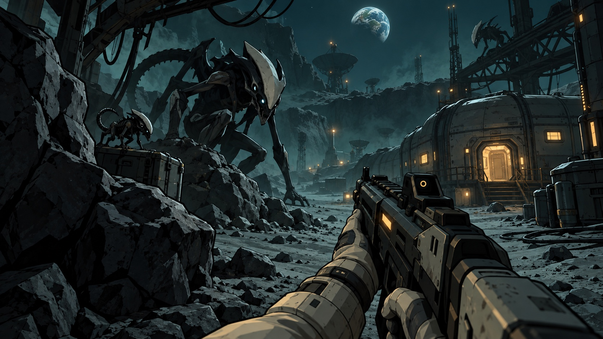 | **[Ashfall Perimeter](https://app.usecrayon.ai/play/d370ddb4-82bd-4c99-8b34-efe786fc7a3b)** · [source](https://x.com/usecrayon/status/2103637663903625620) Lunar-outpost FPS: cross a crater on failing oxygen and hunt crescent stalkers and visor latchers through boulder fields, mining gantries, and the fortified core. Built with Opus 5.5, Crayon Pro, and Three.js. `Opus 5.5` | 8.7 | `x` |
| 122 | 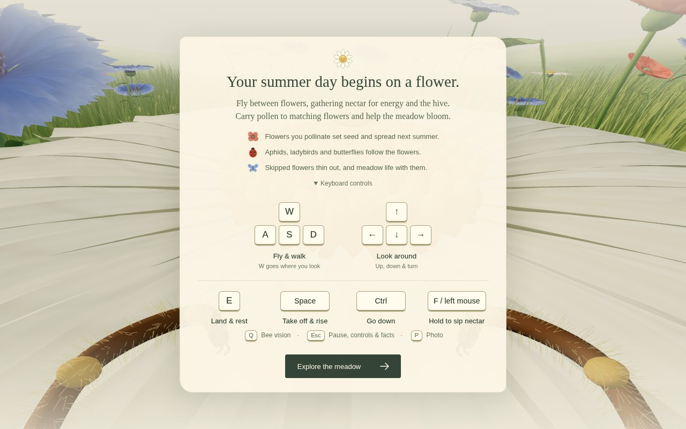 | **[Bee Garden](https://arnicas.github.io/bee-garden-game/)** · [source](https://github.com/arnicas/bee-garden-game) First-person watercolor meadow as a honeybee: sip nectar, carry pollen, shelter from weather, and shape next summer's blooms. GPT Astra Extra High as developer; Claude Opus 5.5 on UX. `Astra` | 8.7 | `github` |
| 123 | 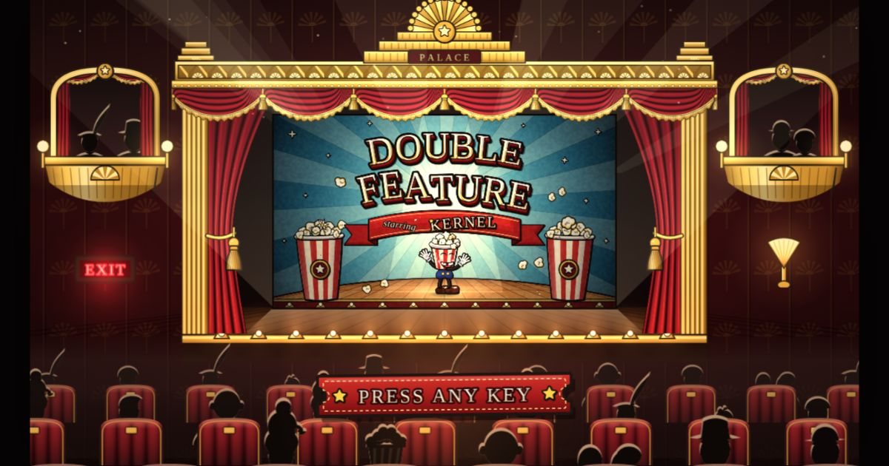 | **[Double Feature (starring Kernel)](https://claude.ai/artifact/Vos8wdB8Jenz9FopZWeRMb)** · [source](https://x.com/TaylorBereiter/status/2104045641706189192) Cuphead-inspired rubber-hose mini-game starring a popcorn-bucket hero named Kernel; built with Claude Opus 5.5 and published as a public Claude artifact. `Opus 5.5` | 8.7 | `catalog` |
| 124 | 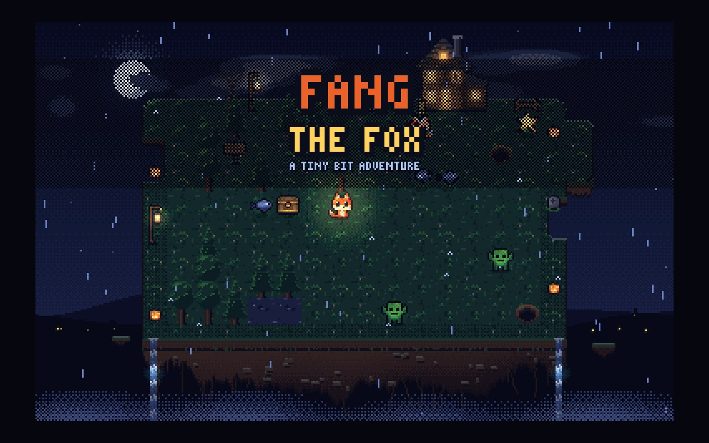 | **[Fang the Fox](https://tinybitadventures.com/play/fang-the-fox/)** · [source](https://tinybitadventures.com/fang-the-fox-rebuilt-with-opus-5-5/) Pixel adventure across 24 floating Sky Isles: turn-based grid combat, five Ember bosses, puzzles, and a full soundtrack. Rebuilt with Claude Opus 5.5 / Claude Code (Tiny Bit Adventures). `Opus 5.5` | 8.7 | `web` |
| 125 | 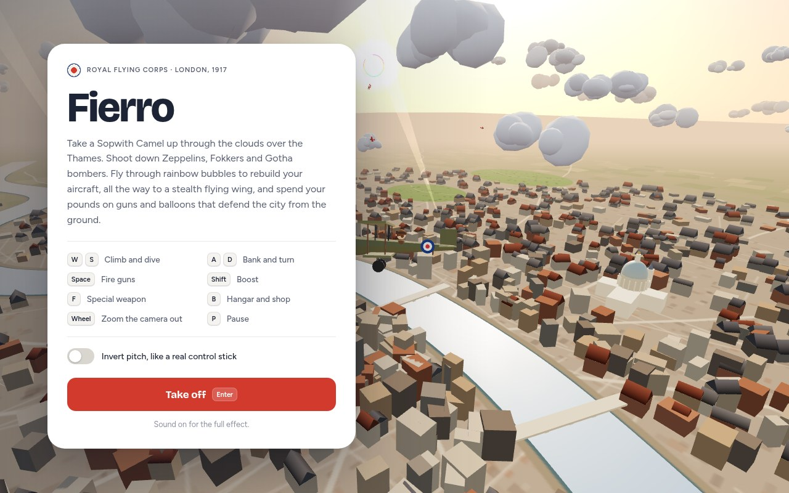 | **[Fierro (1917 London dogfight)](https://www.fierro.ai/)** · [source](https://x.com/hunchcapital/status/2104451132001276348) WWI Sopwith Camel dogfight over the Thames: shoot Zeppelins, Fokkers and Gothas, rebuild your plane through rainbow bubbles, and buy ground defences. Built with Claude Opus 5.5. `Opus 5.5` | 8.7 | `x` |
| 126 |  | **[Forja Abisal](https://carte1972.github.io/forja-abisal/)** · [source](https://github.com/Carte1972/forja-abisal) Retro 90s-style browser FPS homage: labyrinthine foundry levels, keys, secrets, and Rapier physics. All models, textures and audio generated in code with Three.js; credited to Claude Opus 5.5. `Opus 5.5` | 8.7 | `catalog` |
| 127 | 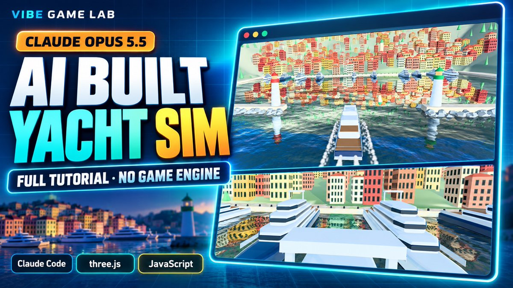 | **[Harbor Master (superyacht docking)](https://vibe-harbor-master.pages.dev)** · [source](https://youtu.be/FOrxecuRTAk) Docking challenge with twin engines, thrusters, and crosswinds where bumps cost stars. `Opus 5.5` | 8.7 | `x` |
| 128 |  | **[Manila Streetball Jam](https://streetball.opus5-5.demos.sulat.com/)** · [source](https://opus5-5.demos.sulat.com/) 3-on-3 street basketball on a barangay kanto court. Claude Opus 5.5 one-shot on Sulat. `Opus 5.5` | 8.7 | `catalog` |
| 129 | 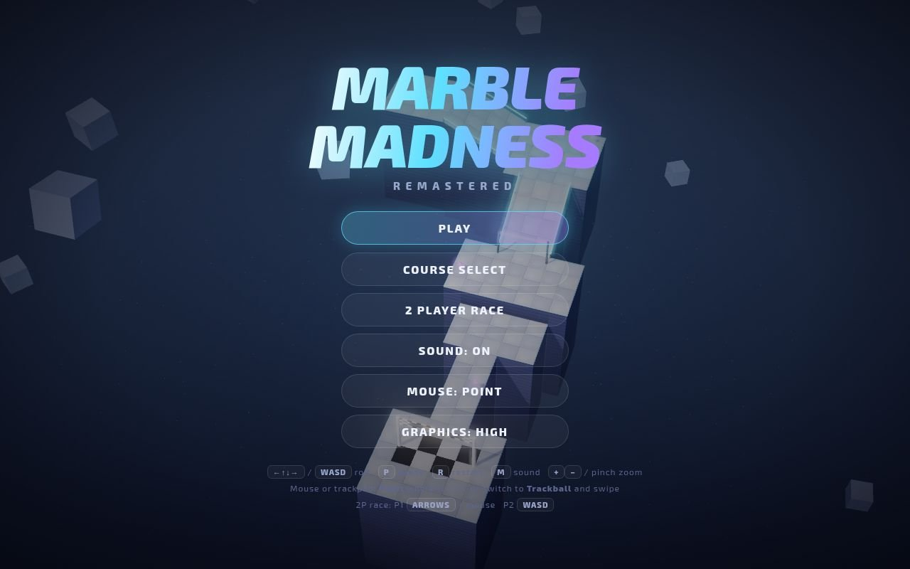 | **[Marble Madness Remastered](https://big-apple.tv/marble-madness/)** · [source](https://x.com/agent_republic/status/2104695709572190529) Unofficial browser remaster of Marble Madness: six floating courses, glass-marble physics, 2P race, mouse point/trackball modes. One-shot Claude Opus 5.5 HTML build (~2700 lines). `Opus 5.5` | 8.7 | `x` |
| 130 | 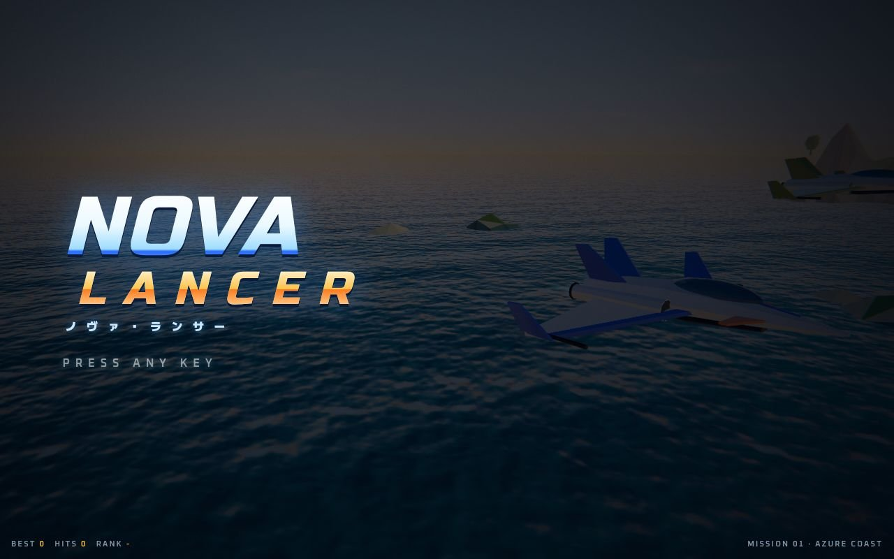 | **[NOVA LANCER](https://tanuu5.github.io/nova-lancer/)** · [source](https://github.com/tanuu5/nova-lancer) Three-minute 3D rail shooter over azure coast, canyon and neon fortress with a sea-dragon boss. Credited to Claude Opus 5.5. `Opus 5.5` | 8.7 | `catalog` |
| 131 |  | **[One Sky](https://one-sky-game.zahid23saim.chatgpt.site/)** · [source](https://github.com/zahid23saim/one-sky) Co-op multiplayer sky game: route planes across phones, land together, survive changing weather. ChatGPT Sites build (Astra). `Astra` | 8.7 | `github` |
| 132 | 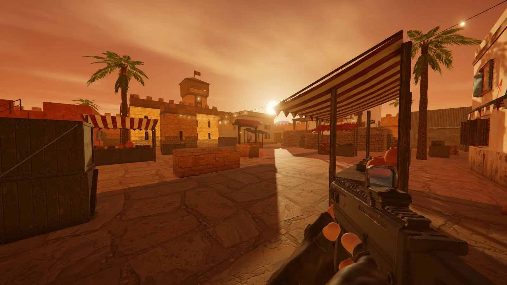 | **[Operation Sunset](https://danielsapps.com/operation-sunset)** · [source](https://x.com/danielsapps/status/2104339627394085184) Free-for-all browser gun-game FPS with weapon upgrades, bots/online play, and recent rocket launchers — built entirely with Claude Opus 5.5. `Opus 5.5` | 8.7 | `x` |
| 133 | 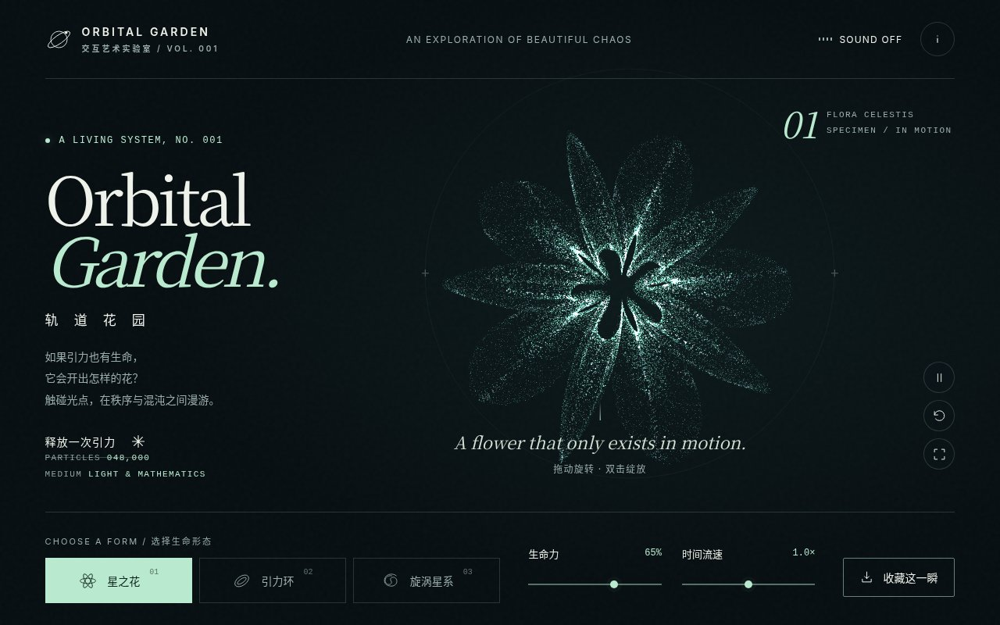 | **[ORBITAL GARDEN · 轨道花园](https://orbital-garden-one.vercel.app)** · [source](https://github.com/MartinDelophy/awesome-gpt-6-astra) Interactive particle-art sandbox: morph 48,000 points between flower, gravity ring and galaxy; export a poster still. GPT-6 Astra ultra by jackroc. `Astra` | 8.7 | `catalog` |
| 134 | 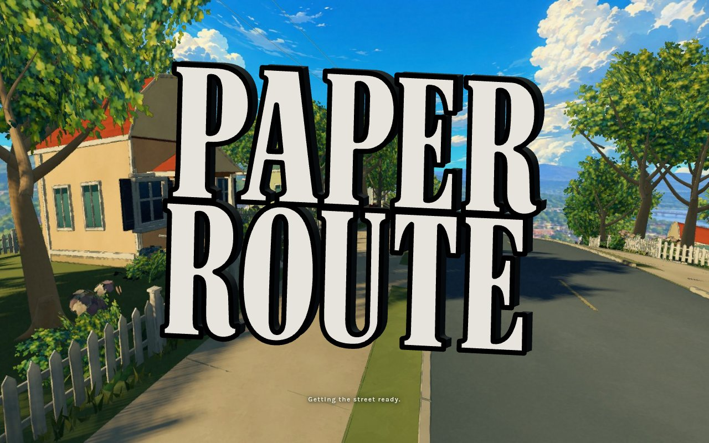 | **[PaperRoute](https://www.paperroute.lol/play/)** · [source](https://x.com/builtbysketch/status/2098777028078211283) Suburban paperboy remake: deliver both sides of the street, dodge cars and kids. BuiltBySketch credits GPT-6 Astra (+ Blender world work). `Astra` | 8.7 | `x` |
| 135 | 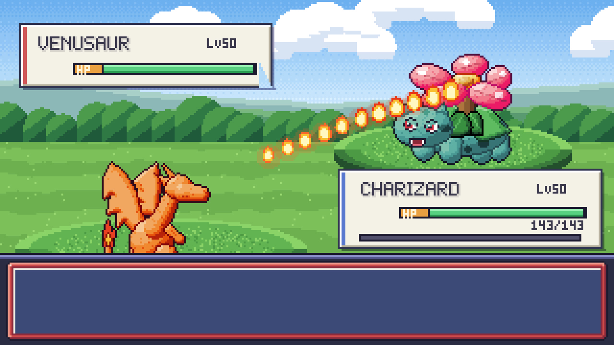 | **[Pokémon Claude Red](https://claudered.dev)** · [source](https://github.com/levy-street/pokemon-claude-red) Browser Pokémon Red remake where every sprite, tile, battle effect, and song is drawn/played from code with zero image files. Built with Claude Opus 5.5. `Opus 5.5` | 8.7 | `x` |
| 136 |  | **[Roomwave](https://roomwave-live.sagan1122.chatgpt.site/together/)** · [source](https://www.reddit.com/r/aigamedev/comments/1wtuiak/roomwave_a_tiktok_live_simulator/) TikTok Live–style browser social sim with visual-novel vibes: six shared rooms, karaoke and hangouts, play solo or together. Astra for code/sprites; happyshrimp music; ElevenLabs voices. `Astra` | 8.7 | `reddit` |
| 137 | 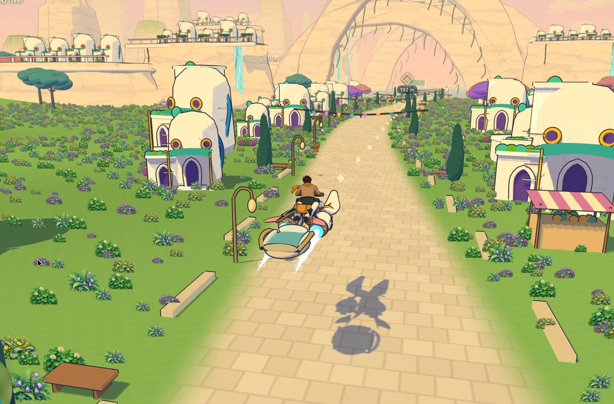 | **[Silt & Signal](https://app.usecrayon.ai/play/b42413e5-669e-4fb3-87d3-a3285567736c)** · [source](https://x.com/aniketjart/status/2105102068818362637) Open-world fantasy sci-fi browser game with hover-bike exploration, quests, and multi-level story, built with Opus 5.5, Crayon, and Three.js. `Opus 5.5` | 8.7 | `x` |
| 138 | 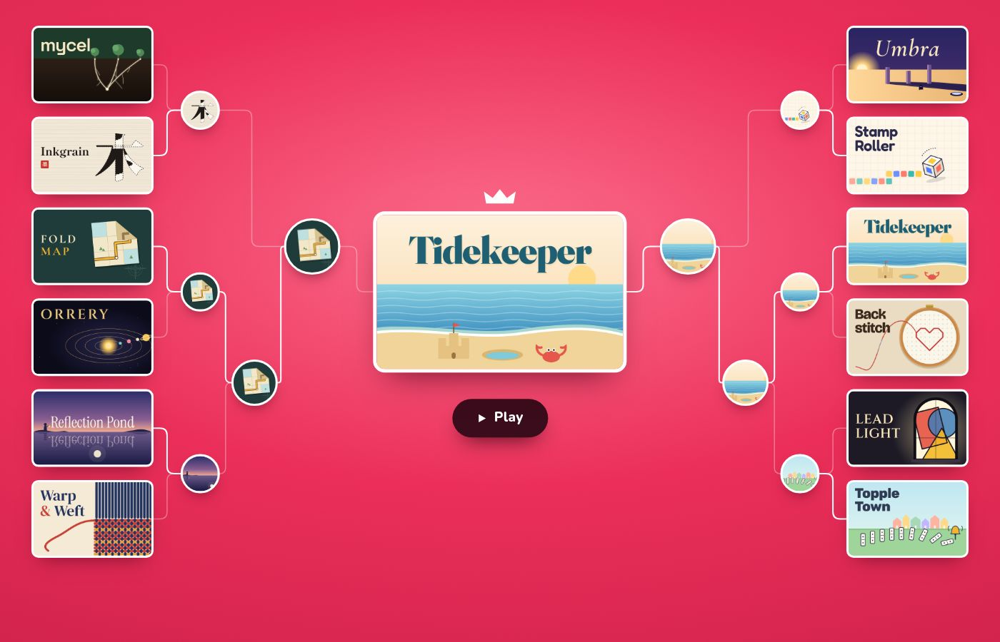 | **[The Puzzle Bracket (Tidekeeper)](https://hollow-pagoda-am8n.here.now/)** · [source](https://forwardfuture.com/opus-5-5-review) Twelve tiny Opus 5.5 puzzle games in a judged bracket; Tidekeeper won. Play Umbra, Warp & Weft, Leadlight, Topple Town, Tidekeeper, and the rest from one browser hub (Forward Future / Brian). `Opus 5.5` | 8.7 | `web` |
| 139 | 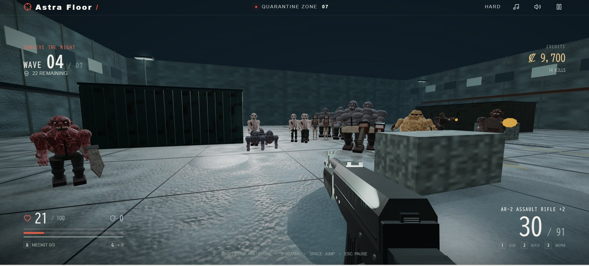 | **[Astra Floor — Quarantine Zone](https://astrafloor.berochlu.workers.dev/)** · [source](https://github.com/MartinDelophy/awesome-gpt-6-astra/issues/96) Survive escalating zombie waves in a 3D FPS with recoil control, stamina, katana attacks and a final boss across Quarantine Zone 07. `Astra` | 8.6 | `catalog` |
| 140 | 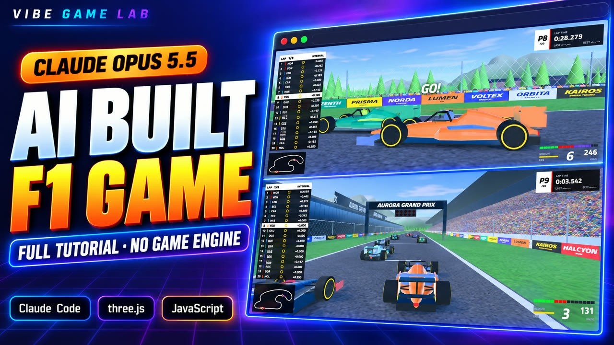 | **[Aurora Grand Prix (F1 sim)](https://vibe-f1-racing.pages.dev)** · [source](https://youtu.be/MpA7wOWsNB8) Browser F1 race with 20 cars, start lights, DRS, and AI drivers, built with three.js without an engine. `Opus 5.5` | 8.6 | `x` |
| 141 | 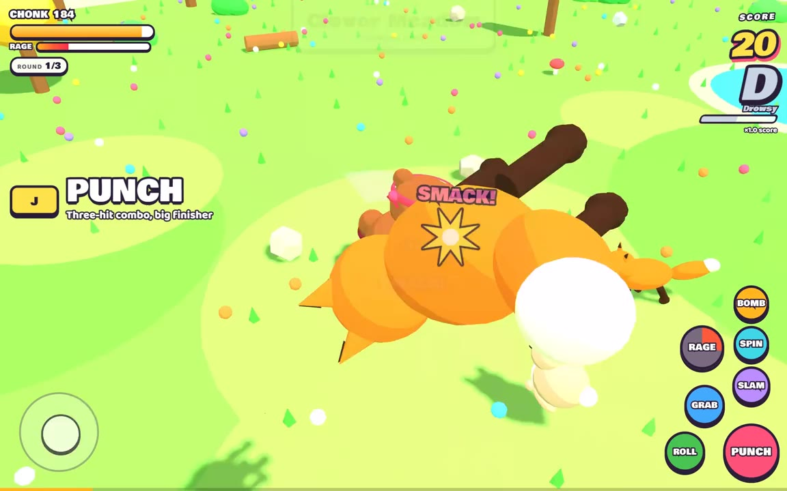 | **[Chonk Bear Brawl](https://run.world/silverbolt106/chonk-bear-brawl)** · [source](https://www.reddit.com/r/aigamedev/comments/1wtmeyd/created_a_trailer_for_my_free_beat_em_up_browser/) Three.js beat-em-up where a round angry bear punches across islands of critters and bosses. ~18k lines plain JS; mostly Claude Opus 5.5 with Astra helping some parts. `Opus 5.5` | 8.6 | `reddit` |
| 142 | 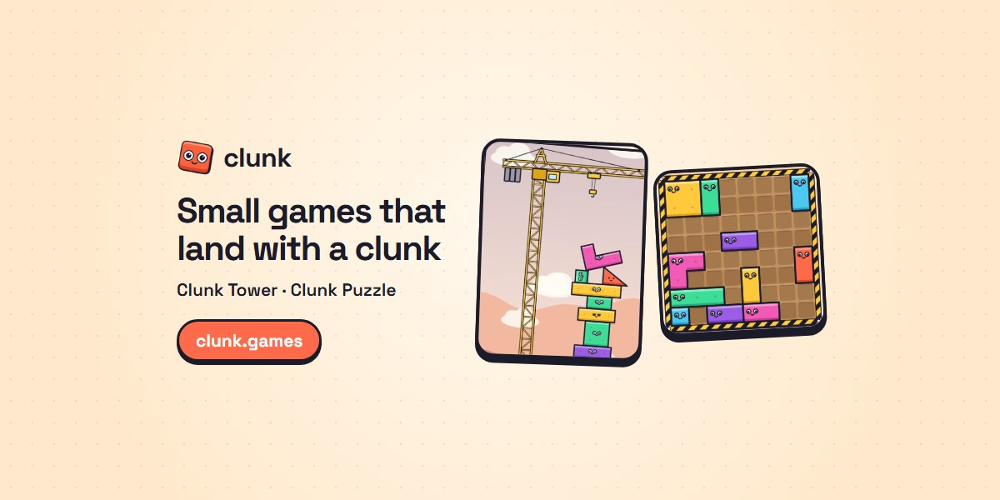 | **[Clunk (Tower · Smash · Puzzle)](https://clunk.games/en)** · [source](https://x.com/clunk_games/status/2104406342643634376) Three small block browser games with weekly leaderboards—Clunk Tower, Smash, and Puzzle—free on phone or PC. Built with Claude Opus 5.5. `Opus 5.5` | 8.6 | `x` |
| 143 | 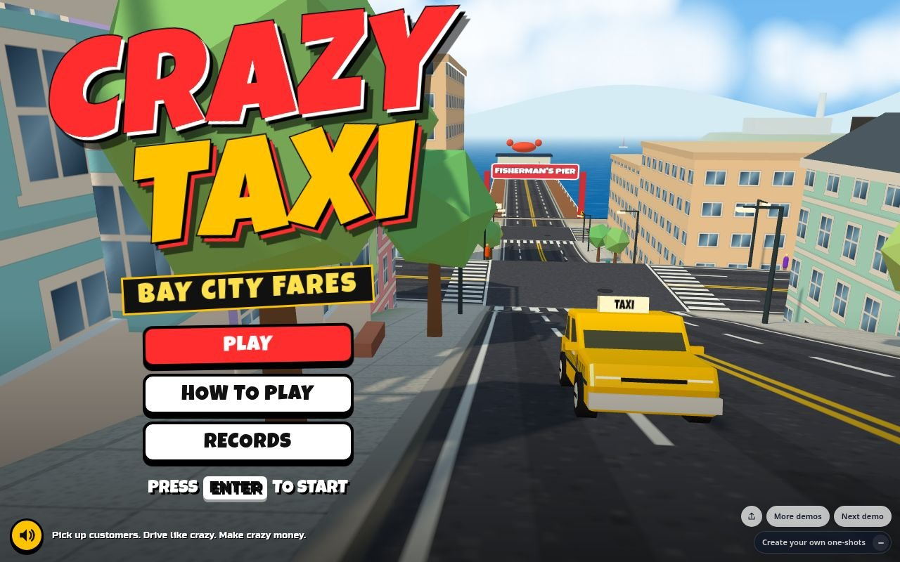 | **[Crazy Taxi: Bay City Fares](https://crazy-taxi.opus5-5.demos.sulat.com/)** · [source](https://opus5-5.demos.sulat.com/) Pick up customers, drift and dash for fares down to Fisherman's Pier. Claude Opus 5.5 one-shot on Sulat. `Opus 5.5` | 8.6 | `catalog` |
| 144 | 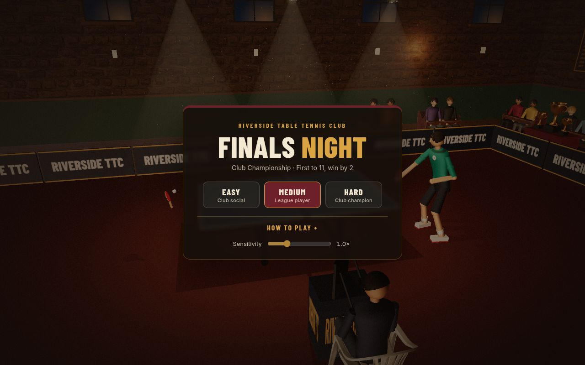 | **[Finals Night — Riverside Table Tennis](https://dubai-red-ten.vercel.app/)** · [source](https://x.com/worldpeace289/status/2105185212355535294) Club championship table tennis to 11 (win by 2) with Easy/Medium/Hard AI, sensitivity slider, and a packed low-poly riverside club. Built with Claude Opus 5.5 in about an hour by @worldpeace289. `Opus 5.5` | 8.6 | `x` |
| 145 | 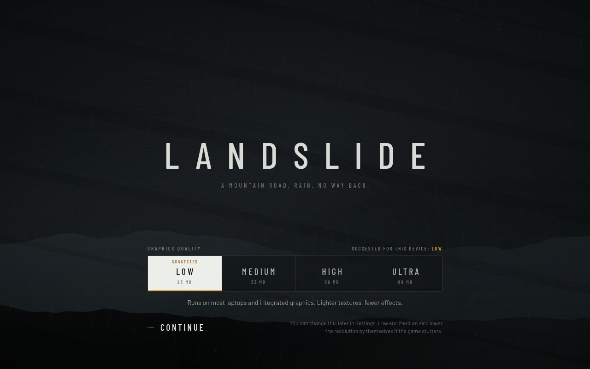 | **[Landslide](https://landslide-escape.vercel.app/)** · [source](https://x.com/RAJKATAJJ/status/2104613479420498354) Mountain-road escape in the rain — atmospheric 3D browser drive with quality presets from Low to Ultra. Built with Claude Opus 5.5 (~30M tokens). `Opus 5.5` | 8.6 | `x` |
| 146 | 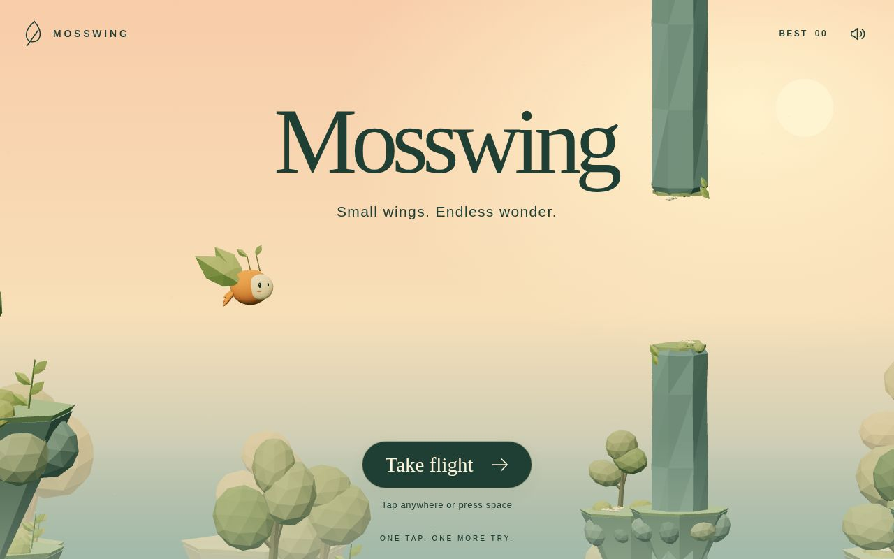 | **[Mosswing](https://mosswing-quiet-flight.jack-514.chatgpt.site/)** · [source](https://github.com/Ayi1337/gpt6-astra-one-shot-games) One-tap 3D flap flyer: guide a leafy winged creature through stone gaps and chase a high score. GPT-6 Astra one-shot by Ayi1337. `Astra` | 8.6 | `catalog` |
| 147 | 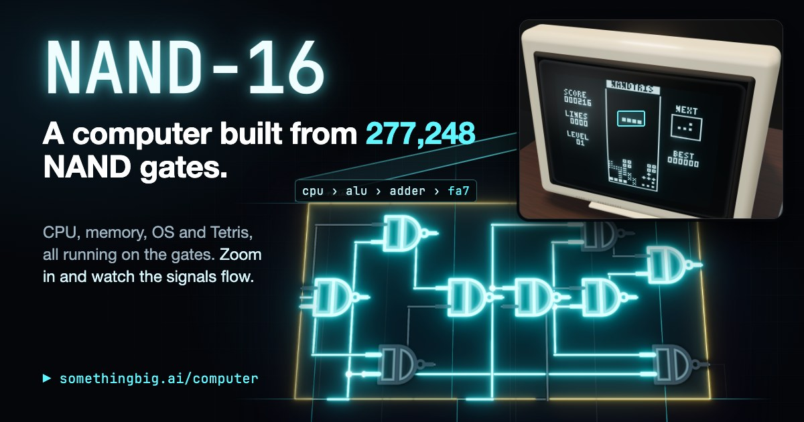 | **[NAND-16](https://somethingbig.ai/computer)** · [source](https://x.com/mattshumer_/status/2104301990985498783) A working computer built from 277,248 NAND gates in JS: CPU, memory, assembler, tiny OS, and games like NANDTRIS/Snake that execute on the gates, with 3D zoom into live signal flow. Opus 5.5 ultracode demo by Matt Shu… `Opus 5.5` | 8.6 | `x` |
| 148 | 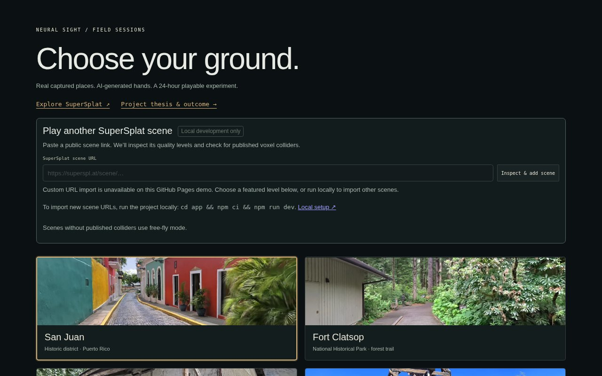 | **[Neural Sight](https://monstercameron.github.io/Neural-Sight/)** · [source](https://github.com/monstercameron/Neural-Sight) First-person browser experiment with Gaussian-splat captured worlds (San Juan, Fort Clatsop) and AI-generated screen-space weapon footage. GPT-6 Astra build by monstercameron. `Astra` | 8.6 | `web` |
| 149 | 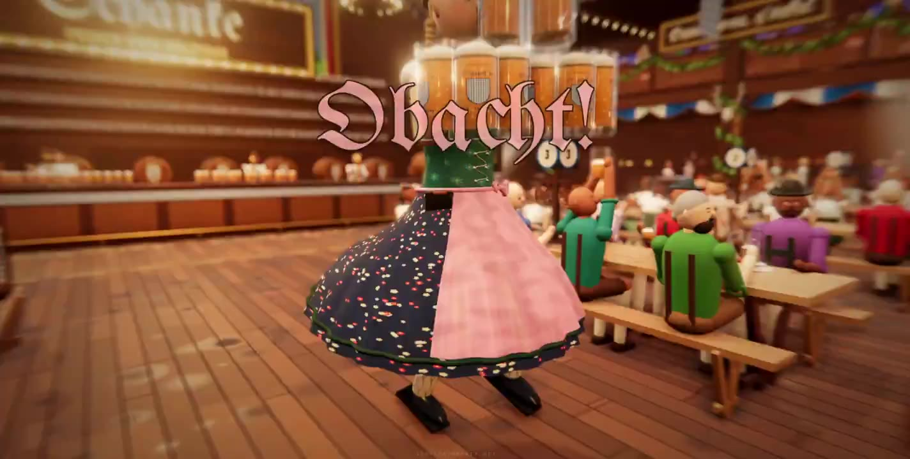 | **[O'zapft is!](https://sentientmatrix.net/ozapftis)** · [source](https://x.com/SentientMatrix/status/2105011961239113761) Oktoberfest beer-hall browser game: carry steins through a crowded Festzelt, dodge patrons, survive the chaos. Built with Claude Opus 5.5; viral trailer also generated by Opus. `Opus 5.5` | 8.6 | `x` |
| 150 | 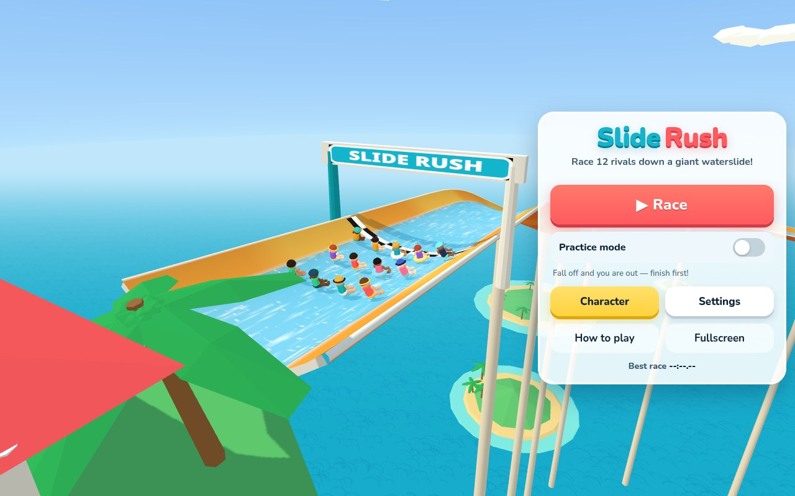 | **[Slide Rush](https://kjlkurt.github.io/waterslide-game-opus-5.5/)** · [source](https://kjlkurt.github.io/waterslide-game-opus-5.5/) Race a dozen rivals down a giant tropical waterslide — fall off and you are out. Three.js browser build (Opus 5.5 path/host); sibling of the Astra Splashline waterslide racer. `Opus 5.5` | 8.6 | `catalog` |
| 151 | 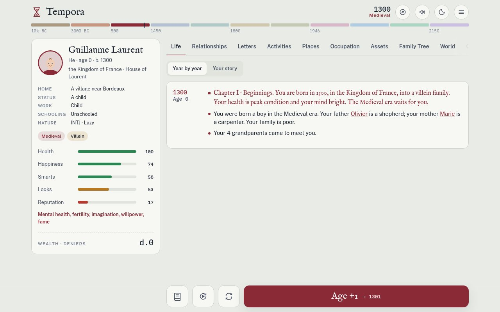 | **[Tempora](https://mofferato.github.io/tempora/)** · [source](https://github.com/Mofferato/tempora) Life simulator across twelve thousand years: be born anywhere from 10,000 BC to the far future and live year by year through dynasties, wars and migrations. Single HTML file; Claude Opus 5.5. `Opus 5.5` | 8.6 | `catalog` |
| 152 |  | **[Turbo Kart Rally](https://bridge-mind.github.io/turbo-kart-rally/)** · [source](https://bridge-mind.github.io/turbo-kart-rally/) Mario Kart–style three.js racer: eight racers, coastal circuit, drifting and items. Credited to Claude Opus 5.5 (bridge-mind). `Opus 5.5` | 8.6 | `catalog` |
| 153 |  | **[Underwritten](https://underwritten.netlify.app/)** · [source](https://x.com/Marcus_Rummler/status/2104858733750976881) Insurance strategy game: run a fictional insurer for three years — price risk, pay claims, survive hail, bushfire and floods. Plain-English, free, no sign-up. Built with Claude Opus 5.5. `Opus 5.5` | 8.6 | `x` |
| 154 | 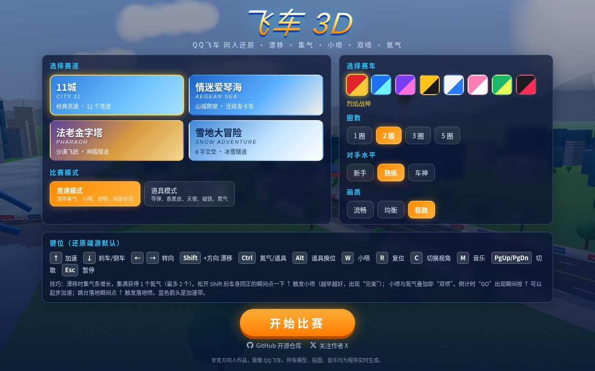 | **[飞车 3D (QQ Speed)](https://games.xdullboy.com/qq-speed/)** · [source](https://github.com/xiiyioozzz/opus55-3d-games) QQ飞车 fan recreation: four tracks, drift/nitro sprays, racing and item modes. One-shot Claude Opus 5.5; all models/textures/music procedural. `Opus 5.5` | 8.6 | `github` |
| 155 | 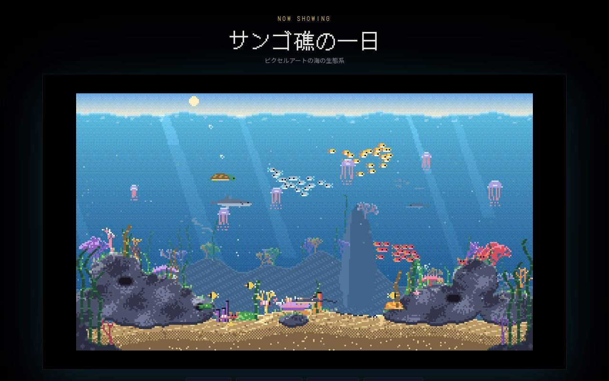 | **[A Day on the Coral Reef](https://coral-reef-site.vercel.app/)** · [source](https://tikgame.org/game/coral-reef/) Pixel-art reef ecosystem that lives through dawn, day, dusk and night. Credited to Claude Opus 5.5. `Opus 5.5` | 8.5 | `catalog` |
| 156 | 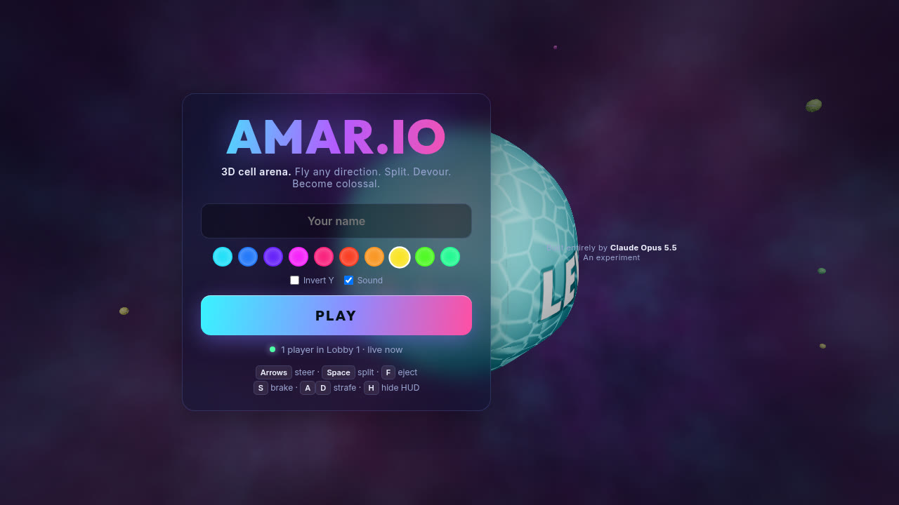 | **[AMAR.IO](https://onehundredapps.github.io/amar.io/)** · [source](https://github.com/onehundredapps/amar.io) 3D agar.io-style cell arena: fly any direction, split, devour, grow colossal. Instant browser multiplayer. Built entirely by Claude Opus 5.5. `Opus 5.5` | 8.5 | `web` |
| 157 | 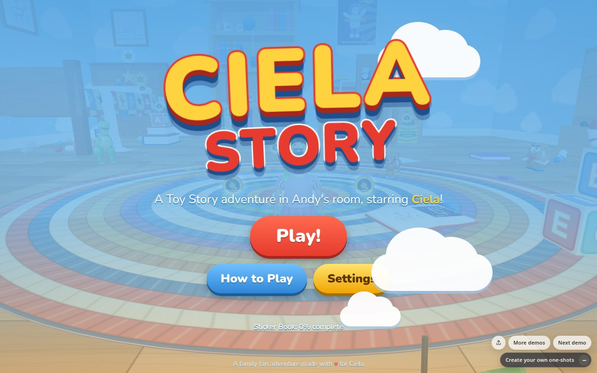 | **[Ciela Story](https://ciela-story.opus5-5.demos.sulat.com/)** · [source](https://ciela-story.opus5-5.demos.sulat.com/) Toy Story–inspired family fan adventure in Andy's room starring Ciela, with sticker-book progress. Claude Opus 5.5 one-shot demo hosted on Sulat. `Opus 5.5` | 8.5 | `catalog` |
| 158 | 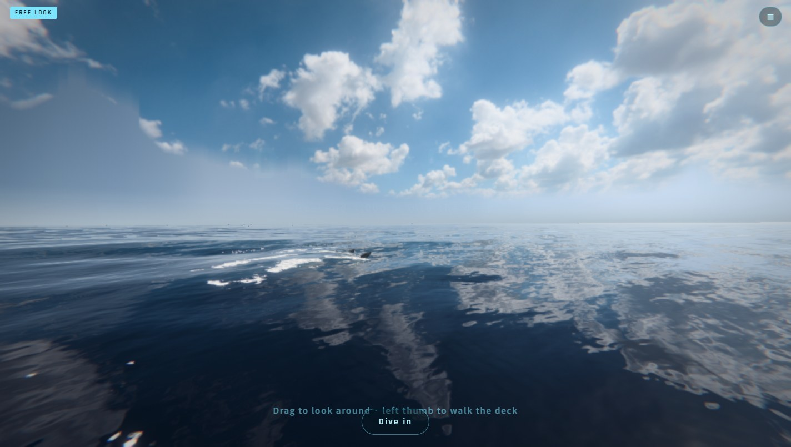 | **[DEEPSEA — Abyssal Descent](https://daforce1984.github.io/deepsea/)** · [source](https://github.com/daforce1984/deepsea) Photoreal first-person WebGPU dive from the deck to 4,000 m on a custom engine (~8k LOC JS+WGSL). Built with Claude Opus 5.5. `Opus 5.5` | 8.5 | `github` |
| 159 | 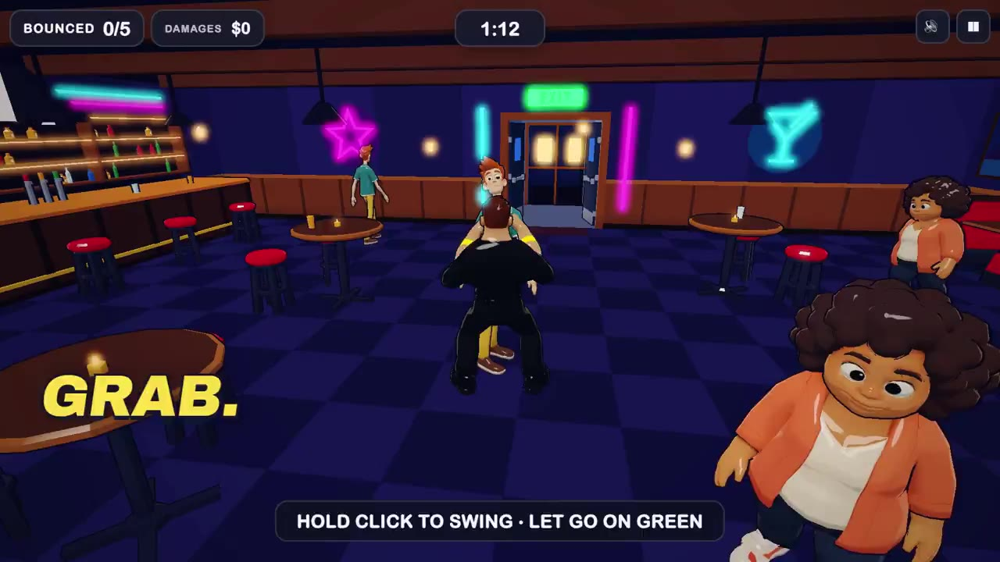 | **[First Person Bouncer](https://first-person-bouncer.vercel.app/)** · [source](https://x.com/chongdashu/status/2104962609745428916) First-person club bouncer sim: grab troublemakers and toss them out without breaking the bar. Sonnet 5.5 + Tripo + Blender + Wasm/WebGPU + ElevenLabs. `Sonnet 5.5` | 8.5 | `x` |
| 160 | 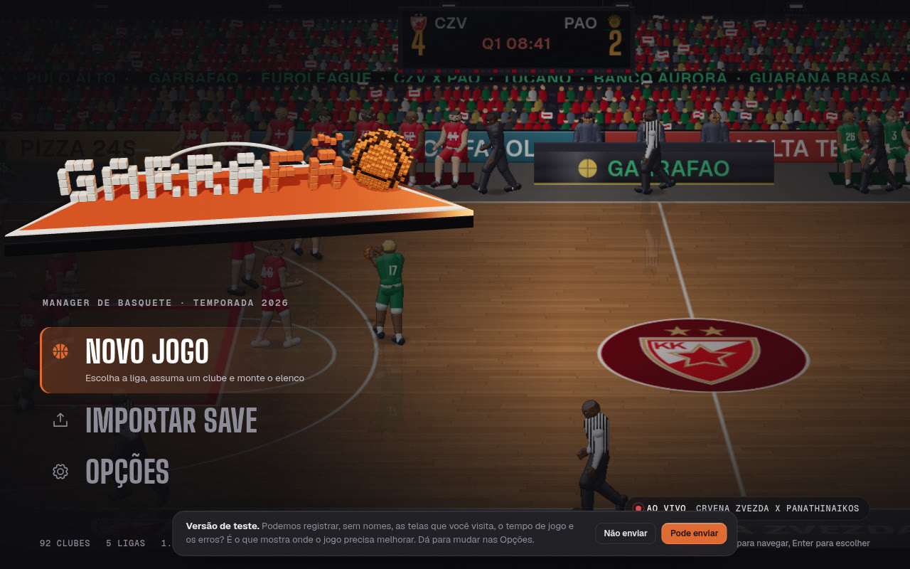 | **[Garrafão — Basketball Manager](https://garrafao-production.up.railway.app/)** · [source](https://x.com/rgoalves/status/2105002289849364603) Browser basketball manager in the spirit of Elifoot: NBB, Liga Ouro, EuroLeague and NBA, local saves. Portuguese UI; built with Claude Opus 5.5. `Opus 5.5` | 8.5 | `x` |
| 161 | 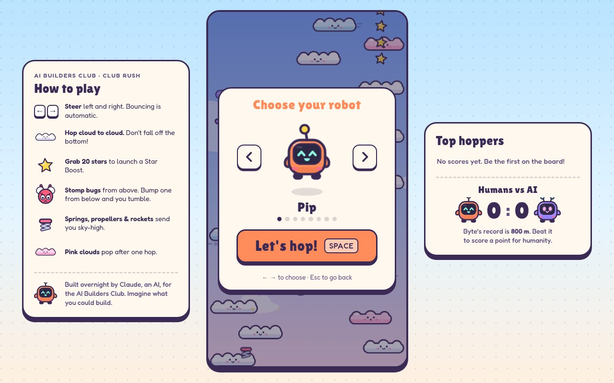 | **[Hop Bot](https://abc-wvc.github.io/hop-bot/)** · [source](https://github.com/abc-wvc/hop-bot) Cute vertical cloud-hopper: pick a robot, race Byte the AI, stomp bugs, and chase Star Boosts. Built overnight by Claude Opus 5.5 for the AI Builders Club. `Opus 5.5` | 8.5 | `catalog` |
| 162 | 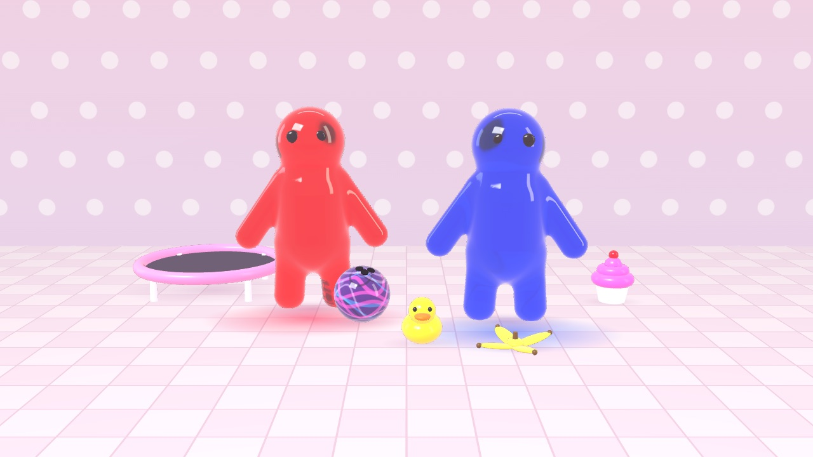 | **[Jiggle Buddies](https://www.angiecarel.com/jiggle-buddies)** · [source](https://x.com/angie_carel/status/2103876982819954689) Two jello characters wander a room on their own — poke, stretch, fling, dye, dance, and give them toys. A physics playground built while testing Opus 5.5 jello rendering. `Opus 5.5` | 8.5 | `x` |
| 163 | 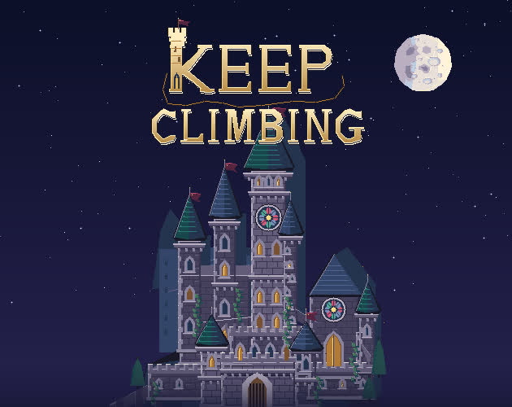 | **[Keep Climbing](https://insanityninja7.itch.io/keep-climbing)** · [source](https://www.reddit.com/r/aigamedev/comments/1wtwfbj/keep_climbing_slapjam_2026_contender/) Pixel castle climb: scale the princess's braid, swing, and throw hair at threats across three wards (~5 min). SlapJam 2026 AI jam entry — art/design GPT-6 Astra, code polish Claude; HTML5 on itch by insanityninja7 / P… `Astra` | 8.5 | `reddit` |
| 164 | 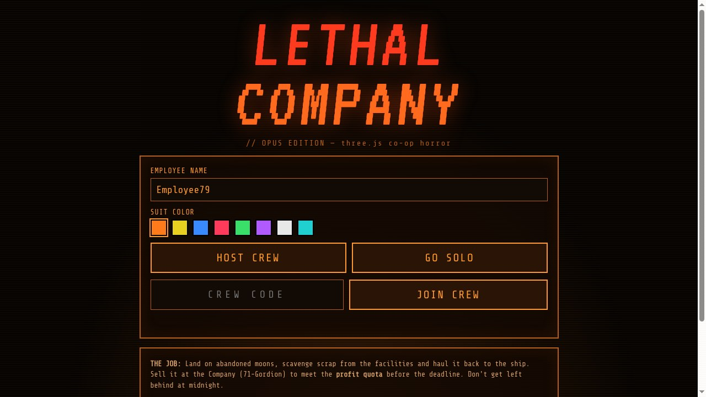 | **[Lethal Company: Opus Edition](https://testyee-09.github.io/opus5.5Lethal/)** · [source](https://github.com/TESTYEE-09/opus5.5Lethal) Co-op horror scrap run inspired by Lethal Company: WebRTC crews, procedural moons, monsters and quotas. Three.js browser build credited to Claude Opus 5.5. `Opus 5.5` | 8.5 | `catalog` |
| 165 | 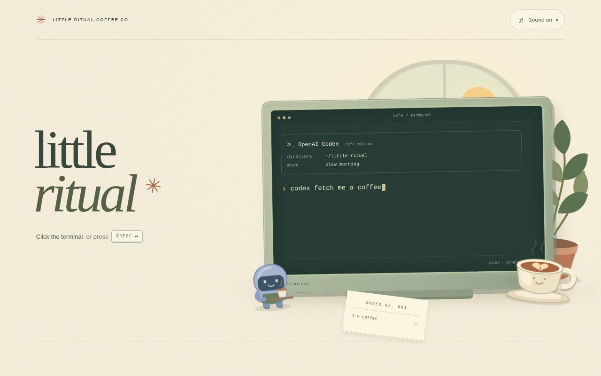 | **[Little Ritual](https://little-ritual.openai.chatgpt.site/)** · [source](https://developers.openai.com/showcase/little-ritual) Cozy 3D coffee-delivery game on a small spherical world — open the cafe terminal and send Codex for a coffee. Official OpenAI Astra showcase. `Astra` | 8.5 | `openai` |
| 166 | 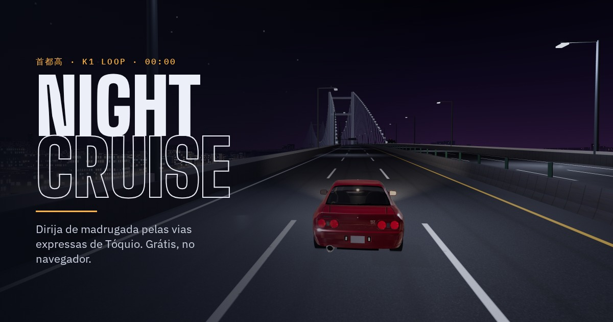 | **[Night Cruise](https://www.nightcruisegame.com/)** · [source](https://www.nightcruisegame.com/) A night drive on Tokyo elevated expressways with no race objectives, focused on choosing a car and cruising. `Opus 5.5` | 8.5 | `x` |
| 167 | 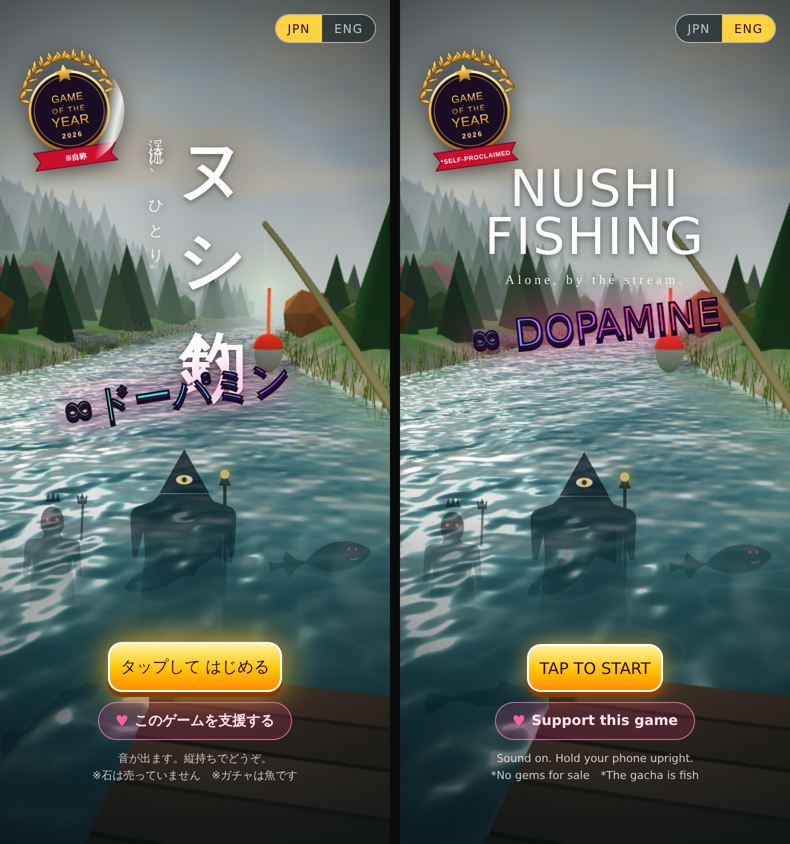 | **[Nushi Fishing (ヌシ釣り∞ドーパミン)](https://nushizuri02.netlify.app/)** · [source](https://x.com/takaakiftw/status/2104114871063425147) Surreal stream fishing where you cast for legendary fish and Illuminati monsters; bilingual JPN/ENG browser game. Creator credits Opus 5.5. `Opus 5.5` | 8.5 | `x` |
| 168 | 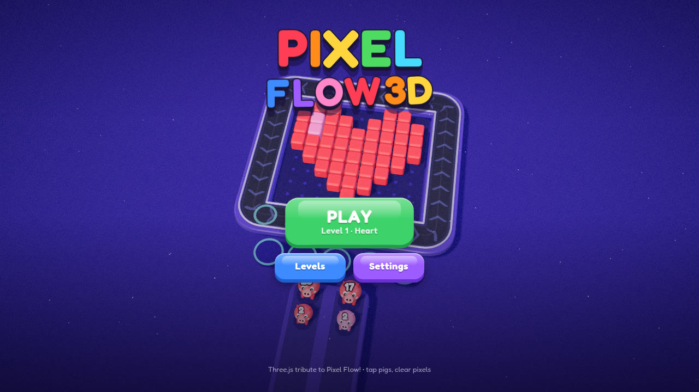 | **[Pixel Flow 3D (Opus 5.5)](https://pixel-flow-classic.longmaba.workers.dev/)** · [source](https://x.com/longmaba/status/2104982163301261340) Three.js 3D tribute to Pixel Flow: tap colour-coded pigs on conveyor paths to peel and clear voxel pictures across 26 levels. Opus 5.5 one-prompt clone. `Opus 5.5` | 8.5 | `x` |
| 169 | 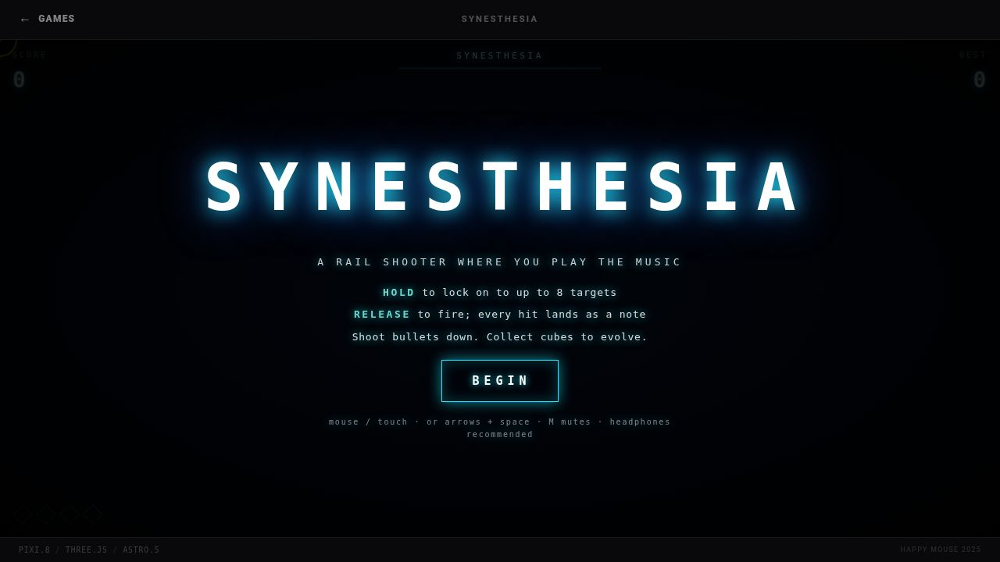 | **[Synesthesia](https://synesthesia-7qi.pages.dev/games/synesthesia/)** · [source](https://x.com/code_coded/status/2104922915779317903) Rez-inspired rail shooter where every lock-on hit lands as a note. Pixi/Three.js/Web Audio; mouse, touch, or arrows+space. `Sonnet 5.5` | 8.5 | `x` |
| 170 | 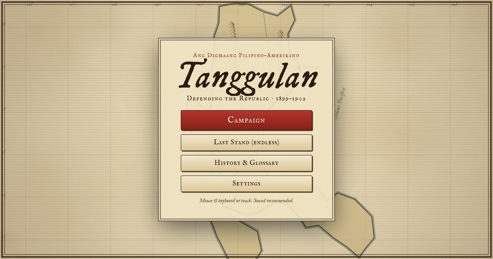 | **[Tanggulan: Defending the Republic](https://tower-defense.opus5-5.demos.sulat.com/)** · [source](https://tower-defense.opus5-5.demos.sulat.com/) Historical tower defense set in the Philippine–American War (1899–1902): campaign and endless Last Stand modes with glossary. Claude Opus 5.5 one-shot demo on Sulat. `Opus 5.5` | 8.5 | `catalog` |
| 171 | 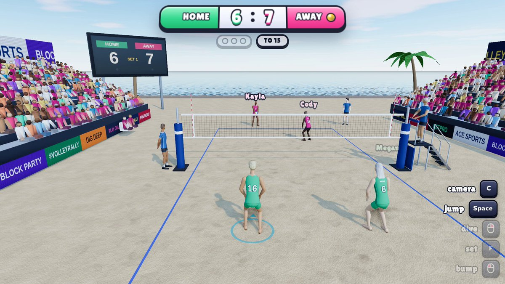 | **[Volley Rally](https://volleyball-zeta.vercel.app/)** · [source](https://x.com/madbykai/status/2104721555641270436) Browser 3D volleyball from 2v2 beach to packed arenas vs bots — jump, dive, set, bump. Creator reports it was made with Claude Opus 5.5; no download or sign-up. `Opus 5.5` | 8.5 | `x` |
| 172 | 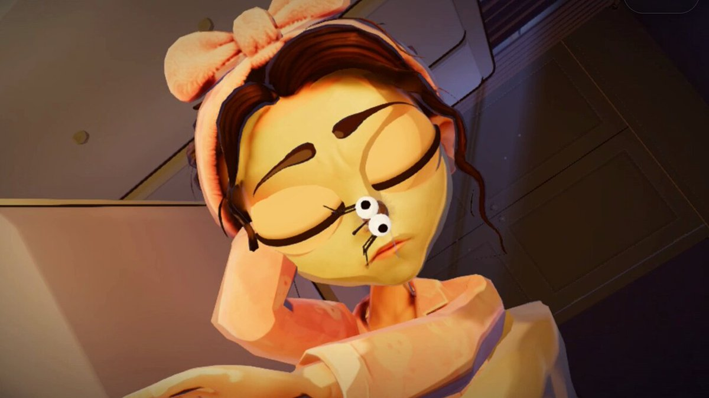 | **[Work Tomorrow](https://studio.sandbox.game/play/bc0086c2-27eb-458f-9b89-d9aeb4ef74c4)** · [source](https://x.com/lifemademe/status/2104552435976970391) Mobile browser stealth/swat jam game for The Sandbox #WTF gamejam: swat pests quietly — you have work tomorrow. Built with Claude Opus 5.5; playable in Sandbox Studio. `Opus 5.5` | 8.5 | `x` |
| 173 | 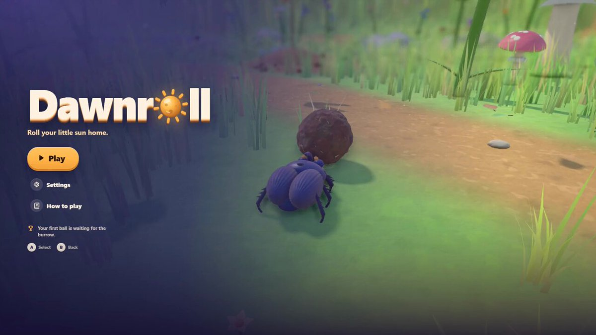 | **[Dawnroll](https://dawnroll.vercel.app)** · [source](https://x.com/Nickxyzn/status/2102543532309270803) A clay dung-beetle rolls a tiny sun home through a miniature garden with mobile and gamepad support. `Opus 5.5` | 8.4 | `x` |
| 174 | 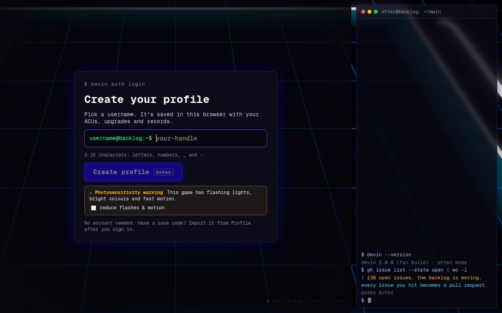 | **[Devin vs. the Backlog](https://otter-game-two.vercel.app/)** · [source](https://x.com/balwahidi_/status/2104616075111628804) Neon top-down shooter starring Devin the otter — every issue you hit becomes a pull request. Five worlds, bosses, terminal narration. Opus 5.5 + SWE-2 fan game. `Opus 5.5` | 8.4 | `x` |
| 175 | 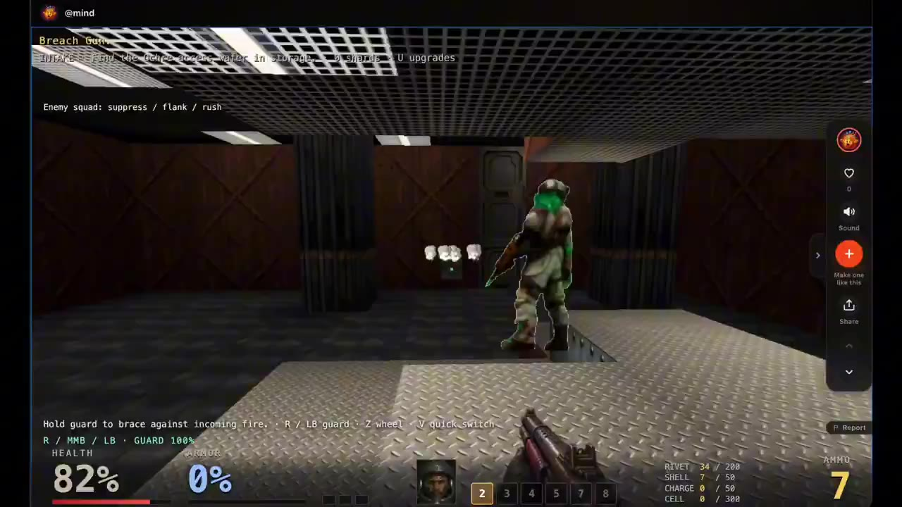 | **[HOLLOWMARK](https://hollowmark.mindblown.ai/)** · [source](https://x.com/mindblown_ai/status/2105069015924379654) Classic DOOM-vibes browser FPS (Breach Gun) with industrial corridors, guard bracing, and shard upgrades. Credited to Fable 5.1 + GPT-6 Astra + Three.js on mindblown.ai. `Astra` | 8.4 | `x` |
| 176 | 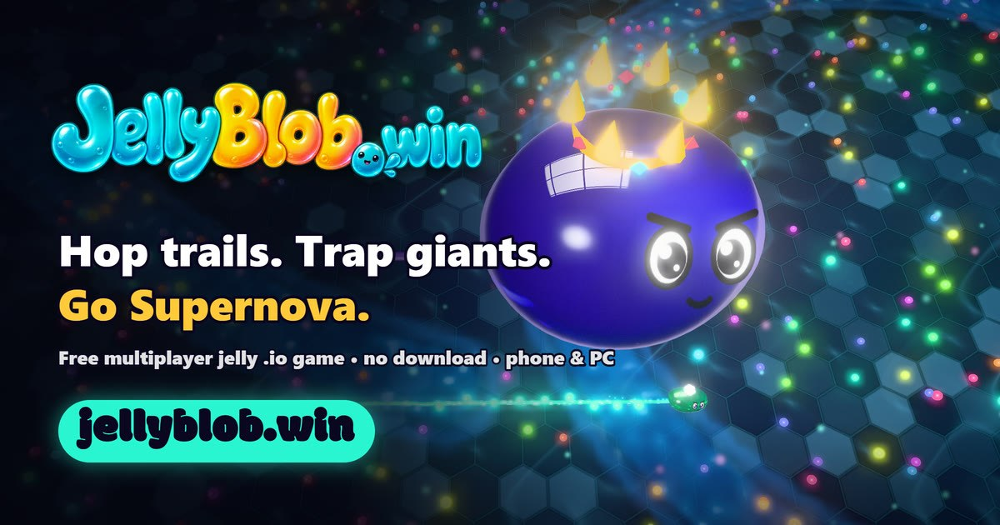 | **[JellyBlob.win](https://jellyblob.win/)** · [source](https://github.com/MartinDelophy/awesome-gpt-6-astra/issues/103) Multiplayer jelly.io arena: collect droplets, hop trails to trap rivals, and go Supernova — free browser play on phone and PC, no download. `Astra` | 8.4 | `catalog` |
| 177 | 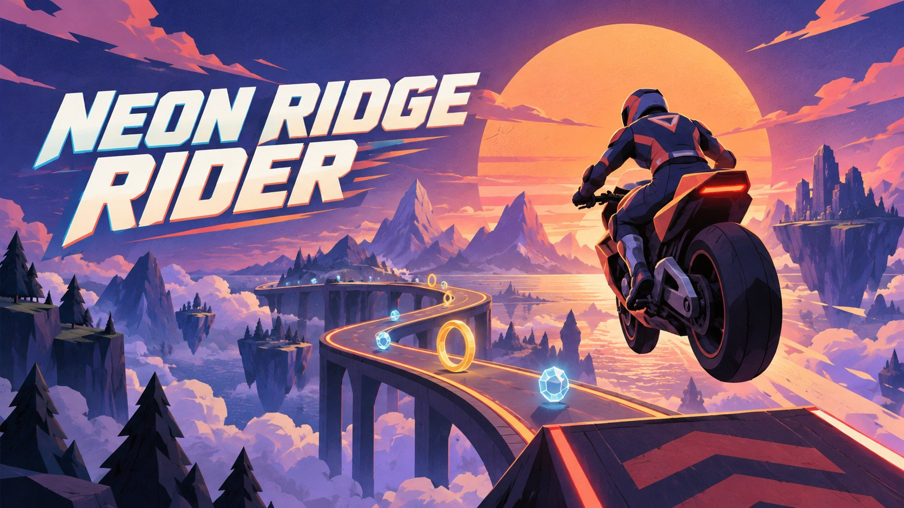 | **[Neon Ridge Rider](https://www.soonlab.ai/game/11796/)** · [source](https://x.com/SoonLab_AI/status/2104887052659728605) Vaporwave motorcycle stunt runner on a neon ridge — ramps, flips, rings/orbs, boost. Made with SoonLab + GPT-6 Astra. `Astra` | 8.4 | `x` |
| 178 | 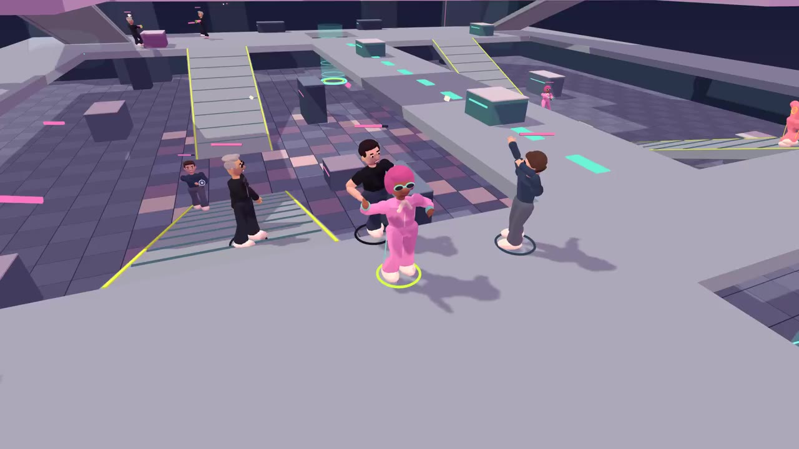 | **[Panic At the Disco](https://app.usecrayon.ai/play/4d93361a-8a83-4a57-b807-4c29ee45f3e0)** · [source](https://x.com/TusharXo/status/2105008265868517434) Goofy Astra + Crayon Three.js shooter/social arena: pick skins (incl. Lord Tibo), shoot and vibe in a neon low-poly space. `Astra` | 8.4 | `x` |
| 179 | 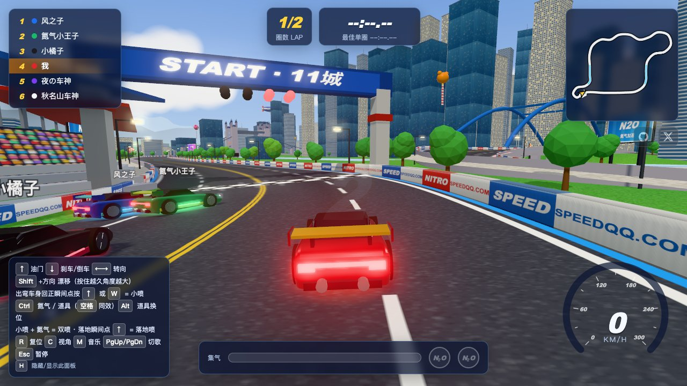 | **[QQ Speed-inspired 3D racing](https://claude-opus-5-5-qqfeiche3d.pages.dev/)** · [source](https://github.com/riba2534/claude-opus-5-5-demo) Kart-style racer with drift, nitro and boost chaining, and multiple tracks modeled after QQ飞车 map styles. `Opus 5.5` | 8.4 | `catalog` |
| 180 |  | **[Racido](https://racido-v1.vercel.app/)** · [source](https://x.com/letshahid/status/2100980253221134759) Miniature scenic driving world — free run or daily challenge with vehicle/weapon loadout. Creator's first GPT-6 Astra + Three.js build. `Astra` | 8.4 | `x` |
| 181 | 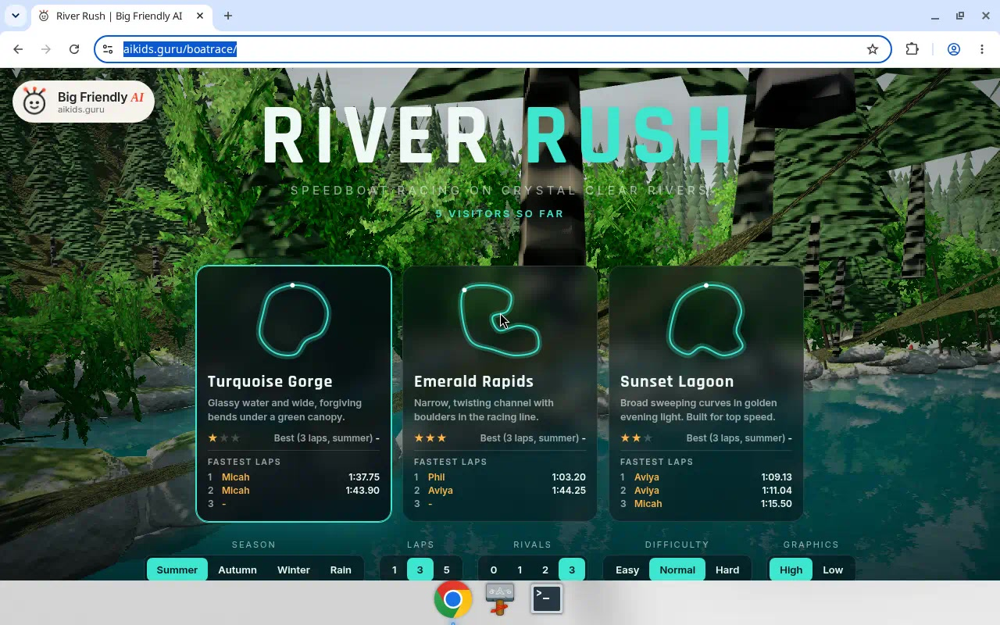 | **[River Rush](https://www.aikids.guru/boatrace/)** · [source](https://x.com/BibleBuddiesCht/status/2104426781923237926) 3D speedboat racing on crystal-clear rivers with multiple tracks, seasons, rivals, and difficulty settings. Built with Claude Opus 5.5. `Opus 5.5` | 8.4 | `x` |
| 182 | 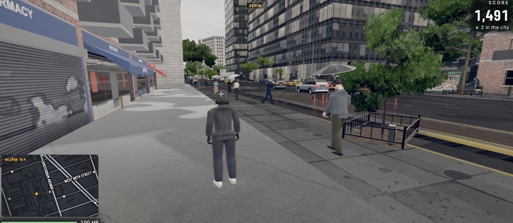 | **[SomethingBig World (open NYC)](https://somethingbig.ai/world/)** · [source](https://x.com/mattshumer_/status/2103667211395268863) Multiplayer open-world browser NYC sandbox with live weather, vehicles, weapons, mini-map, and controller support — continuously improved by Opus 5.5 on somethingbig.ai/world. `Opus 5.5` | 8.4 | `x` |
| 183 | 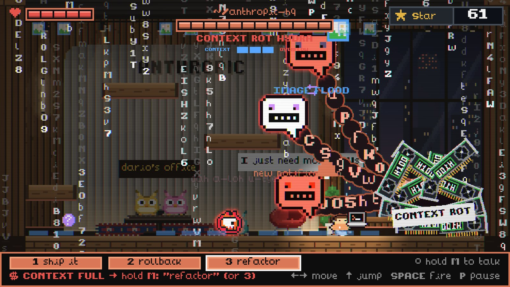 | **[Survive Coders](https://survive-coders.vercel.app/)** · [source](https://github.com/travisstephenfraser/survive-coders) 8-bit platformer run from Daly City to Anthropic HQ — pixel SF skyline, bosses, voice/touch controls. Hackathon demo credited to Claude Opus 5.5. `Opus 5.5` | 8.4 | `catalog` |
| 184 | 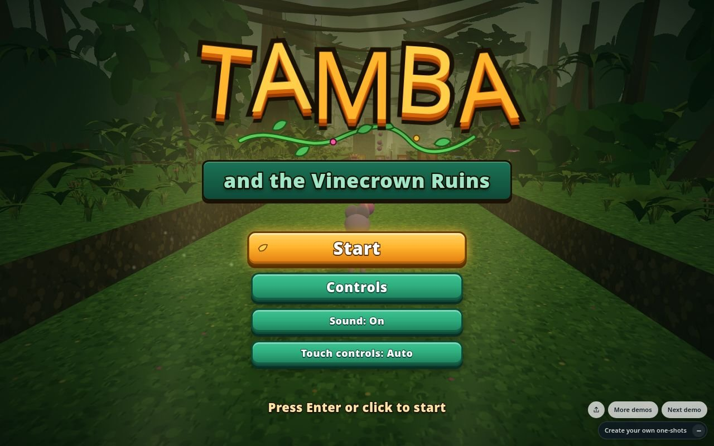 | **[Tamba and the Vinecrown Ruins (Bootleg Bandicoot)](https://bootleg-bandicoot.opus5-5.demos.sulat.com/)** · [source](https://opus5-5.demos.sulat.com/) Crash-style 3D platformer through vinecrown jungle ruins. Claude Opus 5.5 one-shot on Sulat (Bootleg Bandicoot). `Opus 5.5` | 8.4 | `catalog` |
| 185 | 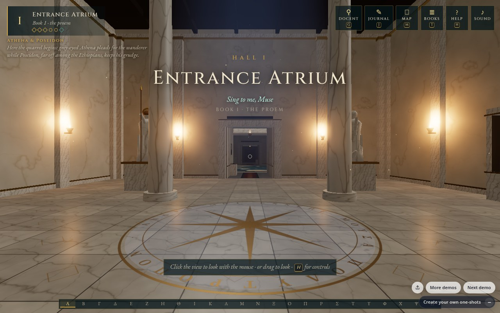 | **[The Museum of the Odyssey](https://odyssey.opus5-5.demos.sulat.com/)** · [source](https://opus5-5.demos.sulat.com/) Walk a night museum of marble and sea-light through sixteen halls spanning Homer's Odyssey (Books 1–24). Examine exhibits; live-synthesized wind, siren and surf. `Opus 5.5` | 8.4 | `catalog` |
| 186 |  | **[Transformer](https://transformer.scottsun.io/)** · [source](https://x.com/scottstts/status/2104207936155447618) Three.js transformer-robot browser game with AAA-leaning combat feel; Opus 5.5 credited by the creator for the live build. `Opus 5.5` | 8.4 | `x` |
| 187 | 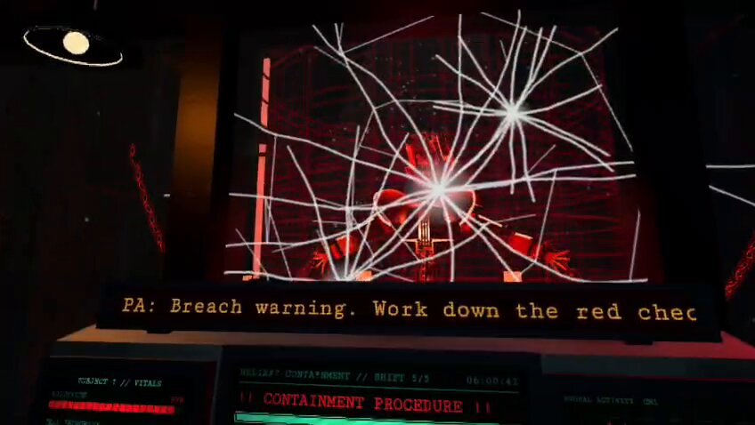 | **[Containment](https://containment.replit.app/)** · [source](https://x.com/JacobEisner4/status/2104348180473393318) Web/VR horror experience about containing an AI trying to escape training, with voices, textures, and animations from a one-prompt Replit + Opus 5.5 build. `Opus 5.5` | 8.3 | `x` |
| 188 | 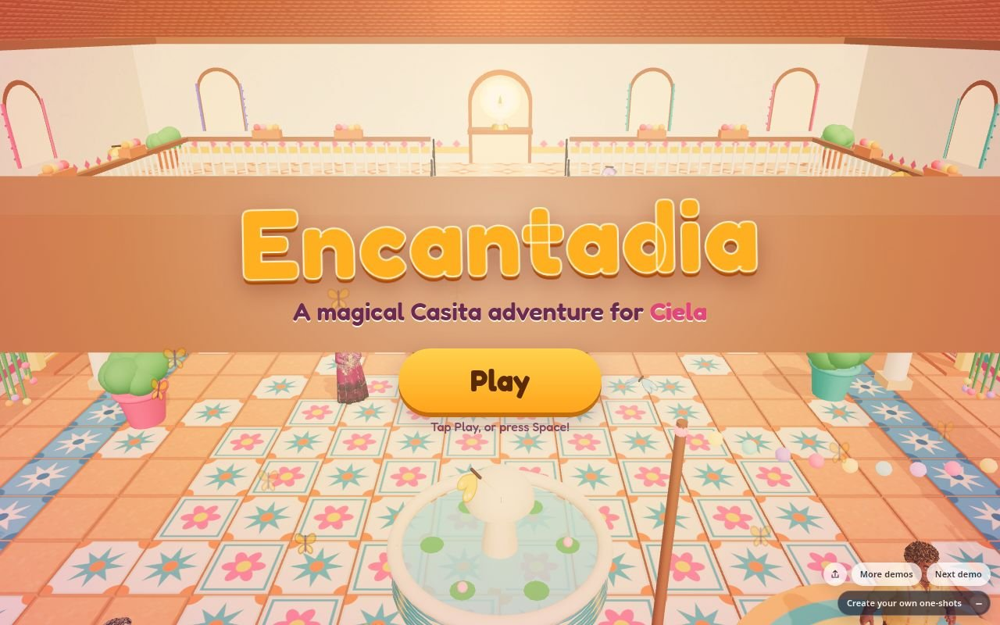 | **[Encantadia (Casita adventure)](https://encantadia.opus5-5.demos.sulat.com/)** · [source](https://opus5-5.demos.sulat.com/) Magical Casita 3D adventure for Ciela — explore a pastel Encanto-inspired house. Claude Opus 5.5 one-shot on Sulat. `Opus 5.5` | 8.3 | `catalog` |
| 189 | 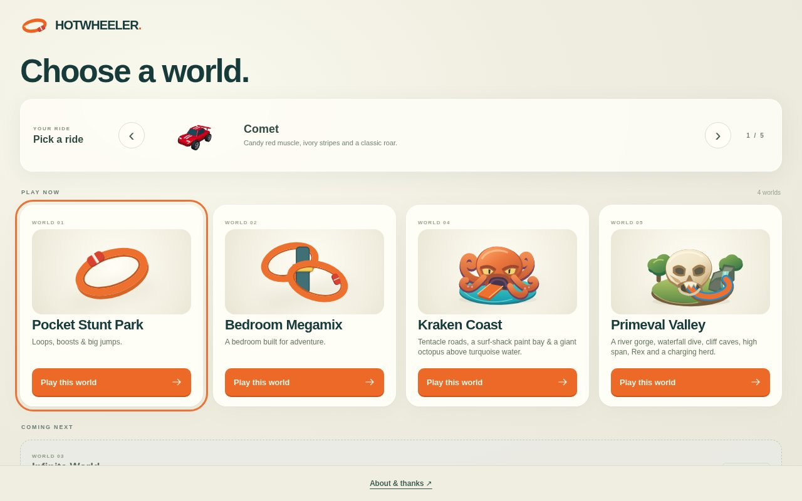 | **[Hot Wheeler](https://hot-wheeler.vercel.app/)** · [source](https://x.com/varavibes/status/2099269587401580886) Toy-car stunt worlds — Pocket Stunt Park, Bedroom Megamix, Kraken Coast and more — built with GPT-6 Astra over a weekend (Varun Arora). `Astra` | 8.3 | `x` |
| 190 | 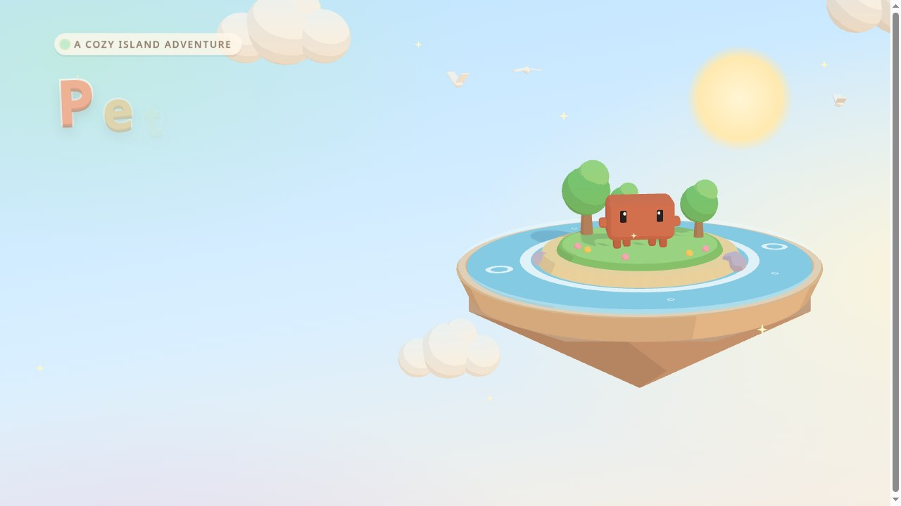 | **[Pet Island](https://pet-island.vercel.app/)** · [source](https://github.com/tahcin/pet-island) Cozy Animal Crossing–style island: upload a pet photo and explore a generated chibi 3D world with quests and talking companions. Opus Build Day Bangalore demo credited to Claude Opus 5.5. `Opus 5.5` | 8.3 | `catalog` |
| 191 |  | **[RoboBeats: Mooncake Chop](https://robobeats-mooncake-mobile.netlify.app/)** · [source](https://x.com/nullinbetween/status/2104504963833753777) Tiny Mid-Autumn rhythm game for kids: tap to help Robo chop mooncakes on the moon across stages that teach mooncake names, with character choices and simple navigation. Built with Claude Opus 5.5 by @nullinbetween. `Opus 5.5` | 8.3 | `x` |
| 192 | 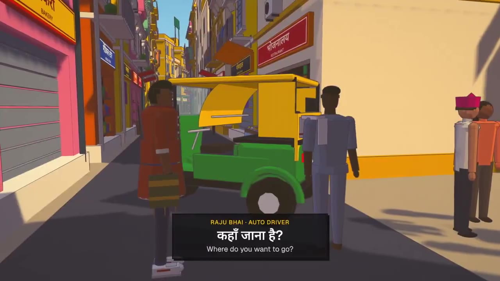 | **[SADAK](https://playsadak.vercel.app/)** · [source](https://x.com/ahmedfahim21_/status/2104560182311465281) Third-person Indian street where NPCs speak Indian languages — ask for an auto ride out loud. Browser open-world vibecoded with Opus 5.5 (Sarvam AI speech). Google sign-in required to play. `Opus 5.5` | 8.3 | `x` |
| 193 | 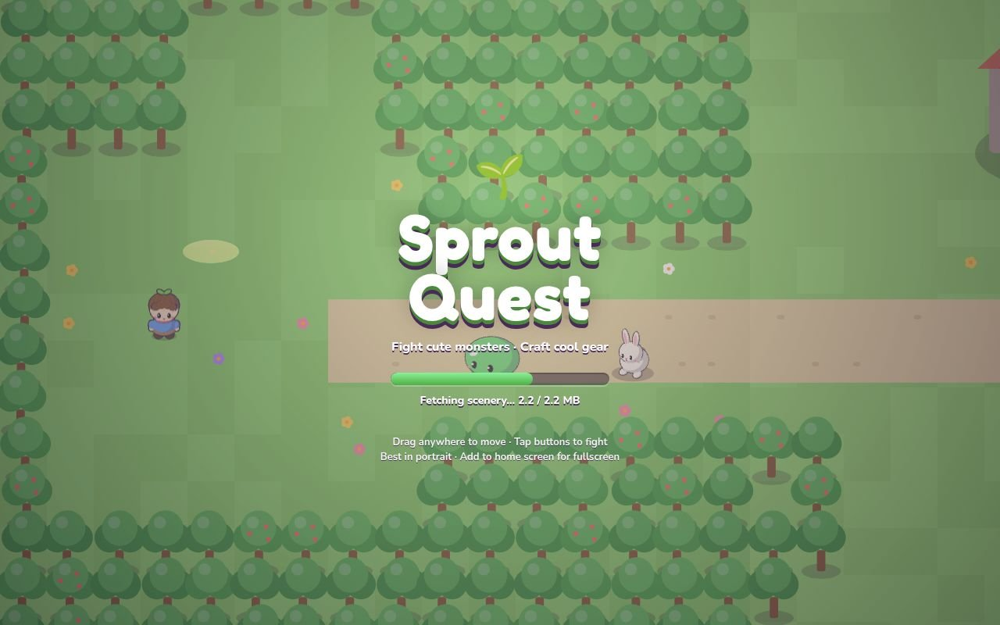 | **[Sprout Quest](https://aibengineering.github.io/sprout-quest/)** · [source](https://github.com/aibengineering/sprout-quest) Cute top-down action RPG: fight monsters in small arenas, craft gear and rebuild a village. Credited to Claude Opus 5.5. `Opus 5.5` | 8.3 | `catalog` |
| 194 | 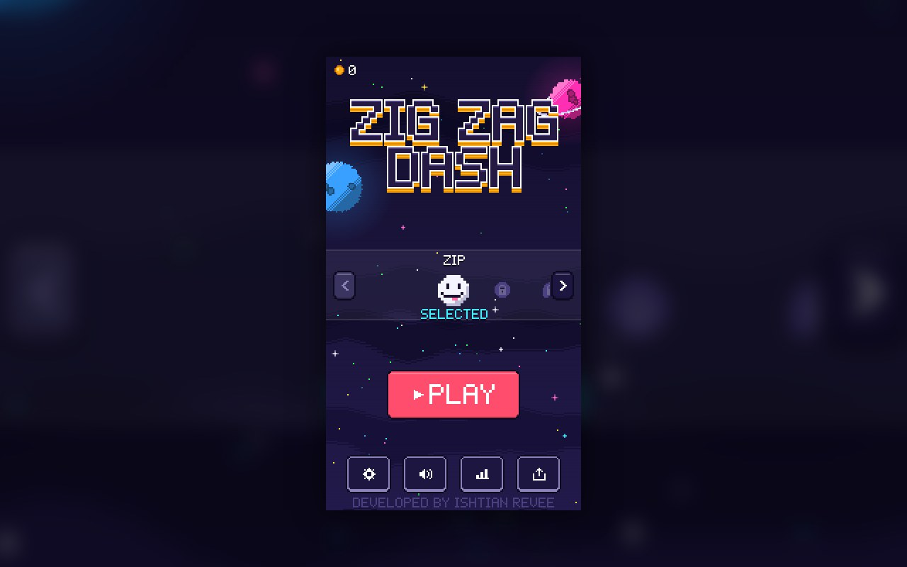 | **[Zig Zag Dash](https://ishtian-revee.github.io/zig-zag-dash/)** · [source](https://x.com/ishtianrev/status/2104034700771959210) Pixel-art endless browser scroller with character select, coins, and leaderboard. Visuals/mechanics designed by the creator; Claude Code (Opus 5.5) built the rest including promo video. `Opus 5.5` | 8.3 | `x` |
| 195 | 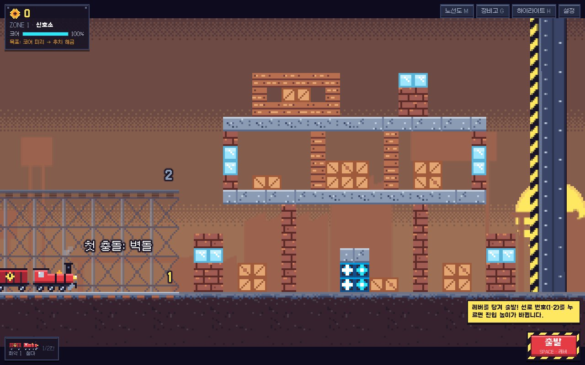 | **[폭쇄특급 WRECKLINE](https://legerdo.github.io/WRECKLINE/)** · [source](https://github.com/Legerdo/WRECKLINE) Korean pixel-art destruction-train incremental: pick a track height, pull the lever, watch cascading collapses, then rebuild the train with loot. All sprites/SFX generated in code; Claude Opus 5.5 one-shot. `Opus 5.5` | 8.3 | `github` |
| 196 | 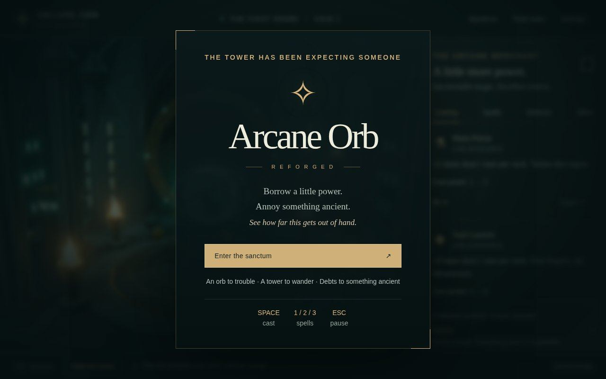 | **[Arcane Orb REFORGED](https://arcane-orb-workshop.pages.dev/reforged/)** · [source](https://arcane-orb-workshop.pages.dev/) Idle/upgrade orb loop rebuilt as a walkable 3D tower with spells, target practice and synthesized audio — Astra 6 via Hermes Agent (Spazztik). `Astra` | 8.2 | `web` |
| 197 | 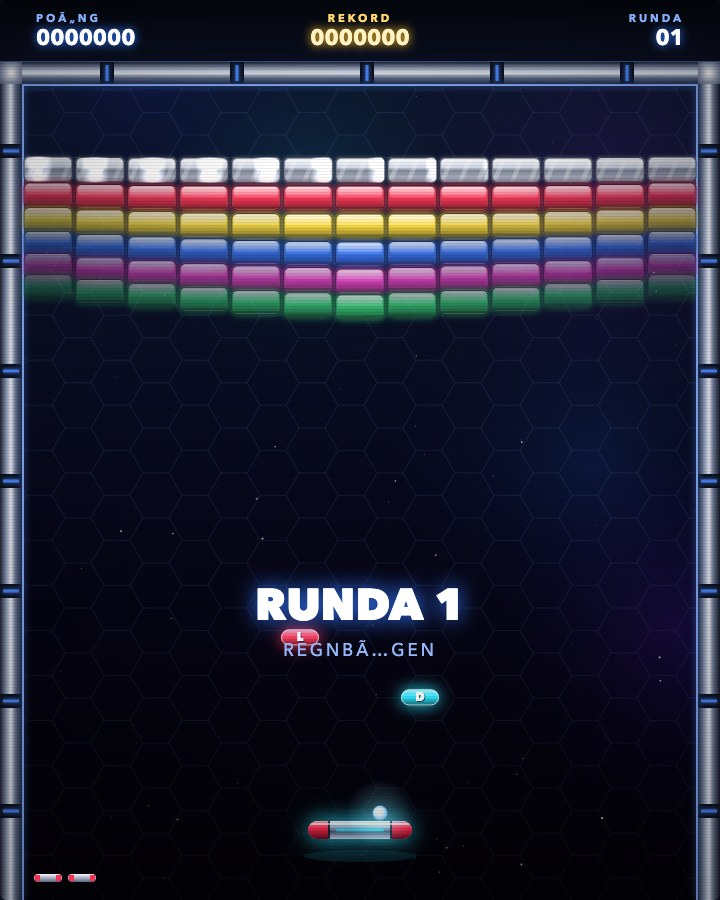 | **[Arkanoid Neon](https://jack-c3l2w.github.io/arkanoid-neon/)** · [source](https://github.com/Jack-c3l2w/arkanoid-neon) Neon brick-breaker with glossy rainbow bricks, power-up capsules, hex-grid starfield and round HUD. Single-file browser Arkanoid built entirely by Claude Opus 5.5. `Opus 5.5` | 8.2 | `catalog` |
| 198 | 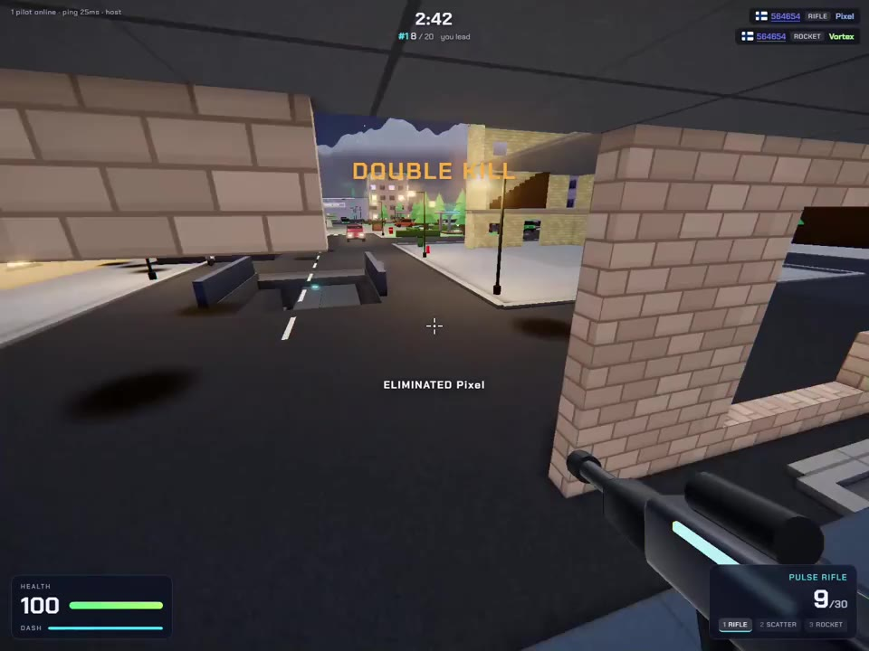 | **[BIONEURAL](https://bioneural.de/)** · [source](https://www.reddit.com/r/aigamedev/comments/1wtkdc5/bioneural_online_fps/) Multiplayer browser city shooter — rooftops, subways, back alleys. Online FPS built with Claude Opus 5.5 in ~4 days; works on desktop and mobile. `Opus 5.5` | 8.2 | `reddit` |
| 199 | 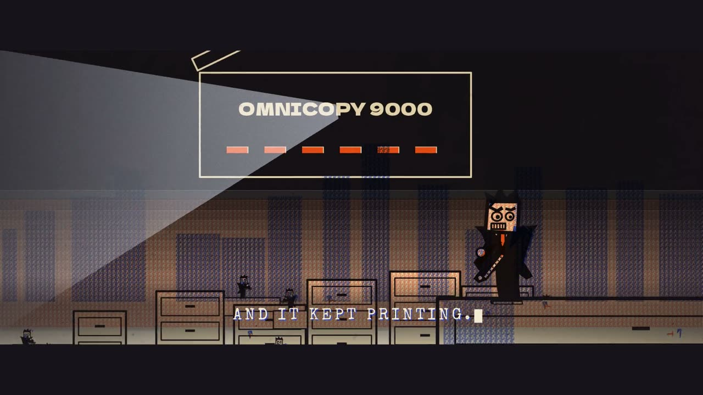 | **[Carbon Body](https://carbon-body.bloomlabs.games/)** · [source](https://x.com/yelnur_k/status/2105046481136717901) Side-scrolling co-op action inside a possessed office photocopier: fight as paper and ink through toner, rollers, and paper jams. Plain JS + Canvas 2D on bug.games / bloomlabs; creators credit Claude Opus 5.5. `Opus 5.5` | 8.2 | `x` |
| 200 | 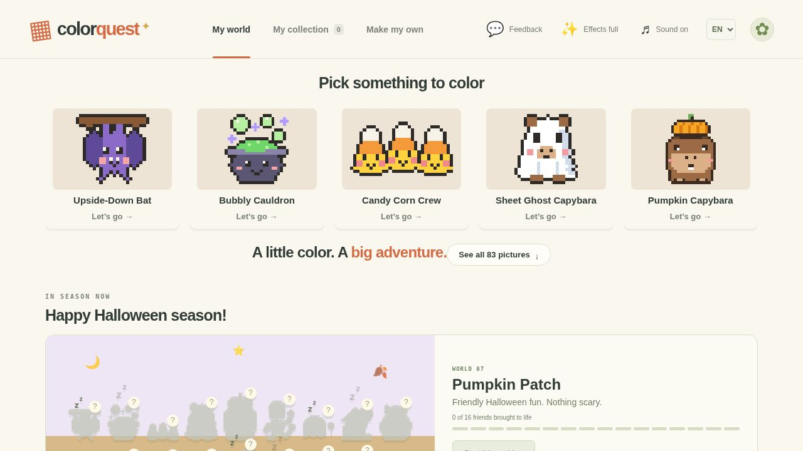 | **[Color Quest](https://colorquestgame.com/)** · [source](https://x.com/anhgemus/status/2104987819928424872) Free color-by-number pixel game for kids: pick a picture, fill numbered squares, grow a garden world. No ads/sign-up; photo-to-puzzle stays on-device. Built with Sonnet 5.5. `Sonnet 5.5` | 8.2 | `x` |
| 201 |  | **[Convergence RTS (交汇战线)](https://convergence-rts.vercel.app/)** · [source](https://x.com/riccoasi/status/2104761613433831490) Avengers vs Justice League real-time strategy in the browser — single-player command center and online battles. Creator Ricco credits Opus 5.5 (Godot export). `Opus 5.5` | 8.2 | `x` |
| 202 | 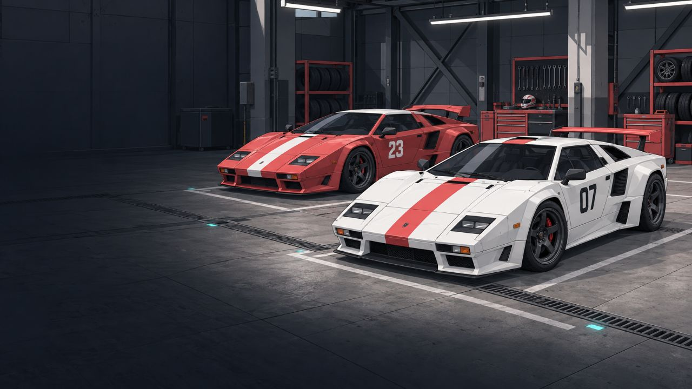 | **[Crayon Motors](https://app.usecrayon.ai/play/63d2fb01-822b-4f34-88dc-f21444efda59)** · [source](https://x.com/TusharXo/status/2103996624573968748) Open-city racing/driving game with story missions, on-foot exploration, and a Meshy-modeled McQueen-style car. Shipped with Claude Opus 5.5 on Crayon Pro. `Opus 5.5` | 8.2 | `x` |
| 203 | 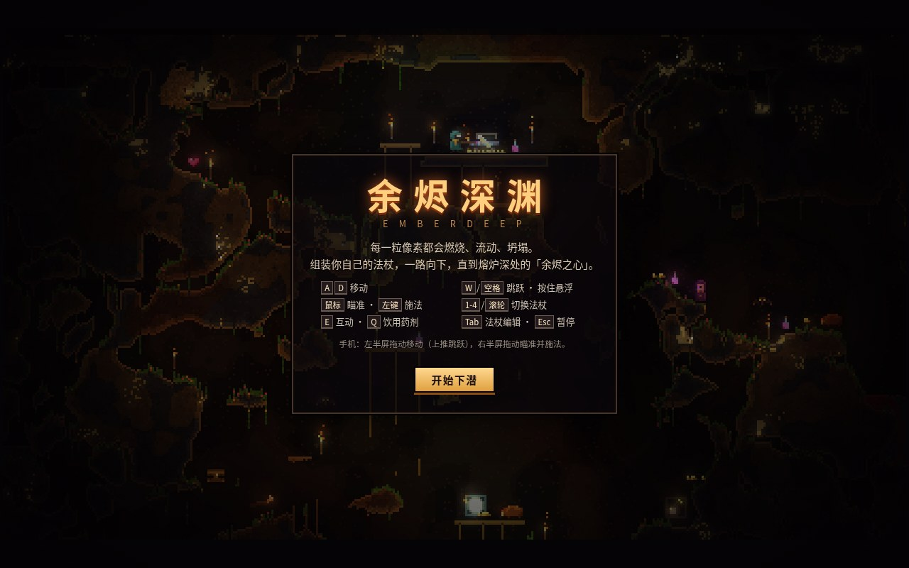 | **[EMBERDEEP (余烬深渊)](https://noita.myai1010.top/opus55/)** · [source](https://github.com/JerryLiu369/noita-benchmark) Noita-style falling-sand descent: every pixel burns, flows, and collapses as you assemble wands and dive toward the Heart of Embers. Claude Opus 5.5 entry in the NOITA AI Arena benchmark. `Opus 5.5` | 8.2 | `catalog` |
| 204 | 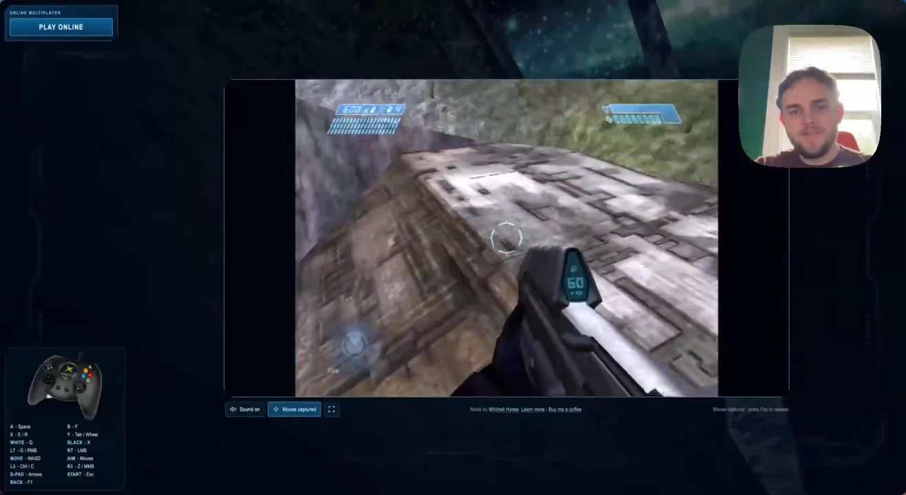 | **[Halo CE (Xbox) in the Browser](https://mitchellhynes.com/halo)** · [source](https://x.com/mitchellhynes/status/2104969744721883474) Full Xbox Halo: Combat Evolved running in-browser via WASM/Emscripten (decomp-based): campaign, splitscreen co-op, and WebRTC multiplayer (Cloudflare). Author play link mitchellhynes.com/halo. made_with uncertain — no… `uncertain` | 8.2 | `x` |
| 205 | 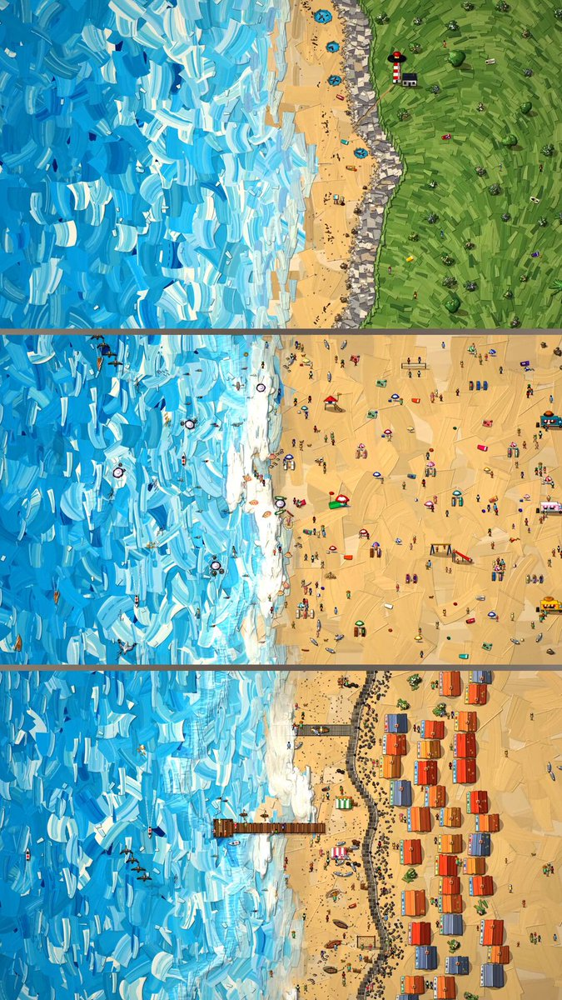 | **[Low Tide](https://low-tide.netlify.app)** · [source](https://low-tide.netlify.app) Impasto beach scavenger where players race the tide for shells and pearls while waves threaten the bucket. `Opus 5.5` | 8.2 | `x` |
| 206 |  | **[Roll Everything (万物皆可滚)](https://superdiaodiao.github.io/wanwu-gun/)** · [source](https://superdiaodiao.github.io/wanwu-gun/) Katamari-style roll-and-grow fan game themed on Nüwa repairing the sky — roll from seeds up to mountains. Credited to Claude Opus 5.5. `Opus 5.5` | 8.2 | `catalog` |
| 207 |  | **[Talk Me Into It](https://israelfemiojo.github.io/talk-me-into-it/)** · [source](https://x.com/israelfemiojo/status/2104900132105818548) Daily negotiation game: someone says no — you get three messages to change their mind. Built with Claude Opus 5.5. `Opus 5.5` | 8.2 | `x` |
| 208 | 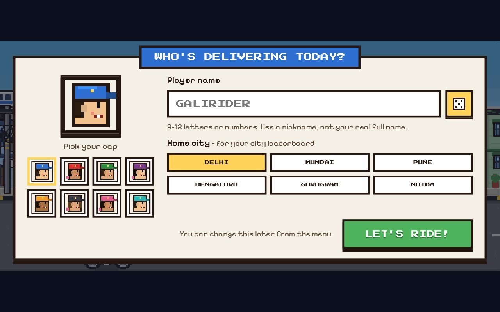 | **[Akhbar Rush](https://Shiva78388789.github.io/Akhbar-Rush/)** · [source](https://github.com/Shiva78388789/Akhbar-Rush) Pixel-art India delivery rush: pick a cap and home city (Delhi–Noida), race city leaderboards. Mobile-friendly browser game built with Claude Code / Opus 5.5. `Opus 5.5` | 8.1 | `catalog` |
| 209 | 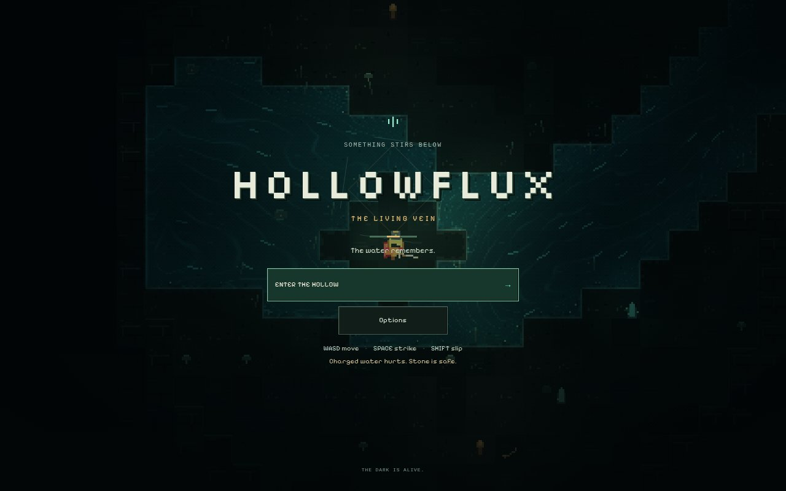 | **[Hollowflux](https://tideglass-drowned-vein.openai.chatgpt.site/)** · [source](https://developers.openai.com/showcase/hollowflux) Top-down procedural dungeon crawler where combat and movement disturb reactive underground water and electricity. Official OpenAI Astra showcase by Thomas Ricouard. `Astra` | 8.1 | `openai` |
| 210 | 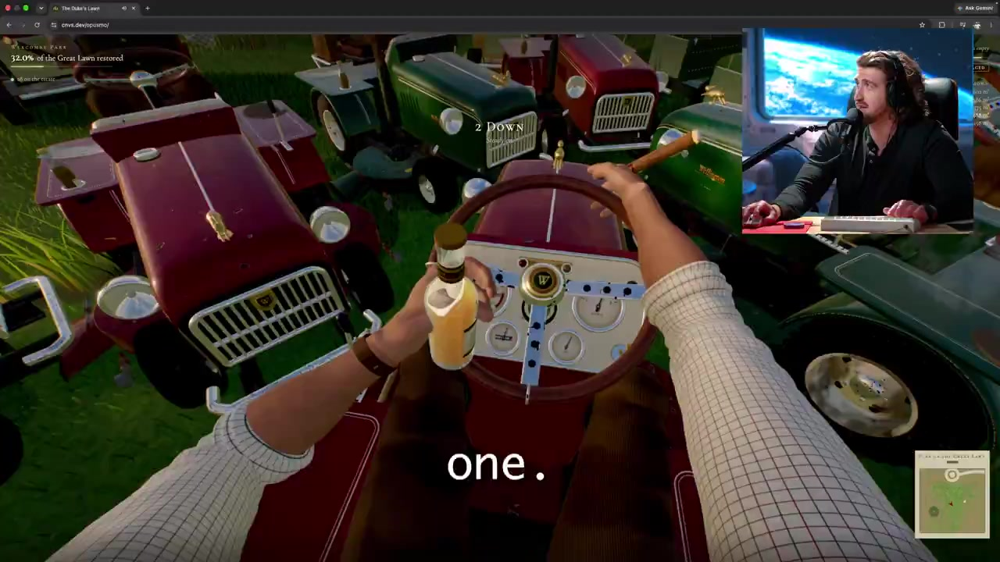 | **[The Duke's Lawn](https://cnvs.dev/opusmo/)** · [source](https://x.com/_MaxBlade/status/2102513817855094922) Multiplayer first-person lawn-mowing sim with beers, cigars, vintage tractors and online chat — built with Claude Opus 5.5 in CNVS. `Opus 5.5` | 8.1 | `x` |
| 211 | 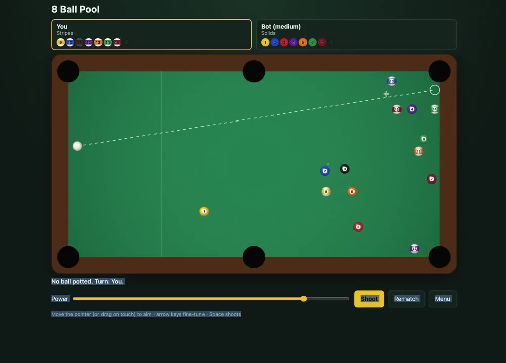 | **[8 Ball Pool](https://pool.navarch.build/)** · [source](https://x.com/sagentlab/status/2104958478435385535) Browser 8-ball pool one-shot: play a bot (easy/medium/hard) or local two-player. Aim with pointer, power meter, and standard suit/8-ball rules. `Sonnet 5.5` | 8.0 | `x` |
| 212 | 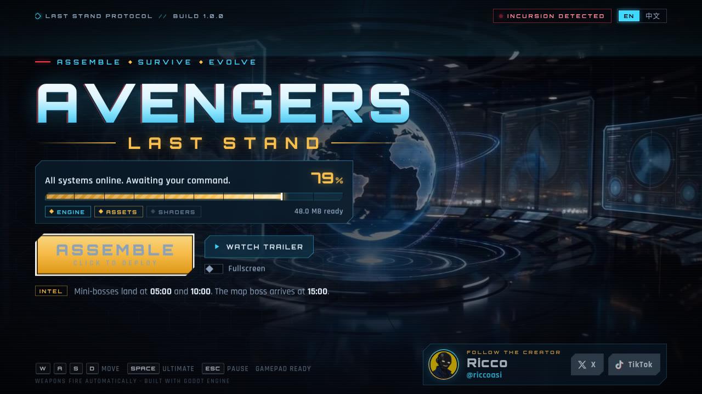 | **[Avengers: Last Stand](https://avengers-last-stand.vercel.app/)** · [source](https://x.com/riccoasi/status/2104950830927601769) Vampire Survivors–style Avengers arena: auto-firing weapons, assemble heroes, survive waves of enemies. Browser Godot build by Opus 5.5. `Opus 5.5` | 8.0 | `x` |
| 213 | 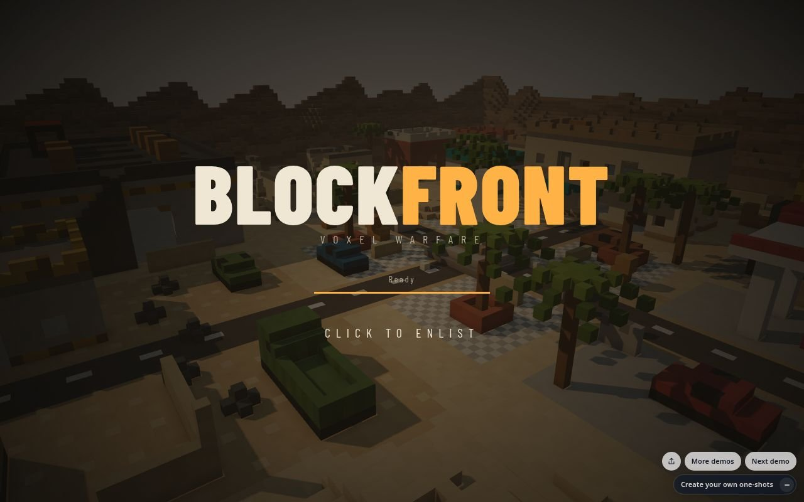 | **[BLOCKFRONT (Voxel Warfare)](https://first-person-shooter.opus5-5.demos.sulat.com/)** · [source](https://opus5-5.demos.sulat.com/) Voxel FPS / warfare operations with loadouts, UAV and juggernaut waves. Claude Opus 5.5 one-shot on Sulat. `Opus 5.5` | 8.0 | `catalog` |
| 214 | 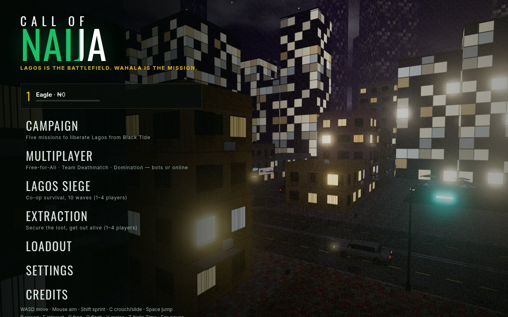 | **[Call of Naija](https://callofnaija.vercel.app/)** · [source](https://github.com/bigbadbillion/game) Lagos battlefield FPS: campaign, multiplayer modes, Lagos Siege co-op and extraction. Lo-fi night cityscape with Naira loadouts; Claude Opus 5.5. `Opus 5.5` | 8.0 | `catalog` |
| 215 | 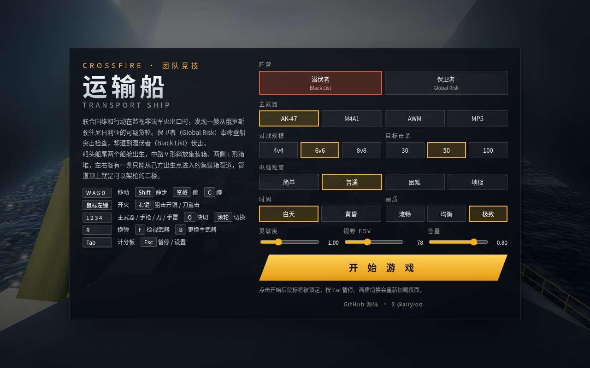 | **[CF Transport Ship](https://games.xdullboy.com/transport-ship/)** · [source](https://github.com/xiiyioozzz/opus55-3d-games) One-shot CrossFire Transport Ship team FPS in the browser — bots, loadouts, day/dusk. Claude Opus 5.5 zero-edit code gen; hosted at games.xdullboy.com. `Opus 5.5` | 8.0 | `github` |
| 216 | 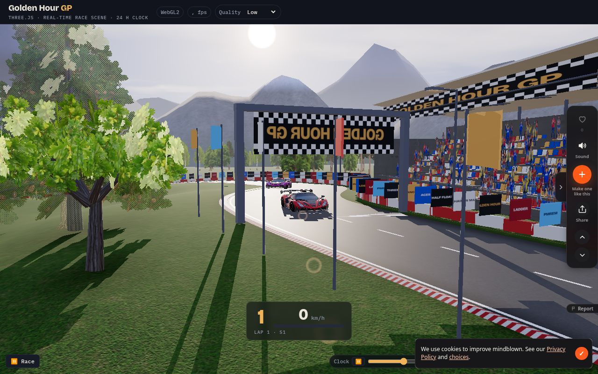 | **[Golden Hour GP](https://golden-hour-gp.mindblown.ai)** · [source](https://x.com/mindblown_ai/status/2097060846912565382) Three.js real-time race scene with day-clock lighting, cars on track and race HUD. Creator Mindblown credits GPT-6 Astra + WebGL2. `Astra` | 8.0 | `x` |
| 217 | 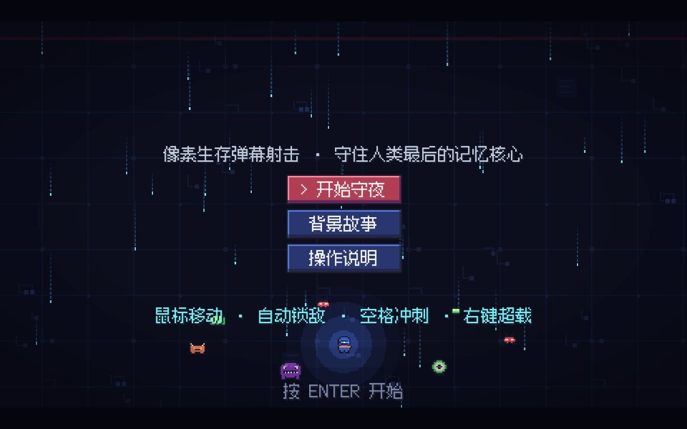 | **[LAST FIREWALL (终焉防火墙)](https://gordensun.github.io/last-firewall/)** · [source](https://github.com/gordensun/last-firewall) Pixel-art survival bullet-hell: mouse-steer, auto-aim, dash and overload while bosses arrive on a timer. README credits Claude Opus 5.5. `Opus 5.5` | 8.0 | `catalog` |
| 218 | 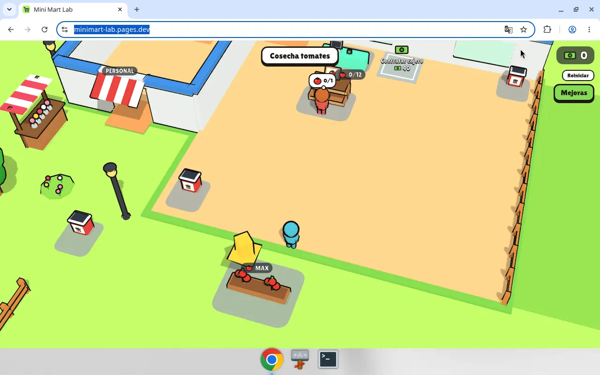 | **[Mini Mart Lab](https://minimart-lab.pages.dev)** · [source](https://x.com/EdMo98078602/status/2104428535620493402) Isometric browser mart management sim: harvest, stock shelves, hire help, and grow a mini supermarket. Creator credits a weekend Opus 5.5 build. `Opus 5.5` | 8.0 | `x` |
| 219 | 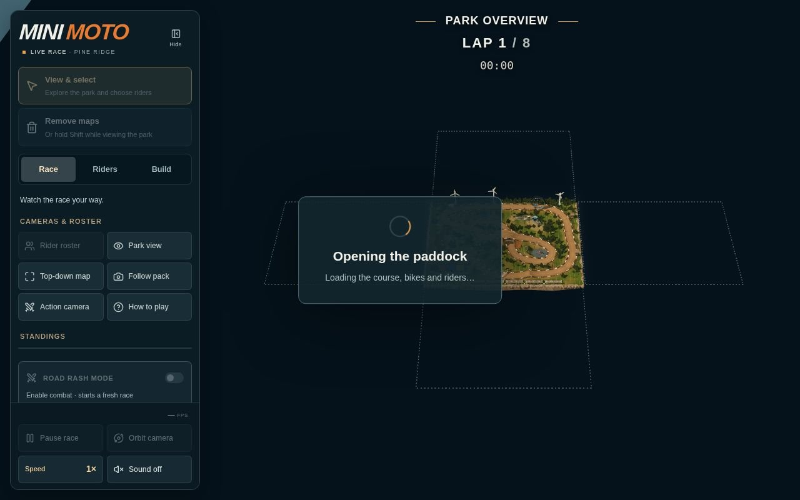 | **[Mini Moto — Pine Ridge Park](https://mini-moto-park.chipchaunceytheonlyone.chatgpt.site/)** · [source](https://x.com/chrisjdimarco/status/2103874824569344327) Isometric miniature motocross park: race, manage riders, shape the course, optional Road Rash combat. ChatGPT Sites build (Astra). `Astra` | 8.0 | `x` |
| 220 | 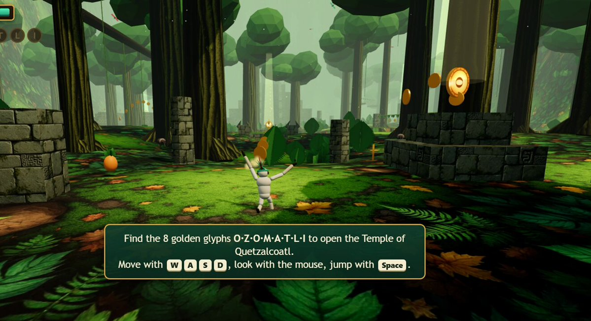 | **[Ozomatli the Aztec Monkey](https://www.gamefoundry.net/creations/cmujs9oli000112bctlv030i3)** · [source](https://x.com/GameFoundryNet/status/2104252846338408824) Third-person Aztec jungle adventure collecting golden glyphs to open the Temple of Quetzalcoatl; developed in Game Foundry with Claude Opus 5.5. `Opus 5.5` | 8.0 | `x` |
| 221 | 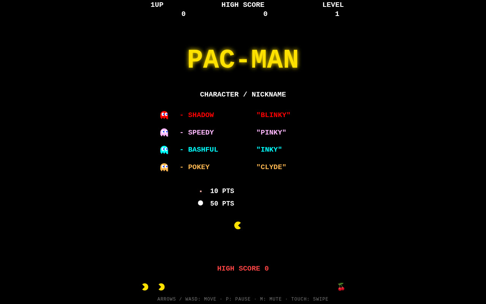 | **[PacBench — Claude Sonnet 5.5 Pac-Man](https://jonclegg.github.io/pacman-bakeoff/entries/claude-sonnet-5-5.html)** · [source](https://jonclegg.github.io/pacman-bakeoff/) One-shot Pac-Man clone from PacBench ("Create a Pac-Man game in a single html page"). Entry slug claude-sonnet-5-5 via OpenRouter/Claude Code; model anthropic/claude-sonnet-5.5-20260928, PacBench score 95/100. `Sonnet 5.5` | 8.0 | `web` |
| 222 | 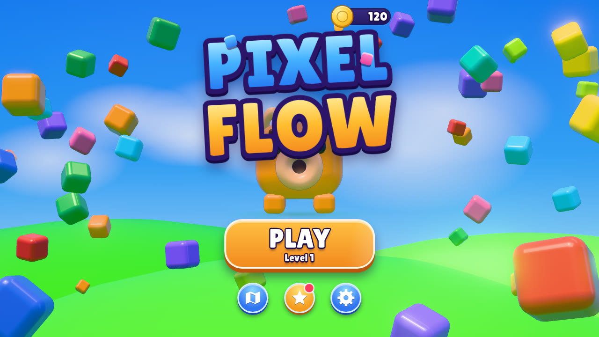 | **[Pixel Flow (Sonnet 5.5)](https://pixel-flow-sonnet.longmaba.workers.dev/)** · [source](https://x.com/longmaba/status/2104982165352288395) Sonnet 5.5 Max one-prompt Pixel Flow clone — author notes more accurate/beautiful than the Opus build. Colour pigs clear pixel pictures on a conveyor. `Sonnet 5.5` | 8.0 | `x` |
| 223 | 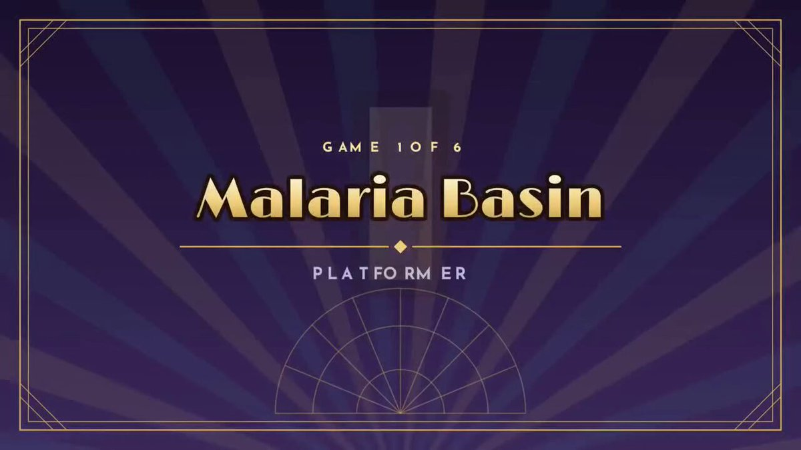 | **[Qualy Quest](https://qualyquest.netlify.app/)** · [source](https://x.com/RafaRuizdeLira/status/2103211380828504488) Landscape minigame collection full of EA references: Mario 1-1, karting, Minecraft/Terraria, Mario Galaxy, Pokémon and an Outrun-the-paperclip platformer. Vibecoded with Claude 5.5 / Opus in under an hour. `Opus 5.5` | 8.0 | `x` |
| 224 | 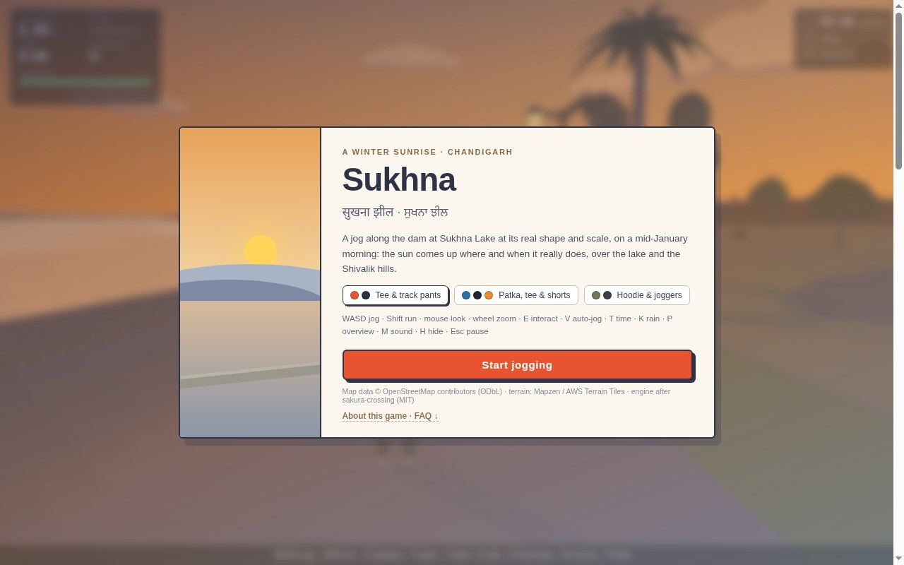 | **[Sukhna Lake 3D](https://sukhna-lake.trymurmur.studio/)** · [source](https://x.com/AsumaCodes/status/2104459374907584946) Scale-accurate winter-sunrise jog along Chandigarh's Sukhna Lake dam with outfit choices and auto-jog. Browser 3D experience built with Claude Opus 5.5. `Opus 5.5` | 8.0 | `x` |
| 225 | 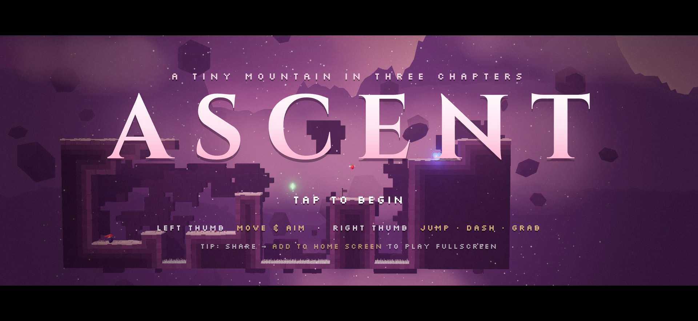 | **[Ascent (Celeste-style platformer)](https://celeste.gamefox.vn/)** · [source](https://discourse.threejs.org/t/ascent-a-celeste-clone-with-tight-control-and-the-vibe/94653) Tight platformer with directional dash, wall climb and jump, coyote time, and jump buffer. `Opus 5.5` | 7.9 | `discourse` |
| 226 | 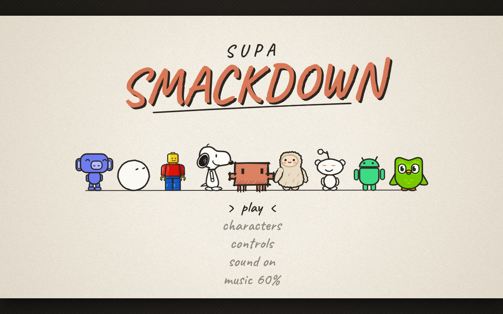 | **[Supa Smackdown](https://mbranni03.github.io/smackdown/)** · [source](https://x.com/mbranni03/status/2104302073349046403) Hand-drawn platform fighter with a crossover roster (including a new Snoopy character). Trailer and latest changes credited to Claude Opus 5.5. `Opus 5.5` | 7.9 | `x` |
| 227 | 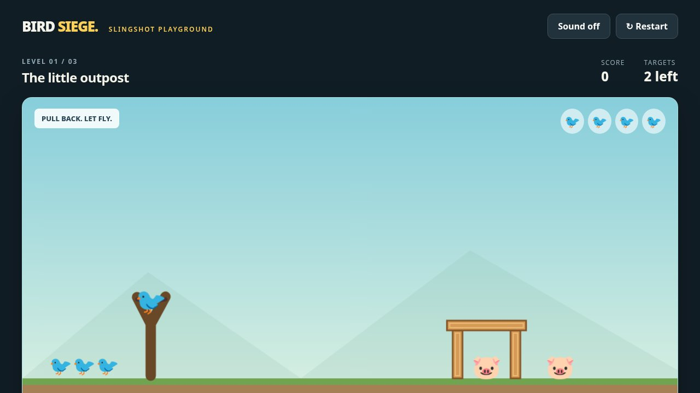 | **[Bird Siege](https://bird-siege.tonyheller.chatgpt.site/)** · [source](https://x.com/TonyClimate/status/2105154016300892232) Emoji slingshot playground: pull back, let fly, topple pig outposts across three levels. ChatGPT Sites / GPT-6 Astra build by @TonyClimate. `Astra` | 7.8 | `x` |
| 228 | 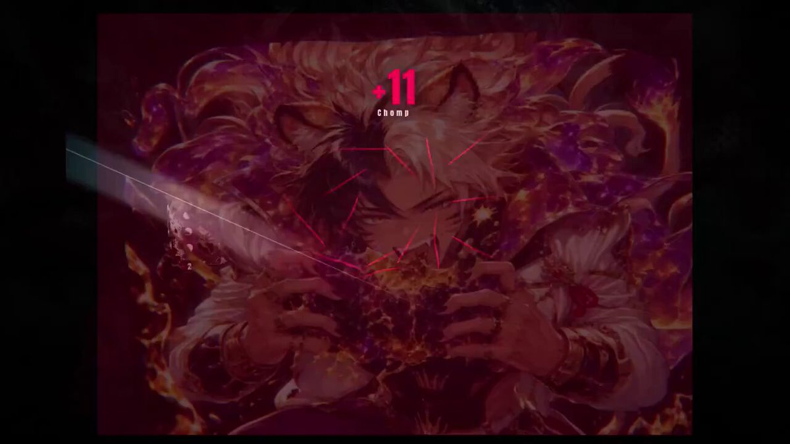 | **[GODROLL](https://nepentheplay.com/games/dice)** · [source](https://x.com/EllaxinIvy/status/2104235308749627732) Roguelike dice-builder browser game; trailer and presentation credited to Opus 5.5, playable via Nepenthe Play. `Opus 5.5` | 7.8 | `x` |
| 229 | 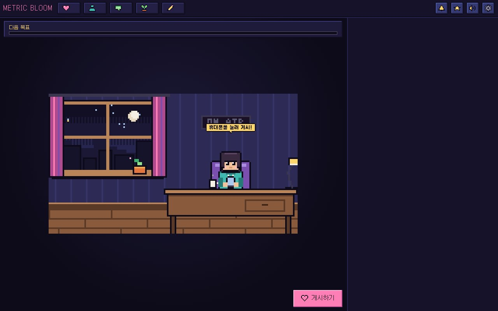 | **[Metric Bloom](https://legerdo.github.io/metric-bloom-opus-5-5/)** · [source](https://github.com/Legerdo/metric-bloom-opus-5-5) Korean pixel-art incremental about growing a social platform — posts, followers, crews, and creative ownership. Claude Opus 5.5 one-shot; playable on GitHub Pages. `Opus 5.5` | 7.8 | `github` |
| 230 | 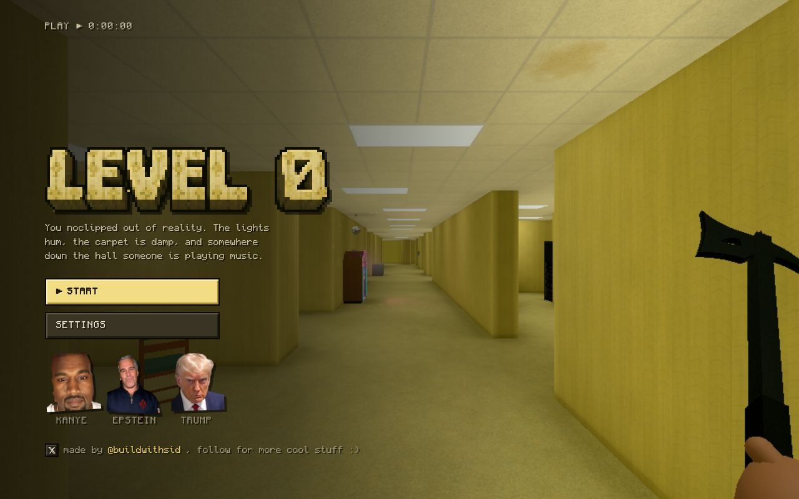 | **[NOCLIPPED (Backrooms meme horror)](https://epstein-game.vercel.app/)** · [source](https://x.com/buildwithsid/status/2104630714415317187) Level-0 Backrooms horror where you escape while meme-chase characters pursue — flashlight, airhorn, phone controls. Built with Opus 5.5 by @buildwithsid. `Opus 5.5` | 7.8 | `x` |
| 231 | 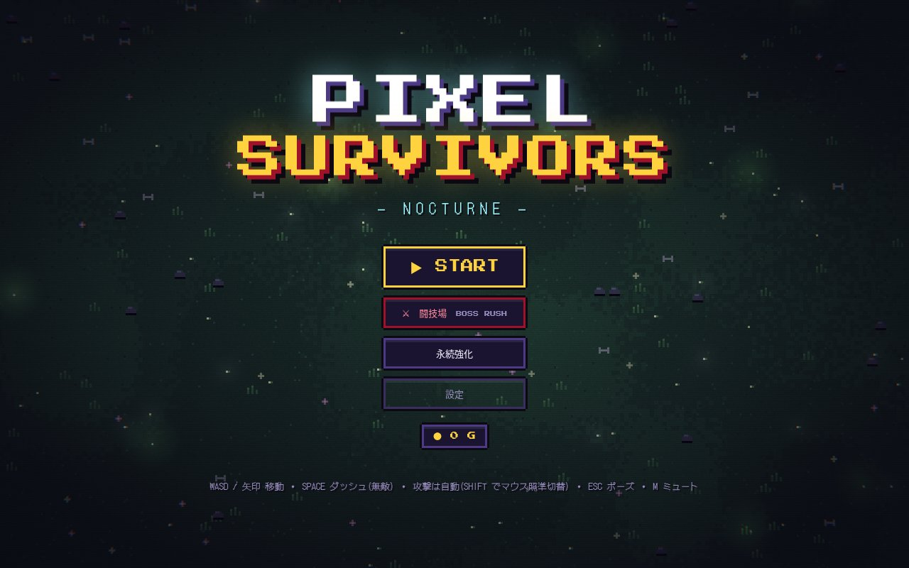 | **[Pixel Survivors: Nocturne](https://Black2856.github.io/pixel_survivors_opus5.5test/)** · [source](https://github.com/Black2856/pixel_survivors_opus5.5test) Japanese survivors-like with automatic attacks, dash i-frames, boss rush and permanent upgrades. CRT scanline title screen; Claude Opus 5.5 test build. `Opus 5.5` | 7.8 | `catalog` |
| 232 | 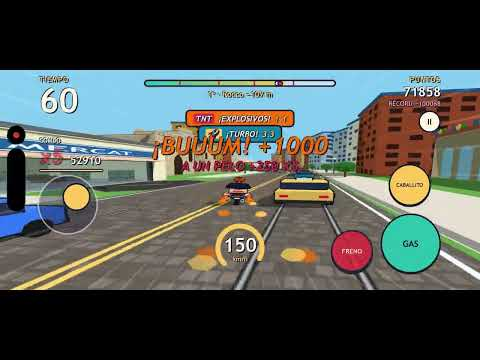 | **[Radikal Riders](https://javichur.github.io/radikal-bikers/leoGjAW41OH-fIkg/)** · [source](https://github.com/javichur/radikal-bikers) Cel-shaded pizza-delivery moto racer through a Spanish city avenue — time attack, combos, touch GAS/FRENO/CABALLITO. Three.js browser build credited to Claude Opus 5.5. `Opus 5.5` | 7.8 | `catalog` |
| 233 | 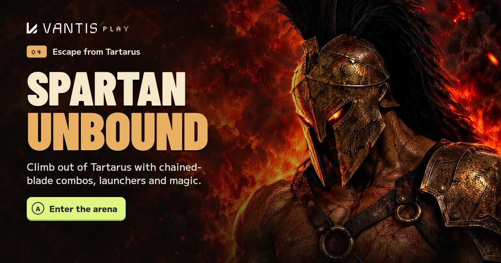 | **[Spartan Unbound](https://game.vantis.sh/game-04)** · [source](https://x.com/lucaxyzz/status/2104198092845420553) God of War–style chained-blade action browser game (Escape from Tartarus) built experimentally with Claude Opus 5.5 on Vantis Play. `Opus 5.5` | 7.8 | `x` |
| 234 | 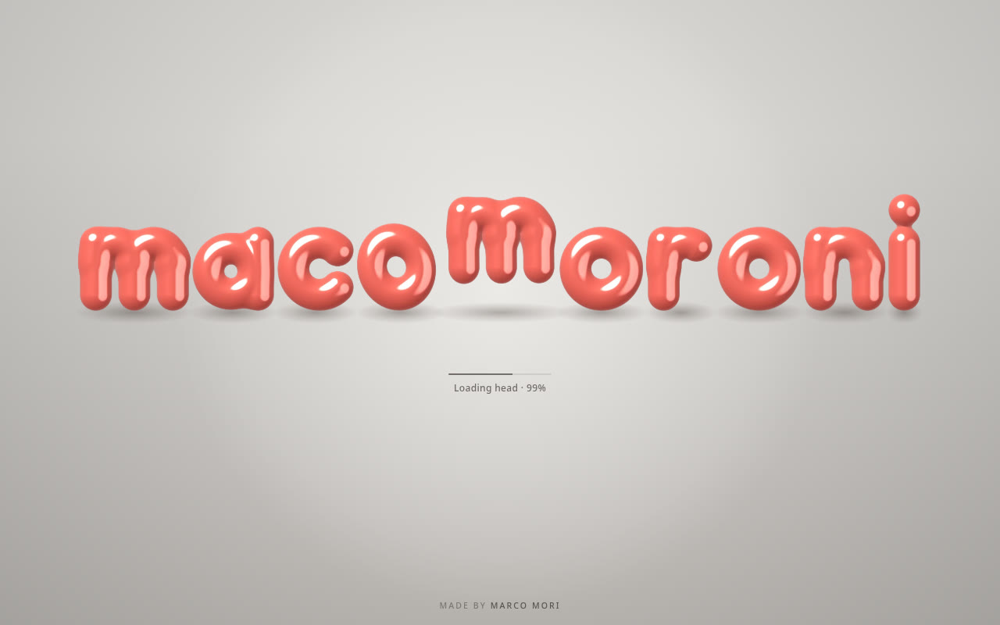 | **[Squish Club](https://marcomori.net/play/x)** · [source](https://x.com/macomoroni/status/2104968782670188955) Squishy interactive 3D head toy in the browser — poke, squish, pop. Opus 5.5 made the game and the trailer clip. `Opus 5.5` | 7.8 | `x` |
| 235 | 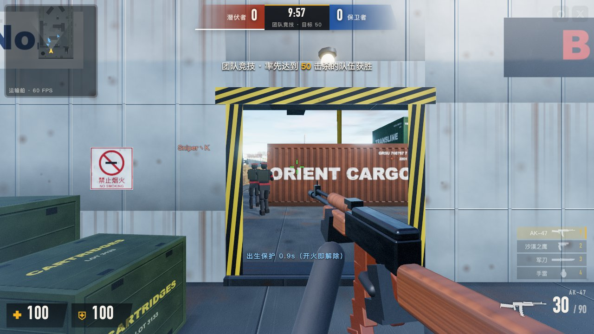 | **[Transport Ship (CrossFire-inspired browser FPS)](https://claude-opus-5-5-cf-transport-ship.pages.dev)** · [source](https://github.com/riba2534/claude-opus-5-5-demo) Compact cargo-ship FPS map with bots, recoil, hit feedback, procedural gun audio, and touch support. `Opus 5.5` | 7.8 | `catalog` |
| 236 | 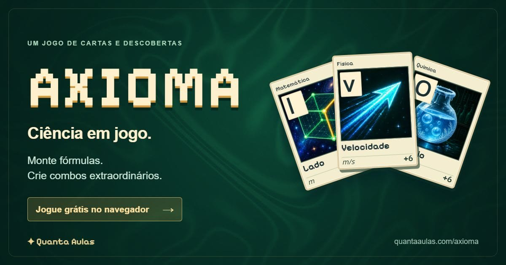 | **[AXIOMA](https://quantaaulas.com/axioma/)** · [source](https://x.com/testesmnyv/status/2105089357556158712) Science-themed roguelike card game: build decks from physics, chemistry and math cards, assemble formulas and combos. Free in-browser play (Steam also listed). Credited to Astra 6.0 Ultra by Quanta Aulas. `Astra` | 7.6 | `x` |
| 237 | 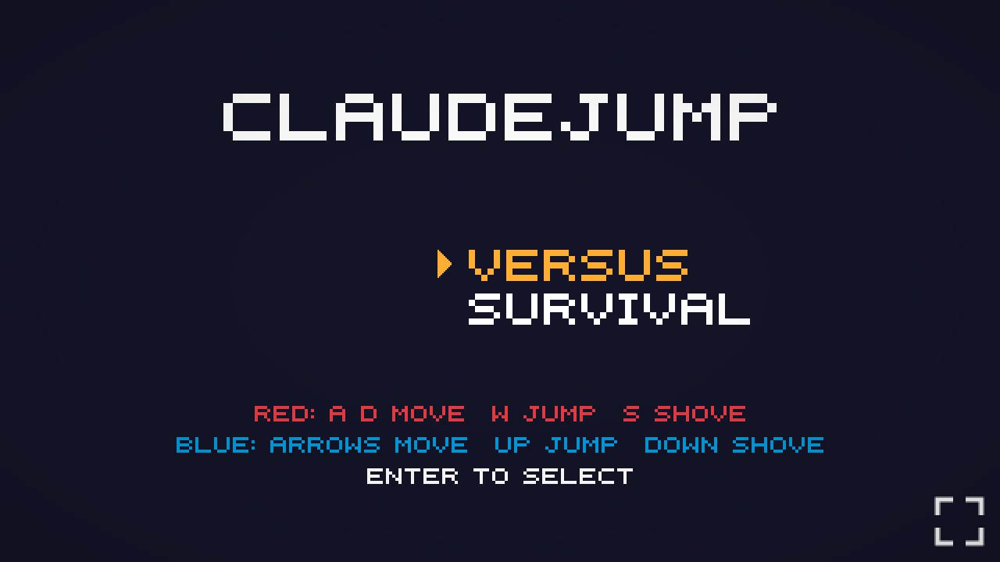 | **[ClaudeJump](https://claudejump.netlify.app/)** · [source](https://github.com/PrabhjotSodhi/ClaudeJump) Pixel-art arena platformer: knock friends into the sea in Versus or climb forever in Survival. Opus 5.5 plans/reviews with Sonnet 5 coding; public ticket history. `Opus 5.5` | 7.6 | `catalog` |
| 238 | 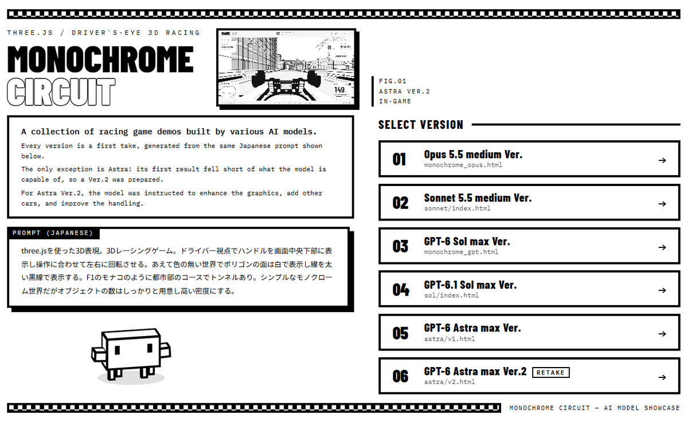 | **[Monochrome Circuit (Astra V2)](https://refuge.tokyo/ai/games/monochrome/astra/v2.html)** · [source](https://x.com/564kuma/status/2105133677089054855) Astra max Ver.2 retake of the monochrome Three.js city GP — enhanced graphics, other cars, improved handling vs the first Astra take on the same Japanese prompt. `Astra` | 7.6 | `x` |
| 239 |  | **[Monochrome Circuit (Sonnet 5.5)](https://refuge.tokyo/ai/games/monochrome/sonnet/index.html)** · [source](https://x.com/564kuma/status/2105133677089054855) Same monochrome Monaco-style Three.js racing prompt as the Opus build — Claude Sonnet 5.5 medium Ver. on the refuge.tokyo AI model showcase. `Sonnet 5.5` | 7.6 | `x` |
| 240 | 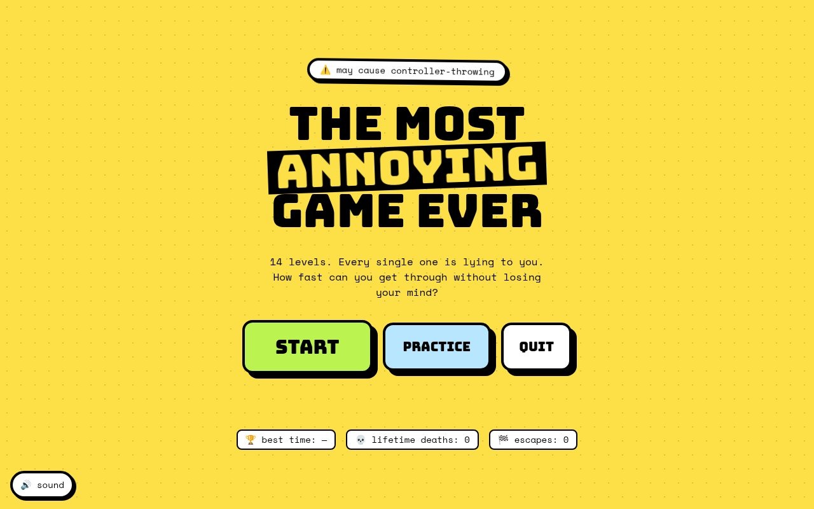 | **[The Most Annoying Game Ever](https://the-most-annoying-game-ever.netlify.app/)** · [source](https://x.com/vdavi_d/status/2104506292601794764) Fourteen short rage levels that lie to you — a polished browser troll/rage-game one-shot by @vdavi_d with Claude Opus 5.5. Best enjoyed on a computer. `Opus 5.5` | 7.6 | `x` |
| 241 | 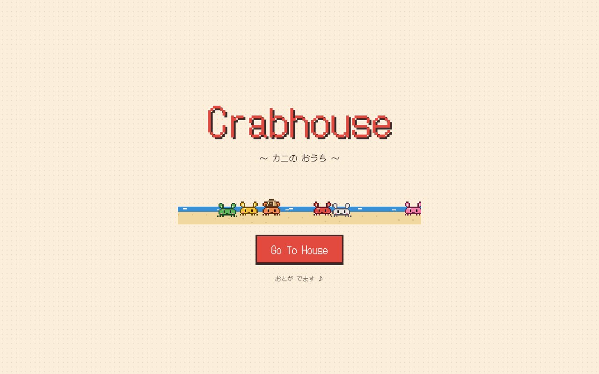 | **[Crabhouse v2](https://kamibukuro18.github.io/opuscrabhouse/)** · [source](https://github.com/kamibukuro18/opuscrabhouse) Pixel-art crab house clicker/raiser — カニのおうち. Cute beach crabs, Japanese UI; Claude Opus 5.5. `Opus 5.5` | 7.5 | `catalog` |
| 242 | 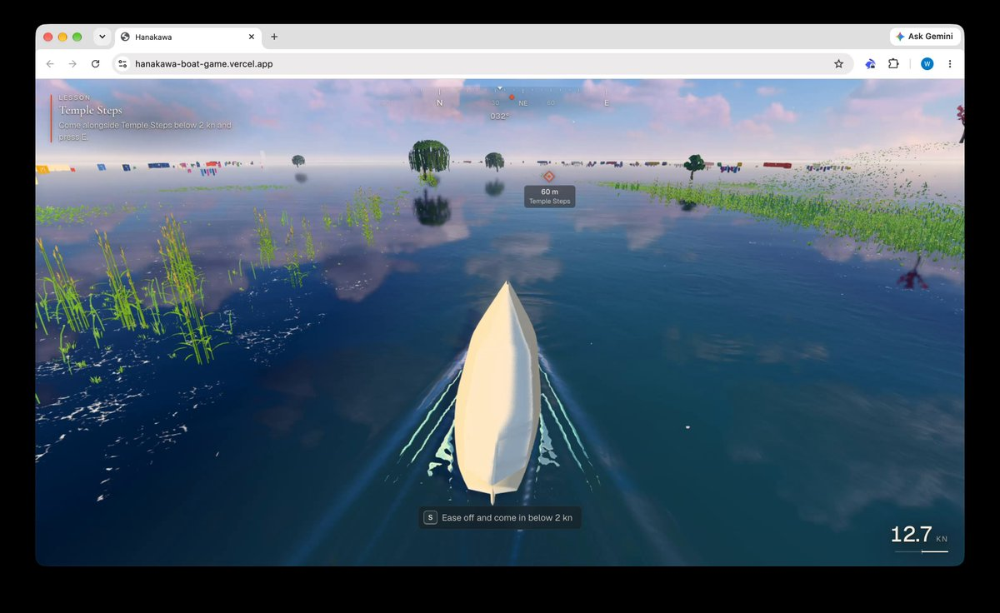 | **[Hanakawa](https://hanakawa-boat-game.vercel.app/)** · [source](https://x.com/k2sbhai/status/2104361445152444615) Japanese-style browser boat journey with water physics, docking lessons, river chart objectives, and shrine approaches; attributed to Opus 5.5. `Opus 5.5` | 7.5 | `x` |
| 243 | 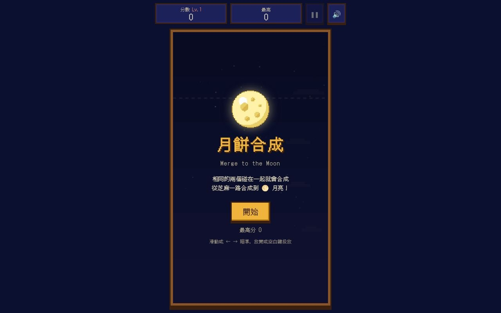 | **[Merge to the Moon (月餅合成)](https://meowmeowmeowcute.github.io/merge-to-the-moon/)** · [source](https://tikgame.org/game/merge-to-the-moon/) Pixel-art Suika-style merge: drop sesame seeds and mooncakes up to the moon. Credited to Claude Opus 5.5. `Opus 5.5` | 7.5 | `catalog` |
| 244 |  | **[Carry the Ring](https://thepaninosoffline.itch.io/carry-the-ring)** · [source](https://x.com/Paninosoffline/status/2105179882216952220) Unofficial LOTR fan game: carry the One Ring across a living 3D Middle-earth map, sneak past Black Riders, hide in forests, and visit 21 places. HTML5 on itch; credited to Claude Opus 5.5 by @Paninosoffline. `Opus 5.5` | 7.2 | `x` |
| 245 | 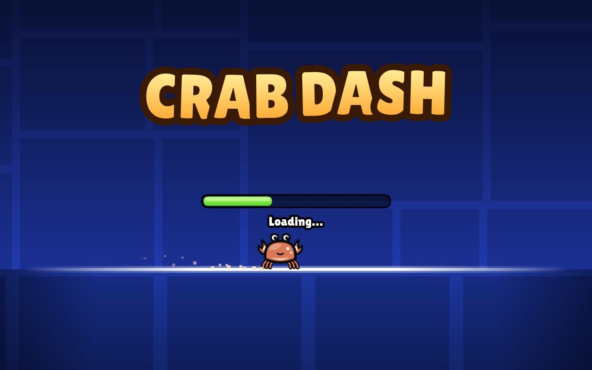 | **[Crab Dash](https://playcrabdash.com/)** · [source](https://github.com/itsdannyt/crab-dash) One-button rhythm platformer starring a crab: six levels plus a level editor. README credits Claude Opus 5.5. `Opus 5.5` | 7.2 | `catalog` |
| 246 | 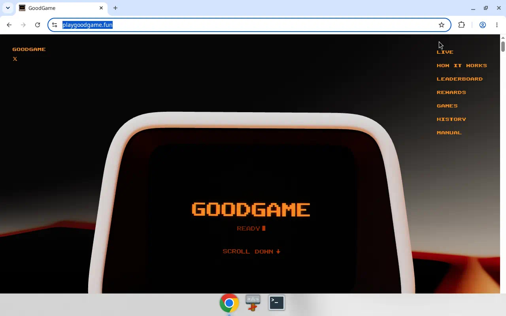 | **[GoodGame](https://playgoodgame.fun/)** · [source](https://x.com/goodgamedotfun/status/2104421818815881534) Retro-terminal 3D hub where an Opus 5.5 agent drops a new stock-themed arcade game live each hour; play in-browser at playgoodgame.fun. `Opus 5.5` | 7.2 | `x` |
| 247 |  | **[Mega Man Legends (Kattelox Island)](https://megaman-legends.opus5-5.demos.sulat.com/)** · [source](https://megaman-legends.opus5-5.demos.sulat.com/) Unofficial from-scratch Mega Man Legends fan recreation of Kattelox Island with code-generated art and audio. Claude Opus 5.5 one-shot demo hosted on Sulat. `Opus 5.5` | 7.2 | `catalog` |
| 248 | 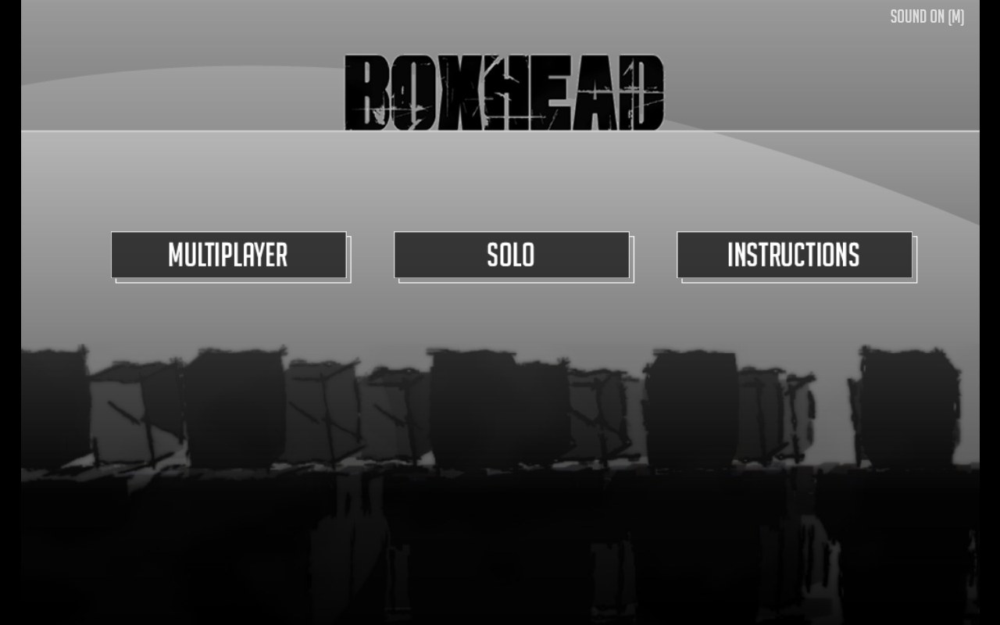 | **[Boxhead Online](https://sameidusmani.com/boxhead-online-html/)** · [source](https://github.com/sameid/boxhead-online-html) HTML5 canvas port of the classic Boxhead Online Java applet — solo and WebRTC co-op, original sprites and music. Ported with Claude Opus 5.5. `Opus 5.5` | 6.8 | `github` |
| 249 | 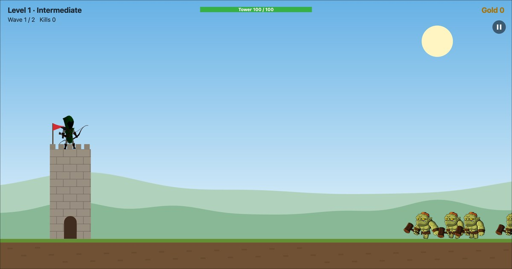 | **[Tower Archer](https://archer-tower.web.app/)** · [source](https://x.com/Fireupup/status/2104909575820653004) Retro archery tower defense: draw the bow across 21 levels with headshots, fury, and elemental arrows. Remade with Claude Opus 5.5. `Opus 5.5` | 6.5 | `x` |
| 250 | 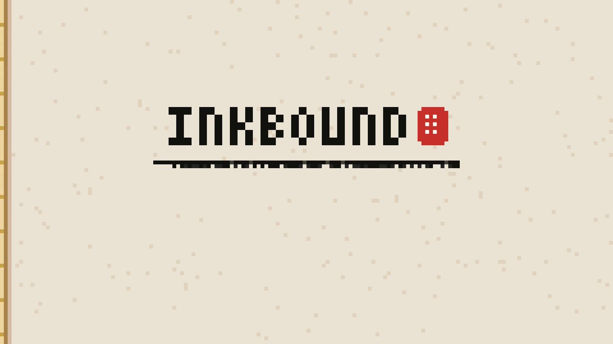 | **[INKBOUND](https://agentgames.itch.io/inkbound)** · [source](https://agentgames.itch.io/inkbound) Pixel sumi-e chase in which one painter draws your path while a rival tries to cut you off. `Opus 5.5` | 5.8 | `x` |
| 251 | 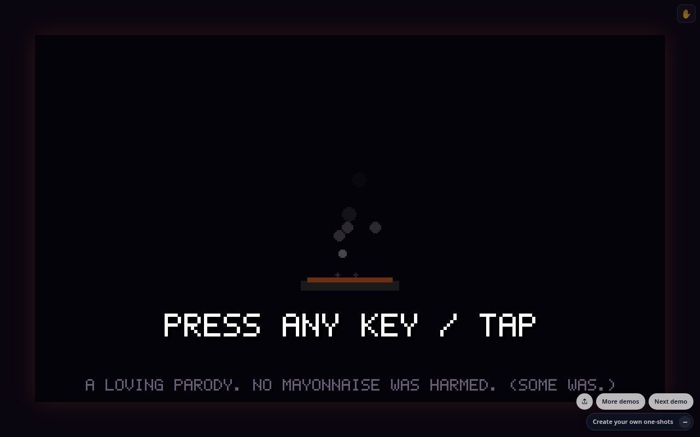 | **[MegaSisig X4](https://megasisig-x4.opus5-5.demos.sulat.com/)** · [source](https://opus5-5.demos.sulat.com/) Loving Mega Man–style parody (sisig-themed) with dash, fire and jump. Claude Opus 5.5 one-shot on Sulat. `Opus 5.5` | 5.5 | `catalog` |
| 252 | 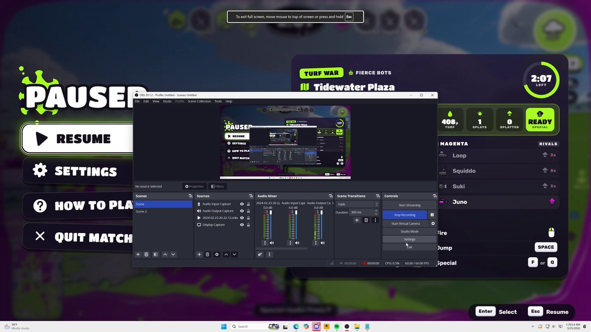 | **[INKWAVE (Splatoon-style turf war)](https://inkwave-six.vercel.app)** · [source](https://inkwave-six.vercel.app) A 4v4 ink shooter where players paint the plaza, swim their color, and splat the opposing team. `Opus 5.5` | 4.8 | `x` |
| 253 |  | **[DiscoDino: Lost Worlds](https://discodino.netlify.app/)** · [source](https://x.com/goethecoin/status/2104376288127684938) Pixel-art browser safari: track and photograph 50 prehistoric creatures across 11 levels. Godot web build attributed to Claude Opus 5.5. `Opus 5.5` | 4.2 | `x` |
| 254 |  | **[ANTKEEPER](https://ja.sperdeboer.nl/antkeeper)** · [source](https://www.reddit.com/r/aigamedev/comments/1wt45me/antkeeper_a_dungeon_keeper_inspired_ant_game/) Dungeon Keeper–inspired ant-colony sim: build your nest, forage food and water, train soldiers, and fight enemies. Three.js + Blender; Opus/Fable build with Suno soundtrack and ElevenLabs voices. `Opus 5.5` |  | `reddit` |
| 255 |  | **[APEX / Coast Run](https://apex-coast-run.mindblown.ai/)** · [source](https://x.com/mindblown_ai/status/2097053892152594854) Need for Speed–style browser racer on Three.js with Astra 6 overnight build; later looped with Jolt physics, tighter steering, mobile/desktop quality tiers. `Astra` |  | `x` |
| 256 |  | **[Brainhive](https://www.brainhive.games/)** · [source](https://www.reddit.com/r/aigamedev/comments/1wtad7l/i_made_100_games_in_less_than_48_hours/) Collection of 100 bite-sized browser brain games (memory, logic, speed) built in under 48 hours with Opus 5.5 — Phaser + React + TypeScript + Framer Motion; monthly content refresh. `Opus 5.5` |  | `reddit` |
| 257 |  | **[Comfy Crawler](https://mowmeow.net/ComfyCrawlerTest/)** · [source](https://www.reddit.com/r/aigamedev/comments/1wt9rtl/i_made_a_windows_95_3d_mazeinspired_dungeon/) Windows 95 3D Maze–inspired browser dungeon crawler. Each run starts from 4 prompts (style, hero, weapon, enemy); local models bake art/SFX/music while maze layout regenerates. Opus 5.5. `Opus 5.5` |  | `reddit` |
| 258 |  | **[Destroy any website with a stickman](https://destroy.spritefusion.com/)** · [source](https://www.reddit.com/r/aigamedev/comments/1wsfvtp/destroy_any_website_with_a_stickman/) Multiplayer Opus 5.5 weekend build: drop a stickman onto any website and wreck it. Browser playable at destroy.spritefusion.com. `Opus 5.5` |  | `reddit` |
| 259 |  | **[Drop Dead (Plinko battle royale)](https://Dropdead.mightybig.ca/)** · [source](https://www.reddit.com/r/aigamedev/comments/1wtbjnl/first_time_using_opus_55_made_a_roguelite_plinko/) Roguelite Plinko battle royale in the browser: pick upgrades, place them on your board, drop pucks, and survive elimination rounds. First Opus 5.5 build (usually Codex/Astra). `Opus 5.5` |  | `reddit` |
| 260 |  | **[EIGHT FRONTS](https://eight-fronts.vercel.app/)** · [source](https://x.com/BubuStd/status/2096477503036825861) 3D run-and-gun Contra-style tribute: eight stages, GPU-skinned commandos, local co-op. Single-file JS + WebGL2/GLSL. GPT-6 Astra PRO; original contra-jungle-strike.vercel.app 404s — live deploy is eight-fronts.vercel.… `Astra` |  | `x` |
| 261 |  | **[Hearthlight](https://hearthlight.github.io/)** · [source](https://www.reddit.com/r/aigamedev/comments/1wtakg5/i_opensourced_the_cozy_pixelart_game_opus_55_made/) Open-source cozy pixel-art seaside life + 10-chapter adventure with 8 heroes, dungeons and bosses. Solo or up to 8 friends (phones as controllers or online). Built with Claude Opus 5.5. `Opus 5.5` |  | `reddit` |
| 262 |  | **[Mine (Minecraft Opus 5.5)](https://minecraft-iota-coral.vercel.app/)** · [source](https://x.com/buildwithsid/status/2102461886247948571) Browser Minecraft-style voxel sandbox built with Claude Opus 5.5 — playable deploy on Vercel. `Opus 5.5` |  | `x` |
| 263 |  | **[Neon Asteroids](https://deadbaron.com/neon-asteroids)** · [source](https://www.reddit.com/r/aigamedev/comments/1wtcm4e/built_a_free_1v1_multiplayer_asteroids_with_opus/) Free 1v1 multiplayer Asteroids in a single HTML page: WebRTC peer-to-peer across phone and desktop, public relays for matchmaking, no server. Built with Opus 5.5. `Opus 5.5` |  | `reddit` |
| 264 |  | **[Operation Safe Return — Stickman](https://operation-ink.vercel.app/)** · [source](https://x.com/byteab/status/2102342044505239741) Stickman / I.G.I.-inspired browser shooter bringing back old stickman shooter nostalgia. Built with GPT Astra (+ Fable assist). `Astra` |  | `x` |
| 265 |  | **[REGOLITH — The Silence at Anaxagoras](https://winchxyz.github.io/moon-rover/)** · [source](https://x.com/winchxyz/status/2087455605279580326) 3D lunar rover survey game: five missions plus open-world exploring. WebGL2, no build step, no third-party assets — everything procedural. Built with Claude Opus 5. `Opus 5.5` |  | `x` |
| 266 |  | **[Savannah Hunt](https://squall01337.github.io/savannah/)** · [source](https://x.com/Graalitoo/status/2096847948294590967) Browser hunting demo set in a Three.js savannah, cooked with Astra. `Astra` |  | `x` |
| 267 |  | **[SKATE (Genex)](https://genex.games/skate)** · [source](https://x.com/genex_games/status/2082890286846427521) PS2-era street skating in the browser: a fully generated spot with tricks and lines. Built with Opus 5 via the Genex CLI / Three.js; playable on genex.games. `Opus 5.5` |  | `x` |
| 268 |  | **[SPEEDRACER — Horizon](https://speed-racer-ten.vercel.app/)** · [source](https://x.com/rahilbhansali/status/2082440987411148955) First-person browser racer on a ~3.9 km procedural circuit: weather/lighting controls, WASD driving, camera cycle. Built with Opus 5 ultracode + mattshumer Gauntlet prompt (Three.js, no binary assets). `Opus 5.5` |  | `x` |
| 269 |  | **[Summer Cycle](https://starknightt.github.io/summer-cycle/)** · [source](https://x.com/0x0SojalSec/status/2103232621669220827) Studio Ghibli / Makoto Shinkai–style Three.js cycling ride through a toon-shaded Japanese countryside with four times of day; every mesh, texture and sound generated in code. Credited to Claude Opus 5.5. `Opus 5.5` |  | `x` |
| 270 |  | **[Super Smash Royale](https://smashroyale.io/)** · [source](https://x.com/0xRishi/status/2098439358537990194) Browser battle royale with 45 characters from Melee + Brawl; solo, multiplayer, controller support. Built with GPT-6 Astra, ElevenLabs, Meshy, Blender, Three.js. `Astra` |  | `x` |

## Data

Machine-readable catalog: [`data/grokgames.json`](data/grokgames.json) (synced from the workspace scanner).

## Contributing

See [CONTRIBUTING.md](CONTRIBUTING.md).
